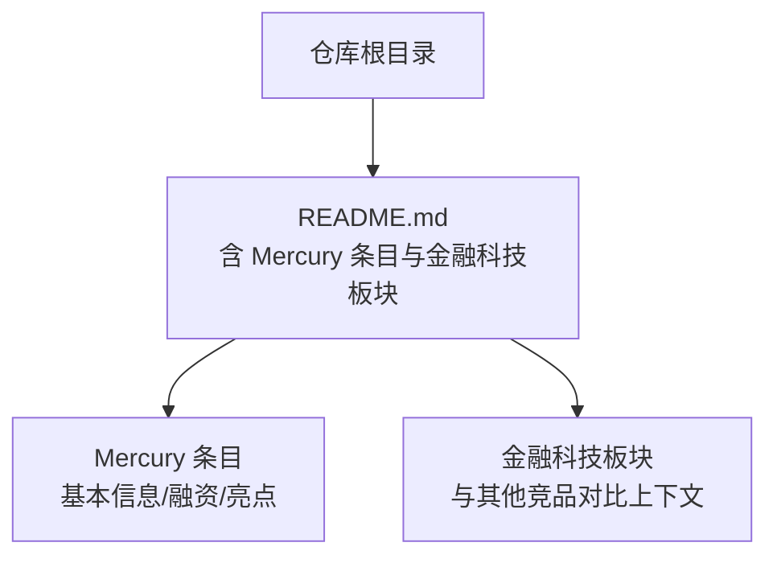
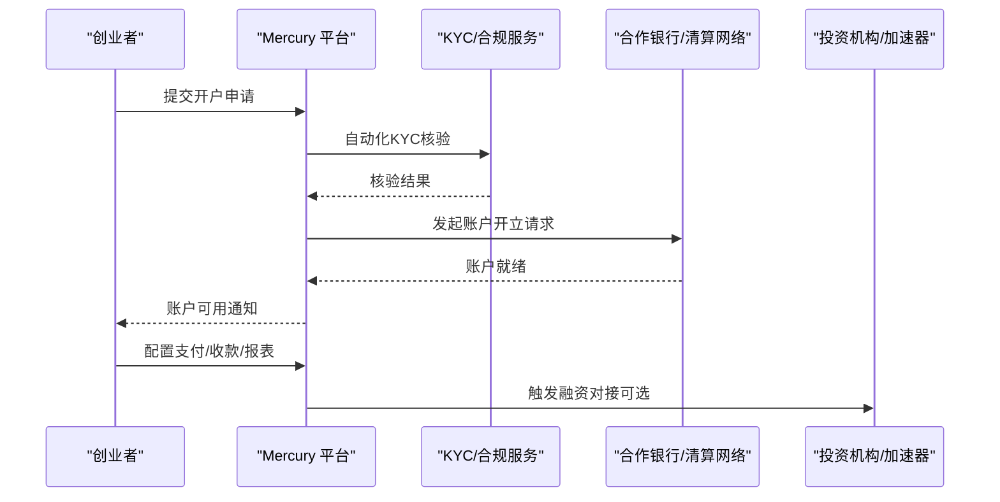
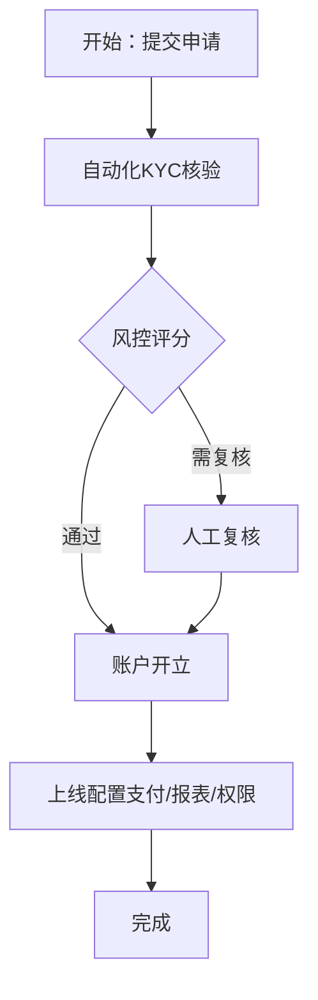
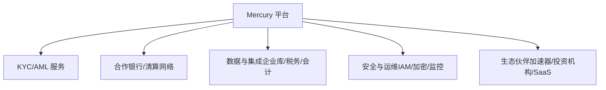

# Mercury - 初创公司银行

<cite>
**本文引用的文件**
- [README.md](file://README.md)
</cite>

## 目录
1. [简介](#简介)
2. [项目结构](#项目结构)
3. [核心组件](#核心组件)
4. [架构总览](#架构总览)
5. [详细组件分析](#详细组件分析)
6. [依赖关系分析](#依赖关系分析)
7. [性能与可扩展性考量](#性能与可扩展性考量)
8. [故障排查指南](#故障排查指南)
9. [结论](#结论)
10. [附录](#附录)

## 简介
本文件围绕 Mercury（mercury.com）作为“初创公司银行”的定位，系统梳理其商业模式、与传统银行的差异、技术架构如何支撑快速开户与自动化流程、与 Y Combinator 等创业生态的整合策略，以及企业选择 Mercury 时的费用、集成难度与安全评估要点。同时讨论监管合规挑战与未来发展方向。内容基于仓库中提供的公开信息，并结合行业通用实践进行解读，帮助读者在决策时具备更全面的视角。

## 项目结构
该仓库为一份持续更新的精选初创公司清单，其中包含对 Mercury 的条目化介绍，涵盖创始人、成立时间、核心产品、最新融资与亮点等信息。这些内容为理解 Mercury 的市场定位、生态位与发展阶段提供了基础事实依据。

图表来源
- [README.md:767-772](file://README.md#L767-L772)
- [README.md:763-818](file://README.md#L763-L818)

章节来源
- [README.md:763-818](file://README.md#L763-L818)

## 核心组件
从仓库信息可提炼出 Mercury 的核心要素：
- 定位：面向初创公司的银行业务平台
- 关键能力（结合条目与行业常识）：企业账户、支付处理、现金管理、融资对接等
- 市场地位：YC 系初创公司首选银行之一，拥有大量客户规模
- 资本背书：完成多轮融资，估值达到数十亿美元级别

上述要点均来自仓库中对 Mercury 的条目化描述与金融科技板块的上下文。

章节来源
- [README.md:767-772](file://README.md#L767-L772)
- [README.md:763-818](file://README.md#L763-L818)

## 架构总览
Mercury 的技术架构以“在线优先、API 驱动、自动化审批”为核心，目标是让初创企业在最短时间内完成开户、资金流转与财务运营。典型流程包括：
- 身份与企业KYC核验（自动化表单+第三方数据源）
- 银行账户开立（通过合作银行或持牌机构通道）
- 支付与结算（收付款、跨境、多币种）
- 现金管理与报表（余额监控、现金流预测、对账）
- 融资对接（与投资机构、加速器生态打通）

图表来源
- [README.md:767-772](file://README.md#L767-L772)
- [README.md:763-818](file://README.md#L763-L818)

## 详细组件分析

### 商业模式与服务范围
- 企业账户：提供初创公司所需的美元及多币种账户，支持日常收支、工资发放、供应商付款等
- 支付处理：聚合多种支付方式，支持线上/线下场景，简化商户接入
- 现金管理：余额可视化、自动对账、现金流预测、预算控制
- 融资对接：与加速器、投资机构生态打通，加速融资进程

以上能力与仓库中“核心产品：初创公司银行业务”的描述一致，并辅以金融科技板块中的竞品对比背景，体现 Mercury 在初创金融基础设施中的角色。

章节来源
- [README.md:767-772](file://README.md#L767-L772)
- [README.md:763-818](file://README.md#L763-L818)

### 与传统银行的区别
- 体验优先：全在线开户、移动端友好、界面简洁，减少纸质材料
- 速度优先：自动化KYC与审批，缩短开户时间
- 开发者友好：API 优先，便于与内部系统集成
- 生态整合：与加速器、投资机构、SaaS工具链深度连接

这些差异化特征可从 Mercury 的“亮点”与“YC 系首选”定位推断，并与金融科技板块中其他竞品的对比形成参照。

章节来源
- [README.md:767-772](file://README.md#L767-L772)
- [README.md:763-818](file://README.md#L763-L818)

### 技术架构如何支持快速开户与自动化
- 自动化KYC：通过规则引擎与外部数据源校验，降低人工审核成本
- 工作流编排：将开户、风控、合规、账户开通串联为标准化流水线
- API 驱动：对外暴露统一接口，对内实现微服务解耦
- 安全与审计：访问控制、日志审计、加密传输与存储

图表来源
- [README.md:767-772](file://README.md#L767-L772)
- [README.md:763-818](file://README.md#L763-L818)

### 与 Y Combinator 等创业生态的深度整合
- 渠道与获客：YC 推荐与入驻流程内嵌，提高转化率
- 数据互通：与加速器系统对接，共享企业里程碑与融资进度
- 联合服务：提供专属费率、额度、顾问支持，加速企业成长

仓库中明确提到 Mercury 是“YC 系初创公司首选银行”，表明其在生态中的强绑定关系。

章节来源
- [README.md:767-772](file://README.md#L767-L772)

### 企业选择 Mercury 的实用指导
- 费用结构：关注账户维护费、转账手续费、跨境费用、API调用费等；建议向 Mercury 索取官方价目表并进行总拥有成本（TCO）测算
- 集成难度：评估API文档质量、SDK覆盖度、沙箱环境、错误码与重试机制；优先选择有成熟案例与技术支持的团队
- 安全性评估：关注数据加密、访问控制、审计日志、合规认证（如SOC 2）、灾备与SLA；必要时开展渗透测试与第三方审计

以上建议基于 Mercury 的“API 优先、自动化”特性与金融科技行业的最佳实践，旨在帮助企业做出稳健决策。

章节来源
- [README.md:767-772](file://README.md#L767-L772)
- [README.md:763-818](file://README.md#L763-L818)

### 监管合规挑战
- KYC/AML：需满足反洗钱与了解你的客户要求，建立持续监控与可疑交易报告机制
- 数据隐私：遵循GDPR、CCPA等数据保护法规，最小化数据采集与留存
- 跨境合规：不同司法辖区的支付与外汇政策差异，需本地化合规策略
- 审计与披露：定期接受内外部审计，确保透明度与可追溯性

章节来源
- [README.md:767-772](file://README.md#L767-L772)
- [README.md:763-818](file://README.md#L763-L818)

### 未来发展方向
- 产品扩展：增加更多币种、跨境支付、供应链金融、保险等增值服务
- 生态深化：与更多加速器、投资机构、SaaS平台打通，形成一体化企业操作系统
- 技术演进：引入AI用于风控、客服、报表生成与异常检测，提升效率与体验
- 国际化：拓展新市场，适配当地监管与支付网络

章节来源
- [README.md:767-772](file://README.md#L767-L772)
- [README.md:763-818](file://README.md#L763-L818)

## 依赖关系分析
Mercury 的业务与技术依赖主要包括：
- 合规与风控：KYC/AML服务商、信用评估、制裁名单筛查
- 银行与清算：合作银行、支付网络、清算所
- 数据与集成：企业信息库、税务与注册数据库、会计软件、ERP
- 安全与运维：身份与访问管理、加密服务、日志与监控、灾备

图表来源
- [README.md:767-772](file://README.md#L767-L772)
- [README.md:763-818](file://README.md#L763-L818)

章节来源
- [README.md:767-772](file://README.md#L767-L772)
- [README.md:763-818](file://README.md#L763-L818)

## 性能与可扩展性考量
- 高并发开户：采用异步任务队列与弹性扩容，保障高峰期稳定性
- 低延迟支付：优化路由与重试策略，提升成功率与用户体验
- 数据一致性：分布式事务与幂等设计，避免重复扣款或漏单
- 容量规划：根据业务增长预估峰值流量，预留冗余资源

章节来源
- [README.md:767-772](file://README.md#L767-L772)
- [README.md:763-818](file://README.md#L763-L818)

## 故障排查指南
常见问题与处理思路：
- 开户失败：检查KYC资料完整性、风控规则命中原因、银行通道状态
- 支付失败：核对收款方信息、汇率与限额、网络超时与重试策略
- 对账差异：定位差异时间点、核对流水号与状态机、修复数据不一致
- 安全事件：立即隔离受影响账户、启用二次验证、审计日志溯源

章节来源
- [README.md:767-772](file://README.md#L767-L772)
- [README.md:763-818](file://README.md#L763-L818)

## 结论
Mercury 以“初创公司银行”为核心定位，凭借在线化、自动化与生态整合的优势，显著提升了企业开户与财务运营的效率。与传统银行相比，Mercury 更注重体验、速度与开发者友好性。企业在选择时需综合评估费用、集成难度与安全合规，并结合自身发展阶段制定合适的金融基础设施方案。未来，随着产品扩展与生态深化，Mercury 有望成为初创企业的一体化财务与融资平台。

## 附录
- 数据来源：仓库中 Mercury 条目与金融科技板块信息
- 参考方向：费用结构、集成难度、安全评估、合规挑战与未来发展路径