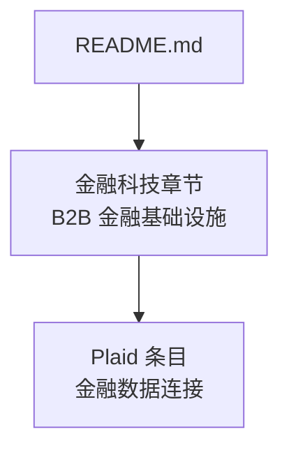
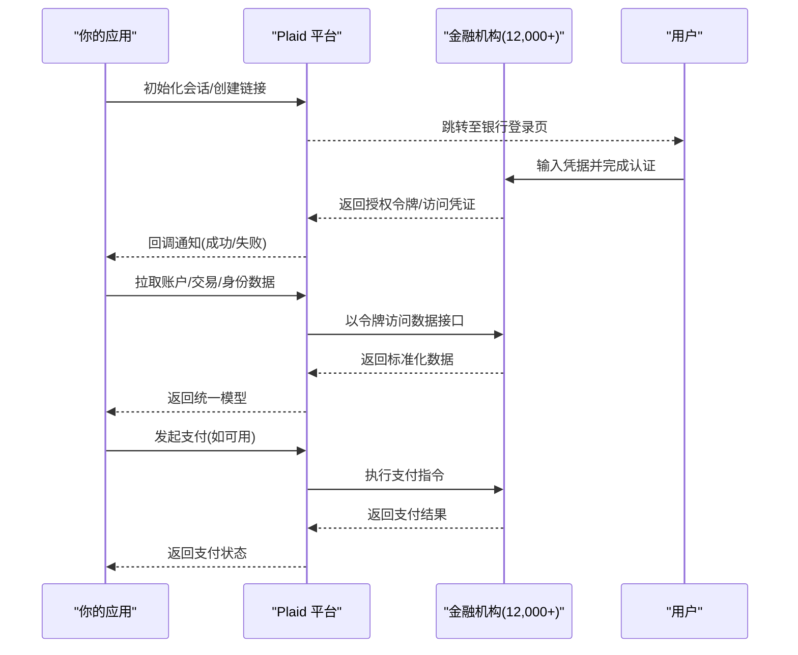
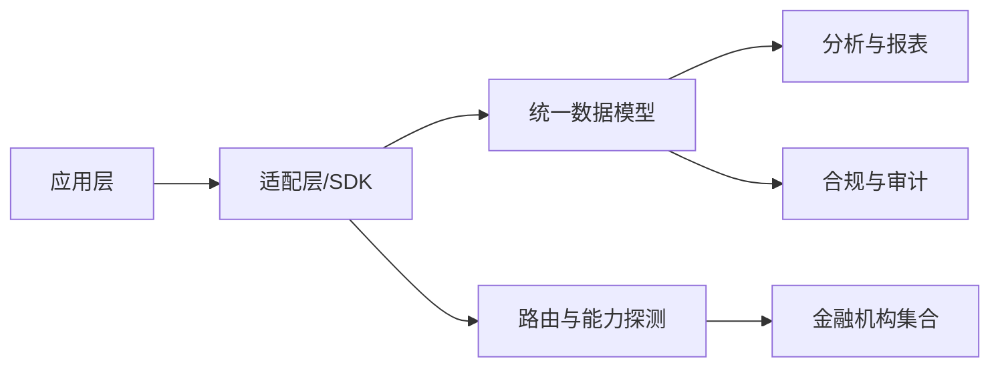

# Plaid - 金融数据连接

<cite>
**本文引用的文件**
- [README.md](file://README.md)
</cite>

## 目录
1. [简介](#简介)
2. [项目结构](#项目结构)
3. [核心组件](#核心组件)
4. [架构总览](#架构总览)
5. [详细组件分析](#详细组件分析)
6. [依赖关系分析](#依赖关系分析)
7. [性能考量](#性能考量)
8. [故障排查指南](#故障排查指南)
9. [结论](#结论)
10. [附录](#附录)

## 简介
本技术文档围绕 Plaid 的金融数据连接能力展开，聚焦账户聚合、交易数据获取、身份验证与支付发起等关键场景，解释其如何标准化对接海量金融机构，并面向个人理财、贷款平台与企业财务管理提供可复用的集成模式。同时给出开发者集成要点（API 调用思路、错误处理与最佳实践）、数据安全与隐私合规建议，帮助读者在真实业务中安全、稳定地落地 Plaid 能力。

说明：本文档基于仓库内现有信息对 Plaid 的定位与价值进行梳理，并结合通用行业实践补充实现层面的指导。

## 项目结构
当前仓库为“精选初创公司清单”，其中包含对 Plaid 的简要条目，用于定位其在金融科技基础设施中的角色与规模。

图表来源
- [README.md:950-980](file://README.md#L950-L980)

章节来源
- [README.md:950-980](file://README.md#L950-L980)

## 核心组件
- 金融数据连接器：统一接入 12,000+ 金融机构，屏蔽底层差异，输出标准化账户、交易、身份与支付相关数据模型。
- 账户聚合：将多机构账户信息归一化，支持余额、资产/负债、分类标签等维度。
- 交易流水：按时间线聚合交易明细，支持搜索、过滤、分类与汇总。
- 身份验证：通过银行级登录流程完成用户授权与强认证，确保访问合法合规。
- 支付发起：在具备支付能力的机构上，触发转账、付款或账单支付等动作（受机构能力与合规约束）。

章节来源
- [README.md:972-976](file://README.md#L972-L976)

## 架构总览
下图展示从应用侧到金融机构的典型数据流与交互环节，体现 Plaid 作为“标准化中间层”的作用。

图表来源
- [README.md:972-976](file://README.md#L972-L976)

## 详细组件分析

### 账户聚合
- 目标：将不同银行的账户结构、字段命名、分类方式统一为一致的数据模型，便于上层应用消费。
- 关键点：
  - 账户类型识别（支票、储蓄、信用卡、投资等）
  - 余额与可用额度管理
  - 账户层级与归属关系
  - 数据更新频率与增量同步策略
- 复杂度：主要取决于机构接口差异与数据质量；需设计容错与重试机制。

### 交易数据获取
- 目标：按时间线获取交易明细，支持筛选、聚合与分类。
- 关键点：
  - 分页与增量拉取，避免重复与遗漏
  - 交易分类与商户识别
  - 异常交易标记与去重
  - 历史回溯与归档策略
- 复杂度：高吞吐与低延迟要求下，需优化缓存与批处理。

### 身份验证
- 目标：以银行级安全流程完成用户授权，确保后续数据访问合法。
- 关键点：
  - 多因素认证与风控校验
  - 会话管理与令牌生命周期
  - 失败回退与引导用户重新授权
- 复杂度：跨机构认证协议差异大，需抽象统一流程。

### 支付发起
- 目标：在支持的机构上完成转账、付款或账单支付。
- 关键点：
  - 支付能力探测与降级路径
  - 金额、收款方与用途校验
  - 幂等性与对账
  - 合规审批与审计留痕
- 复杂度：受机构开放程度与监管限制影响较大。

### 典型使用模式
- 个人理财应用：账户聚合 + 交易分类 + 预算/洞察
- 贷款平台：收入/支出核验 + 信用评估辅助 + 还款自动化
- 企业财务管理：多主体账户视图 + 资金归集 + 费用管控

[本节为概念性说明，不直接分析具体代码文件]

## 依赖关系分析
- 外部依赖：
  - 金融机构 API（数量庞大且异构）
  - 网络与证书体系（TLS、双向认证等）
  - 第三方风控与反欺诈服务（可选）
- 内部耦合：
  - 数据模型层与适配器层的解耦
  - 事件驱动的消息总线（用于异步任务与重试）
  - 配置中心（机构能力矩阵、开关与灰度）

图表来源
- [README.md:972-976](file://README.md#L972-L976)

章节来源
- [README.md:972-976](file://README.md#L972-L976)

## 性能考量
- 并发与限流：针对高频拉取与批量写入实施限流与背压，避免下游机构拒绝。
- 缓存与去重：本地缓存热点账户与最近交易，结合唯一键去重。
- 重试与退避：指数退避与抖动，配合幂等键保障一致性。
- 分片与并行：按机构或租户维度分片，提升吞吐。
- 监控与告警：指标覆盖成功率、延迟、错误码分布与容量水位。

[本节提供通用指导，不直接分析具体代码文件]

## 故障排查指南
- 常见错误与处理：
  - 认证失败：检查凭据、MFA 流程与令牌有效期；提示用户重新授权。
  - 机构不可用：切换备用通道或降级为只读模式；记录并上报。
  - 数据不一致：核对源端变更日志，触发补偿与再同步。
  - 支付失败：校验金额与收款方，必要时转人工复核。
- 诊断手段：
  - 链路追踪：端到端 TraceID 贯穿请求
  - 日志规范：结构化日志，脱敏敏感字段
  - 指标看板：错误率、P95/P99 延迟、重试次数
  - 回放与沙箱：利用测试环境复现问题

[本节提供通用指导，不直接分析具体代码文件]

## 结论
Plaid 通过标准化接口与规模化连接，显著降低了接入海量金融机构的复杂度，使个人理财、贷款与企业财务等场景得以快速构建。实践中应重视数据模型抽象、错误恢复、性能优化与安全合规，以确保系统在高可用与合规前提下稳定运行。

[本节为总结性内容，不直接分析具体代码文件]

## 附录

### 开发者集成要点（概览）
- 初始化与授权：创建会话，引导用户完成银行登录与授权，接收回调。
- 数据读取：按账户/交易/身份维度拉取数据，注意分页与增量。
- 支付流程：先探测能力，再进行参数校验与幂等提交，最后对账。
- 错误处理：区分客户端错误、服务端错误与机构错误，制定重试与降级策略。
- 最佳实践：最小权限原则、数据脱敏、审计留痕、灰度发布与回滚预案。

[本节为概念性说明，不直接分析具体代码文件]

### 数据安全、隐私保护与合规
- 加密传输与存储：全链路 TLS，敏感数据静态加密。
- 访问控制：基于角色的细粒度权限与最小权限原则。
- 审计与合规：操作留痕、数据血缘、可追溯审计；遵循当地法规与行业标准。
- 隐私治理：数据最小化、目的限定、用户同意与撤回机制。

[本节为概念性说明，不直接分析具体代码文件]