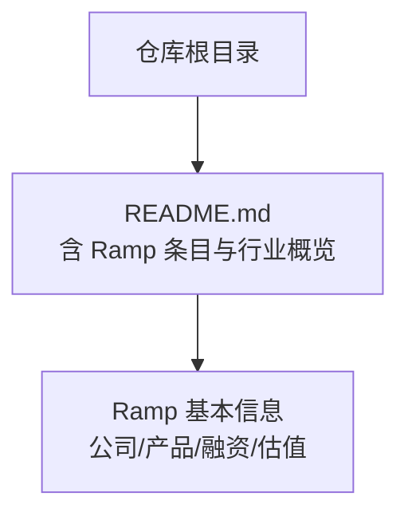
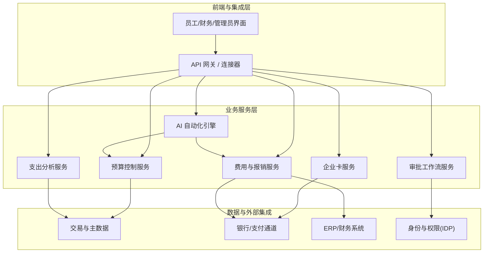
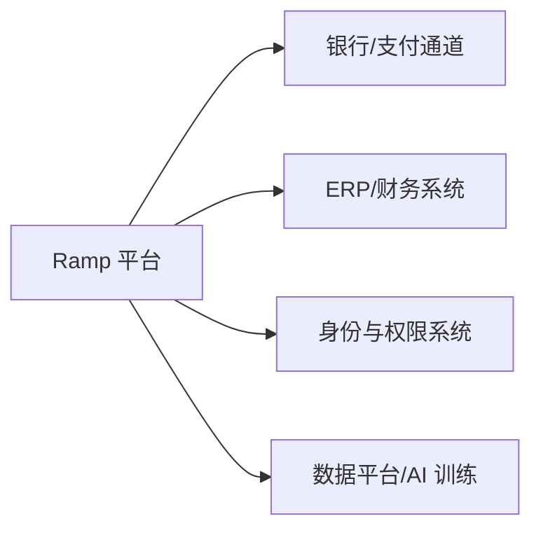

# Ramp - 企业开支管理

<cite>
**本文引用的文件**
- [README.md](file://README.md)
</cite>

## 目录
1. [简介](#简介)
2. [项目结构](#项目结构)
3. [核心组件](#核心组件)
4. [架构总览](#架构总览)
5. [详细组件分析](#详细组件分析)
6. [依赖关系分析](#依赖关系分析)
7. [性能考量](#性能考量)
8. [故障排查指南](#故障排查指南)
9. [结论](#结论)
10. [附录](#附录)

## 简介
本文件面向希望评估与部署 Ramp 企业开支管理平台的企业决策者、财务与内控负责人，以及实施工程师。文档基于仓库中提供的公开信息，系统梳理 Ramp 在企业卡发行、自动记账、费用审批工作流、预算控制与支出分析等方面的能力要点，并结合其 AI 驱动的自动化与风控能力，给出与传统费控软件（如 Concur）的差异化视角、企业级部署路径、合规与安全建议及 ROI 分析方法。

## 项目结构
当前仓库为“精选初创公司清单”，其中包含对 Ramp 的关键信息条目，用于支撑本文档的事实基础。该 README 提供了 Ramp 的公司背景、产品定位、融资与估值等关键事实，作为后续分析与建议的依据来源。

图表来源
- [README.md:836-841](file://README.md#L836-L841)

章节来源
- [README.md:836-841](file://README.md#L836-L841)

## 核心组件
基于仓库中对 Ramp 的描述，可归纳出以下与企业开支管理直接相关的核心能力维度：
- 企业卡发行与管理：面向企业员工的虚拟/实体卡发放、额度与权限控制、交易生命周期管理。
- 自动记账与对账：通过 API 与银行/支付通道对接，实现交易数据自动采集、分类与入账。
- 费用审批工作流：按规则与角色进行事前授权与事后审核，支持多级审批与例外处理。
- 预算控制：在部门/项目/成本中心层面设定预算阈值与预警机制，实时拦截超支。
- 支出分析：提供多维度的支出可视化、趋势洞察与异常检测，辅助管理层决策。

上述能力在 Ramp 的产品定位中被统一纳入“企业开支管理 + AI 财务自动化”的整体方案中，强调以自动化与智能手段提升效率与合规性。

章节来源
- [README.md:836-841](file://README.md#L836-L841)

## 架构总览
下图展示了一个典型的企业开支管理系统的分层架构，并与 Ramp 的能力域对应。该图为概念性架构图，用于帮助理解各模块之间的交互关系。

[此图为概念性架构图，不直接映射具体源码文件]

## 详细组件分析
### 企业卡发行与管理
- 目标：为企业员工快速发放虚拟/实体卡，并精细化控制使用范围、商户类别、单笔/累计限额、有效期等。
- 关键点：
  - 卡片生命周期管理：申请、激活、冻结、注销。
  - 权限模型：基于角色与策略的动态授权。
  - 风险控制：实时拦截可疑交易、黑名单商户管控。
- 与 AI 的结合：利用机器学习对交易模式进行建模，动态调整风险评分与拦截策略。

[本节为通用能力说明，不直接分析具体源码文件]

### 自动记账与对账
- 目标：将银行/支付流水自动转化为会计凭证，减少人工录入与差错。
- 关键点：
  - 数据接入：通过 API 或批量文件获取交易明细。
  - 分类与映射：按科目、成本中心、项目等维度自动归类。
  - 对账闭环：与 ERP/财务系统双向核对，差异自动提示。
- 与 AI 的结合：通过自然语言处理与历史数据训练，提高分类准确率与异常识别能力。

[本节为通用能力说明，不直接分析具体源码文件]

### 费用审批工作流
- 目标：建立标准化、可配置的费用审批流程，确保合规与效率平衡。
- 关键点：
  - 规则引擎：金额阈值、敏感商户、政策限制触发不同审批路径。
  - 多角色协同：申请人、直属主管、财务、合规等多节点流转。
  - 审计留痕：全流程记录，便于内审与外审追溯。
- 与 AI 的结合：智能路由与优先级排序，缩短高价值/高风险单据的处理时间。

[本节为通用能力说明，不直接分析具体源码文件]

### 预算控制
- 目标：在部门/项目/成本中心层面实现预算前置控制与实时预警。
- 关键点：
  - 预算模型：按周期（月/季/年）与维度（部门/项目/供应商）设置。
  - 控制策略：硬控制（禁止超支）与软控制（预警+审批升级）。
  - 预测与滚动：结合历史消耗与业务计划进行滚动预测。
- 与 AI 的结合：基于时序预测优化预算分配与预警阈值。

[本节为通用能力说明，不直接分析具体源码文件]

### 支出分析
- 目标：提供多维度支出可视化、趋势洞察与异常检测，驱动降本增效。
- 关键点：
  - 指标体系：花费率、节约率、合规率、周转天数等。
  - 可视化看板：按组织、品类、供应商、地区等维度下钻。
  - 异常检测：识别重复报销、超标消费、异常商户等。
- 与 AI 的结合：聚类与离群点检测，自动发现潜在浪费与合规风险。

[本节为通用能力说明，不直接分析具体源码文件]

### AI 技术：智能分类与异常检测
- 智能分类：
  - 输入：交易描述、商户名称、金额、时间、历史标签等。
  - 方法：监督学习与无监督学习结合，持续迭代提升准确率。
  - 输出：自动匹配会计科目、成本中心、项目编码等。
- 异常检测：
  - 信号：高频小额、非工作时间、敏感商户、跨区消费等。
  - 方法：统计模型与机器学习模型联合判断，降低误报。
  - 处置：自动标记、升级审批、冻结卡片或账户。

[本节为通用能力说明，不直接分析具体源码文件]

## 依赖关系分析
从企业级落地角度，Ramp 需要与以下外部系统或服务集成：
- 银行/支付通道：获取交易流水、执行扣款与结算。
- ERP/财务系统：同步凭证、主数据与预算信息。
- 身份与权限系统：统一用户、角色与访问控制。
- 数据平台：存储与分析交易与行为数据，支撑 AI 模型训练与报表生成。

[此图为概念性依赖图，不直接映射具体源码文件]

## 性能考量
- 吞吐与延迟：在高并发交易场景下，需保证卡片授权、费用校验与审批路由的低延迟响应。
- 可扩展性：采用微服务与事件驱动架构，按需扩展计算与存储资源。
- 数据一致性：分布式事务与补偿机制确保账务一致性与对账准确。
- 容灾与备份：多可用区部署、定期快照与演练恢复流程。
- 监控与告警：全链路追踪、关键指标监控与分级告警。

[本节为通用指导，不直接分析具体源码文件]

## 故障排查指南
- 常见问题定位：
  - 交易失败：检查银行接口状态、风控规则命中、额度与权限。
  - 对账差异：核对原始流水、分类映射、汇率与币种转换。
  - 审批卡顿：确认流程配置、角色权限、附件与必填字段。
- 诊断工具与日志：
  - 启用请求追踪与错误码映射，集中收集日志。
  - 建立数据质量看板，监控关键字段缺失与异常值。
- 应急措施：
  - 临时降级：关闭非关键功能，保障核心交易与审批。
  - 回滚与修复：版本回退、规则修正与数据修复脚本。

[本节为通用指导，不直接分析具体源码文件]

## 结论
Ramp 以“企业开支管理 + AI 财务自动化”为核心定位，聚焦于企业卡、自动记账、审批工作流、预算控制与支出分析的全链路数字化。结合其在市场中的高增长与高估值表现，表明其产品与市场契合度较强。企业在选择与部署时，应结合自身合规要求、系统集成复杂度与人才能力，制定分阶段实施方案，并通过明确的 ROI 指标衡量成效。

[本节为总结性内容，不直接分析具体源码文件]

## 附录
### 与传统费控软件（如 Concur）的差异化视角
- 自动化程度：Ramp 强调 AI 驱动的自动化分类、异常检测与审批路由，减少人工干预。
- 体验与速度：面向现代企业的轻量化与敏捷化设计，提升员工与财务的使用效率。
- 生态整合：更贴近 API-first 的集成方式，便于与 ERP、银行与数据平台打通。
- 风险与合规：内置风控策略与实时监控，强化事前与事中控制。

[本节为通用对比说明，不直接分析具体源码文件]

### 企业部署实施指南
- 需求调研：明确预算、审批、对账、报表与合规的具体诉求。
- 系统集成：规划银行、ERP、IDP 的数据对接与权限模型。
- 数据迁移：清洗与映射历史数据，确保科目、成本中心与项目编码一致。
- 培训与推广：针对员工、审批者与财务人员开展分层培训。
- 上线与运维：灰度发布、监控告警、问题闭环与持续优化。

[本节为通用实施指导，不直接分析具体源码文件]

### ROI 分析方法
- 成本节约：减少手工录入、对账与纠错成本；降低违规与罚款风险。
- 效率提升：缩短审批周期与结账时间，提高财务与业务响应速度。
- 资金占用：优化付款节奏与现金流管理，降低资金占用成本。
- 指标体系：定义基线与目标，跟踪节省金额、周期缩短比例与合规率变化。

[本节为通用方法论，不直接分析具体源码文件]

### 监管合规与数据安全
- 合规框架：遵循当地财税法规、反洗钱与隐私保护要求。
- 数据治理：最小化采集、加密传输与存储、访问控制与审计。
- 安全实践：零信任架构、威胁检测与应急响应预案。
- 第三方审计：引入独立审计与认证，增强可信度。

[本节为通用合规建议，不直接分析具体源码文件]