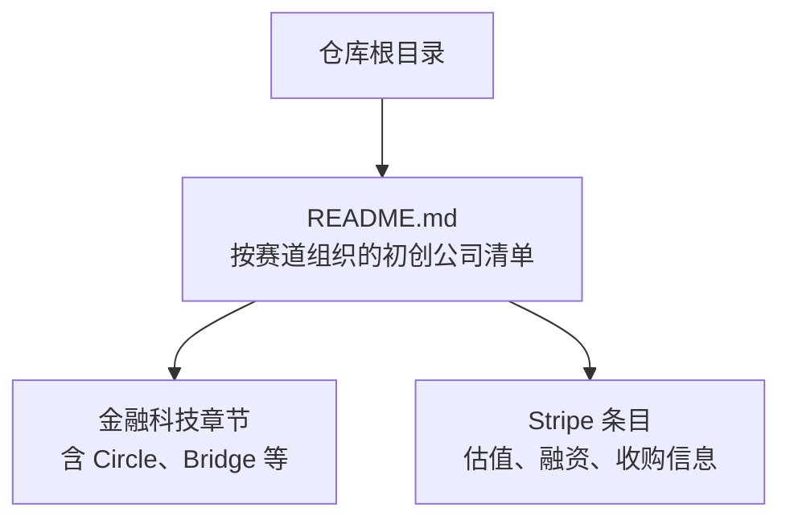
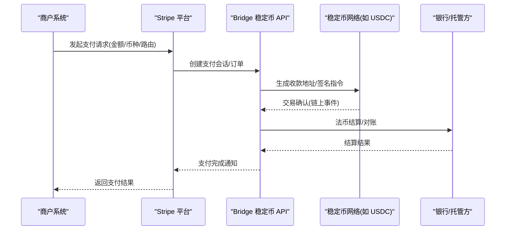
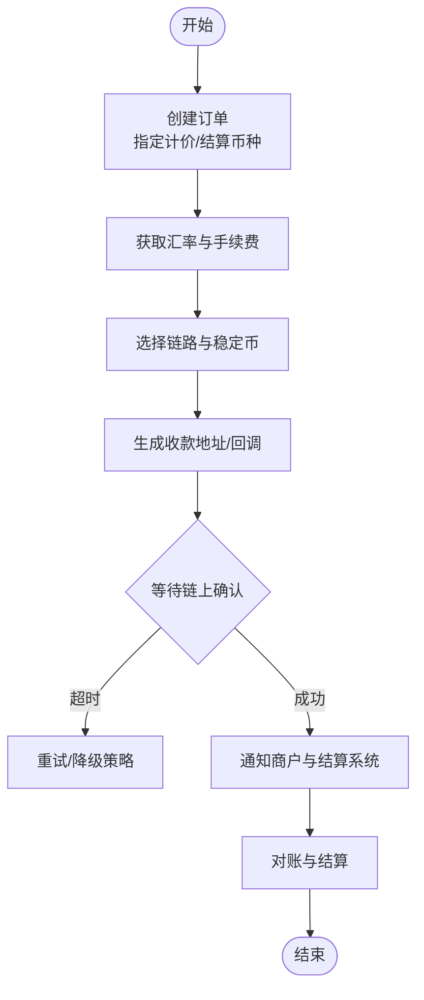
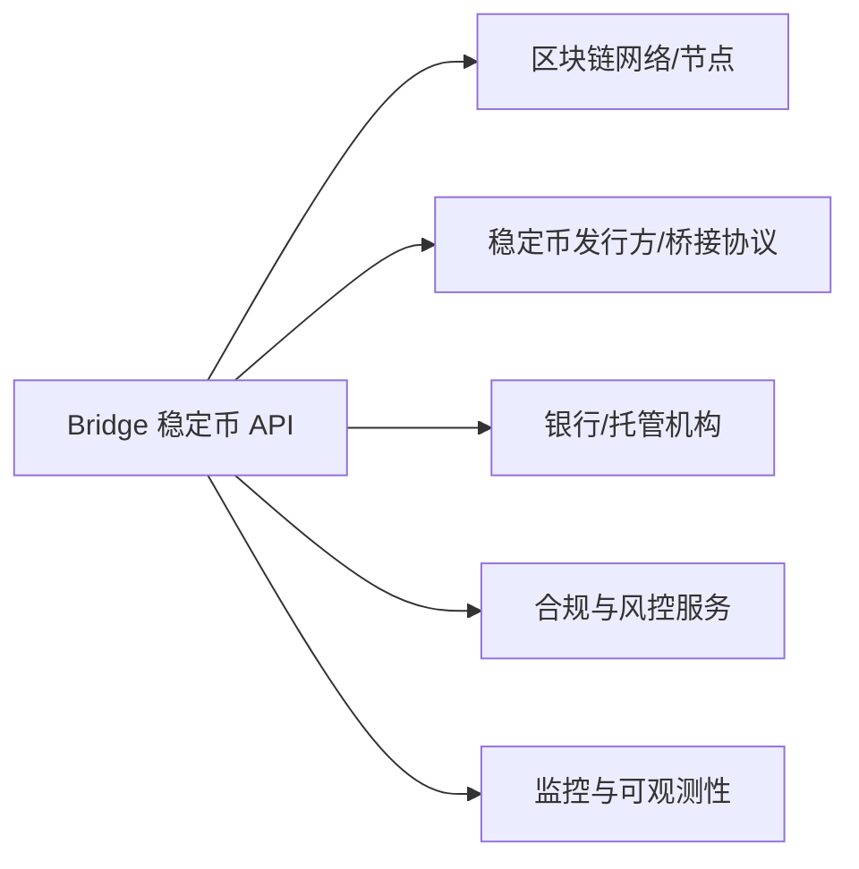

# Bridge - Stripe 子公司稳定币 API

<cite>
**本文引用的文件**
- [README.md](file://README.md)
</cite>

## 目录
1. [简介](#简介)
2. [项目结构](#项目结构)
3. [核心组件](#核心组件)
4. [架构总览](#架构总览)
5. [详细组件分析](#详细组件分析)
6. [依赖关系分析](#依赖关系分析)
7. [性能考量](#性能考量)
8. [故障排查指南](#故障排查指南)
9. [结论](#结论)
10. [附录](#附录)

## 简介
本文件基于仓库内容，系统性梳理 Bridge 作为 Stripe 子公司的稳定币 API 服务在加密支付基础设施中的角色与技术实现要点。重点包括：
- Stripe 收购 Bridge 的战略意义与对传统金融体系整合加密货币支付的推动
- 稳定币支付的关键流程、API 集成思路与合规要点
- 面向开发者的集成路径与最佳实践建议

说明：本仓库为初创公司清单文档，未包含 Bridge 的源代码或接口规范；本文所有技术细节均基于公开信息与通用行业实践进行归纳，并结合仓库中关于 Stripe 与 Bridge 的信息进行解读。

## 项目结构
仓库为单一 README 文档，按赛道组织头部初创公司信息，其中包含 Stripe 与 Bridge 的相关条目，用于理解其在金融科技与加密金融生态中的定位。

图表来源
- [README.md:159-164](file://README.md#L159-L164)
- [README.md:898-908](file://README.md#L898-L908)

章节来源
- [README.md:159-164](file://README.md#L159-L164)
- [README.md:898-908](file://README.md#L898-L908)

## 核心组件
围绕 Bridge 的稳定币 API 服务，可抽象出以下关键组件与职责：
- 支付网关层：对外暴露统一 API，屏蔽底层链路与稳定币差异
- 结算与清算层：对接银行/托管方，完成法币与稳定币之间的转换与结算
- 合规与风控层：KYC/KYB、交易监控、制裁名单筛查、审计留痕
- 钱包与密钥管理：多签、热冷分离、MPC/TEE 等安全方案
- 数据与可观测性：指标、日志、追踪、报表与对账

这些组件共同构成“从商户到链上”的端到端支付能力，使企业能以熟悉的方式接入稳定币支付。

[本节为概念性总结，不直接分析具体文件]

## 架构总览
下图展示典型稳定币支付流程中各参与方的交互顺序，体现 Bridge 在 Stripe 生态中的位置。

图表来源
- [README.md:159-164](file://README.md#L159-L164)
- [README.md:898-908](file://README.md#L898-L908)

## 详细组件分析

### 支付流程与 API 集成示例
- 订单创建：商户调用 API 创建订单，指定计价货币与结算货币（例如 USD 计价，USDC 结算）
- 价格与汇率：实时获取稳定币汇率，支持滑点保护与最小成交阈值
- 支付路由：根据商户配置选择链路与稳定币（EVM/Solana 等），并生成收款地址或智能合约回调
- 确认与回调：监听链上事件，触发回调通知商户与内部结算系统
- 结算与对账：将稳定币兑换为法币或转入托管账户，完成对账与报表输出

[本节为概念性流程图，不直接映射具体源码文件]

### 合规与风控要点
- KYC/KYB：对商户与最终用户进行身份核验与背景调查
- 交易监控：异常模式检测、黑名单与制裁名单筛查
- 审计与留存：全链路日志、不可篡改记录与监管报送
- 地域合规：遵循不同司法辖区对稳定币与跨境支付的监管要求

[本节为通用合规要点，不直接分析具体文件]

### 安全与密钥管理
- 多签与 MPC：降低单点风险，提升资金安全性
- 冷热钱包：大额资金离线存储，日常运营使用热钱包
- 访问控制：最小权限原则、操作审批流与双人复核
- 安全审计：定期渗透测试与第三方审计

[本节为通用安全要点，不直接分析具体文件]

## 依赖关系分析
Bridge 的稳定币 API 通常依赖以下外部实体与内部模块：
- 区块链网络与节点：提供交易广播与事件监听
- 稳定币发行方与桥接协议：确保资产可用性与流动性
- 银行与托管机构：完成法币出入金与合规结算
- 风控与合规服务：KYC、AML、制裁筛查
- 可观测性与监控系统：保障高可用与快速排障

[本节为概念性依赖图，不直接映射具体源码文件]

## 性能考量
- 低延迟与高吞吐：优化 RPC 调用、批量处理与缓存策略
- 链上确认时间：采用多链并行与确认阈值策略平衡速度与确定性
- 可扩展性：微服务化拆分、弹性扩缩容与消息队列削峰
- 容灾与回滚：多活部署、灰度发布与快速回滚机制

[本节为通用性能建议，不直接分析具体文件]

## 故障排查指南
常见问题与处理建议：
- 链上确认失败：检查 Gas 设置、网络拥堵与目标合约状态
- 汇率波动导致失败：启用价格保护窗口与最小成交阈值
- 合规拦截：核对 KYC/KYB 状态与制裁名单匹配结果
- 对账不一致：核查链上哈希、区块高度与内部流水号映射

[本节为通用故障排查建议，不直接分析具体文件]

## 结论
Bridge 作为 Stripe 的子公司与稳定币 API 提供者，在加密支付基础设施中扮演“桥梁”角色，帮助传统金融机构与企业以标准化方式接入稳定币支付。Stripe 通过收购 Bridge，强化其在企业计费与区块链领域的布局，推动法币与加密资产的无缝融合。对于开发者而言，借助稳定的 API 与完善的合规、风控与安全能力，可以更快构建面向未来的支付产品。

[本节为总结性内容，不直接分析具体文件]

## 附录
- 相关参考
  - Stripe 条目：估值、融资与收购信息
  - Bridge 条目：稳定币 API 与加密金融定位
  - Circle 条目：合规稳定币标杆

章节来源
- [README.md:159-164](file://README.md#L159-L164)
- [README.md:898-908](file://README.md#L898-L908)