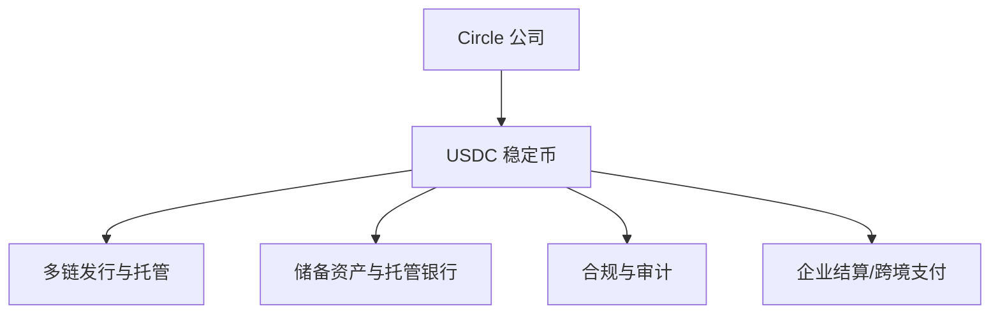
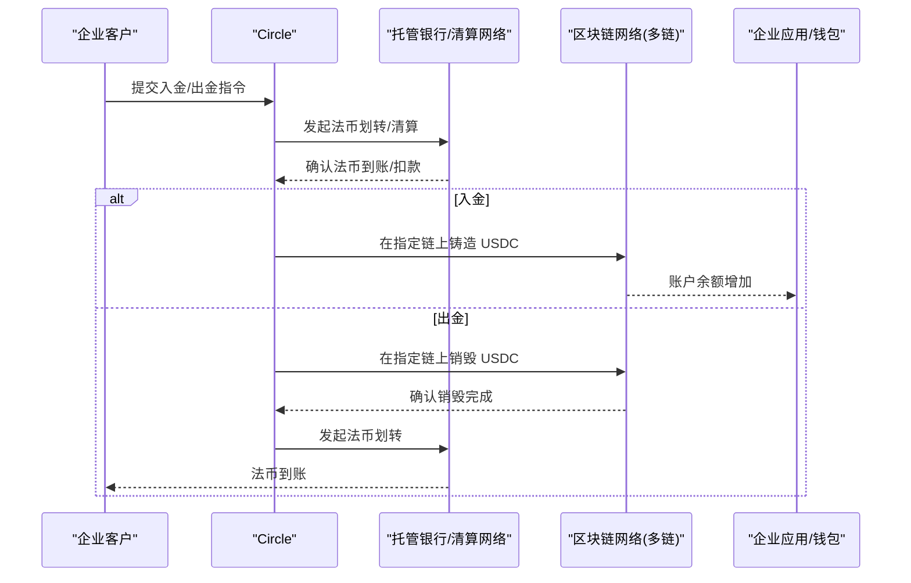
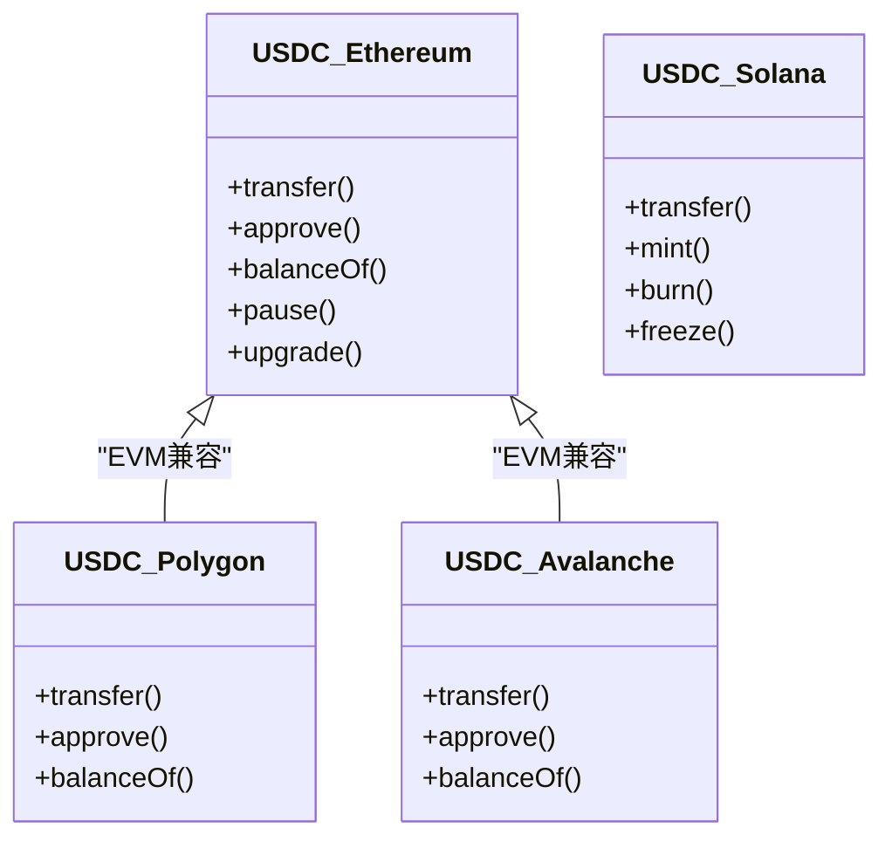
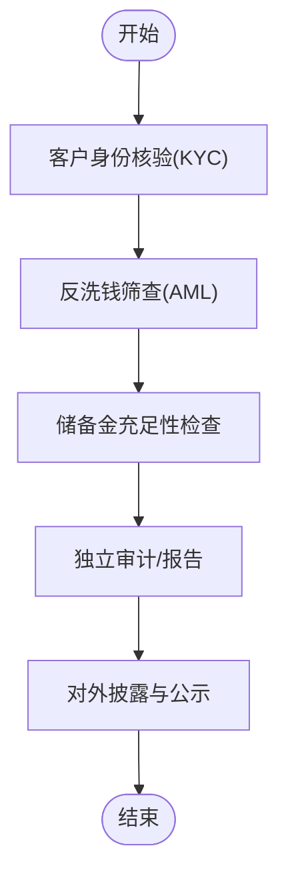
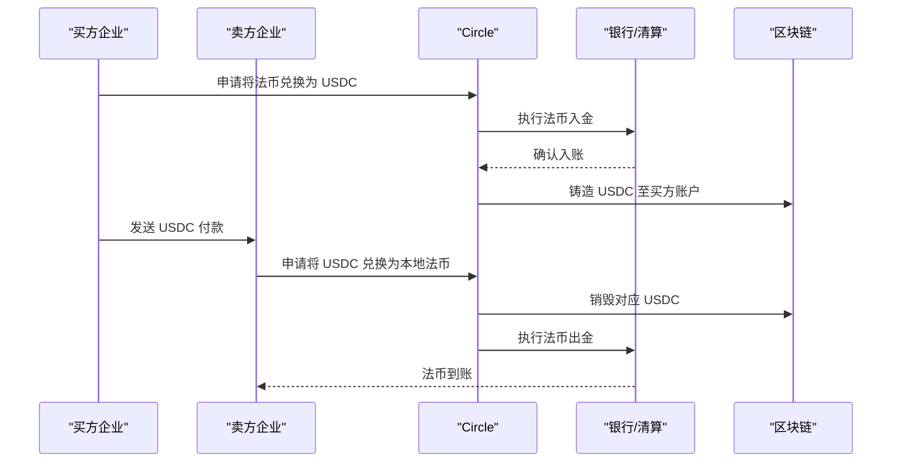
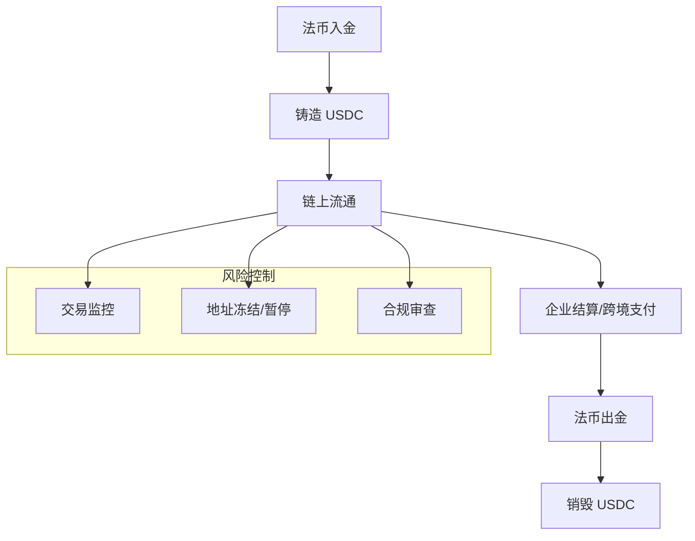
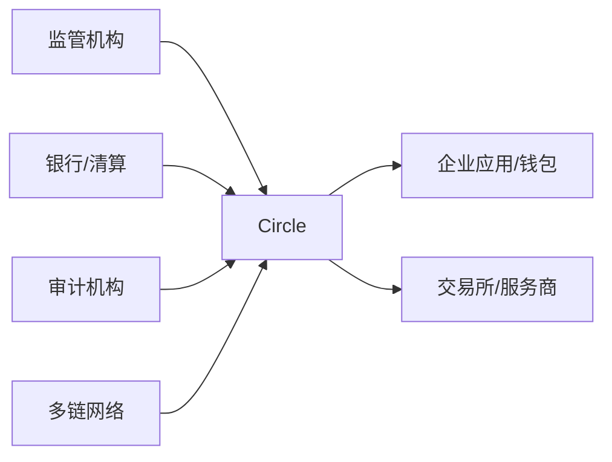

# Circle - USDC 稳定币

<cite>
**本文引用的文件**
- [README.md](file://README.md)
</cite>

## 目录
1. [引言](#引言)
2. [项目结构](#项目结构)
3. [核心组件](#核心组件)
4. [架构总览](#架构总览)
5. [详细组件分析](#详细组件分析)
6. [依赖关系分析](#依赖关系分析)
7. [性能与合规考量](#性能与合规考量)
8. [故障排查指南](#故障排查指南)
9. [结论](#结论)
10. [附录](#附录)

## 引言
本文件围绕 Circle 公司及其 USDC 稳定币，系统梳理技术架构、合规策略与商业模式，并结合其在纽约证券交易所（NYSE）上市后的发展轨迹，探讨监管合规、储备金管理与跨境支付应用。重点分析 USDC 与美元挂钩机制、审计透明度与风险控制措施，并提供在企业结算与跨境汇款中的应用案例及风险评估。

## 项目结构
当前仓库为“精选初创公司”清单文档，其中包含对 Circle 的简要条目，作为本专题的背景信息。基于该背景，本文在公开可验证信息基础上进行结构化扩展，形成面向企业与技术读者的专业文档。

[本节为概念性结构说明，不直接引用具体代码或文件]

## 核心组件
- 稳定币发行与销毁：由 Circle 在受控流程中根据法币入金/出金指令在多条区块链上铸造与销毁 USDC。
- 储备资产管理：以高流动性、低风险的美元资产（如现金与短期国债等）作为支撑，确保 1:1 兑付能力。
- 合规与审计：遵循美国监管框架，定期披露储备金状况，接受独立第三方审计与报告。
- 多链生态集成：USDC 在以太坊、Solana、Polygon、Avalanche 等多条公链部署，提供标准化接口供开发者与企业使用。
- 企业级服务：通过 API、SDK 与托管方案，为企业客户提供资金流转、结算、汇兑与合规工具。

**章节来源**
- [README.md:792-795](file://README.md#L792-L795)

## 架构总览
下图展示 USDC 从法币到链上资产的端到端流程，以及企业用户的使用路径。

**图表来源**
- [README.md:792-795](file://README.md#L792-L795)

**章节来源**
- [README.md:792-795](file://README.md#L792-L795)

## 详细组件分析

### 技术架构：多链发行与智能合约
- 多链部署：USDC 在以太坊、Solana、Polygon、Avalanche 等主流公链均有部署，便于不同生态的企业与开发者接入。
- 标准接口：各链上的 USDC 合约遵循相应代币标准（如 ERC-20），提供转账、授权、余额查询等基础能力。
- 治理与升级：关键权限（如暂停、升级）通常由受控的多签或治理机制管理，确保在极端情况下可快速响应风险事件。

**图表来源**
- [README.md:792-795](file://README.md#L792-L795)

**章节来源**
- [README.md:792-795](file://README.md#L792-L795)

### 合规策略：监管与审计
- 监管框架：在美国市场运营需满足反洗钱（AML）、了解你的客户（KYC）与证券/货币传输相关法规要求；上市后需遵循交易所信息披露与财务合规。
- 储备金透明：定期发布储备金报告，由独立第三方机构进行审计或审阅，确保 USDC 始终具备足额且高质量的美元资产支持。
- 风险控制：建立暂停交易、冻结地址、黑名单等风控能力，配合监管执法与司法程序，降低滥用与非法活动风险。

**图表来源**
- [README.md:792-795](file://README.md#L792-L795)

**章节来源**
- [README.md:792-795](file://README.md#L792-L795)

### 商业模式：企业结算与跨境支付
- 企业结算：利用 USDC 实现实时、低成本、可追踪的全球结算，减少传统代理行模式中的中间环节与时间成本。
- 跨境汇款：结合多链网络与合规通道，为跨国企业提供高效、透明的跨境资金转移方案。
- 收入来源：包括托管费、交易手续费、API 调用费、增值服务（如合规工具、报表与分析）等。

**图表来源**
- [README.md:792-795](file://README.md#L792-L795)

**章节来源**
- [README.md:792-795](file://README.md#L792-L795)

### 挂钩机制、审计与风险控制
- 挂钩机制：USDC 以 1:1 锚定美元，通过严格的准备金管理与托管安排维持稳定性；在市场波动时依靠高质量流动资产保障兑付。
- 审计透明度：按周期发布储备金明细与审计报告，增强市场信任与监管合规。
- 风险控制：实施交易监控、异常检测、地址冻结与暂停功能，配合监管要求与法律程序，防范系统性风险。

**图表来源**
- [README.md:792-795](file://README.md#L792-L795)

**章节来源**
- [README.md:792-795](file://README.md#L792-L795)

## 依赖关系分析
- 外部依赖：银行与清算网络（法币出入金）、托管机构（资产保管）、审计机构（储备金审计）、监管机构（合规监督）。
- 内部依赖：合规团队（KYC/AML）、产品与工程团队（多链合约与 API）、风控与法务团队（风险控制与监管对接）。
- 生态依赖：多链生态（以太坊、Solana 等）、企业应用与钱包、支付网关与服务商。

**图表来源**
- [README.md:792-795](file://README.md#L792-L795)

**章节来源**
- [README.md:792-795](file://README.md#L792-L795)

## 性能与合规考量
- 性能特征：多链并行处理提升吞吐与可用性；选择合适链可降低费用与延迟；批量结算与聚合优化提升效率。
- 合规要点：严格 KYC/AML 流程、持续监控与报告、及时响应监管问询与执法要求；上市后强化信息披露与内控。
- 风险管理：储备金质量与流动性管理、压力测试与应急预案、智能合约安全与升级治理、数据隐私与安全。

[本节为通用指导，不直接引用具体代码或文件]

## 故障排查指南
- 常见故障：链拥堵导致确认延迟、跨链桥接失败、托管银行结算超时、合规审核未通过。
- 排查步骤：
  - 确认链上状态与区块确认数，必要时切换至低拥堵链或提高 Gas 优先级。
  - 核对托管银行流水与清算状态，联系银行确认异常原因。
  - 复核 KYC/AML 结果与合规审批进度，补充必要材料。
  - 若涉及智能合约交互，检查参数、授权与权限设置。
- 应急措施：启用暂停/冻结机制，通知受影响用户，发布公告并协调修复。

[本节为通用指导，不直接引用具体代码或文件]

## 结论
Circle 的 USDC 稳定币在多链生态中提供了合规、透明、高效的全球结算与跨境支付基础设施。其技术架构强调多链兼容与企业级能力，合规策略聚焦 KYC/AML、储备金透明与审计披露，商业模式围绕企业结算与跨境汇款展开。上市后，Circle 需在信息披露、内控与监管协同方面持续提升，以巩固其作为合规稳定币标杆的地位。

[本节为总结性内容，不直接引用具体代码或文件]

## 附录
- 术语解释：
  - 稳定币：与法定货币或其他资产保持固定汇率的加密货币。
  - 托管：由持牌机构保管数字资产与法币，确保安全与合规。
  - 审计：由独立第三方对储备金与财务报表进行核查与报告。
- 参考来源：
  - 本专题基于仓库中对 Circle 的条目信息进行扩展与结构化整理。

**章节来源**
- [README.md:792-795](file://README.md#L792-L795)