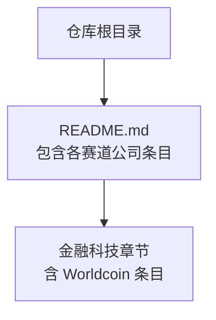
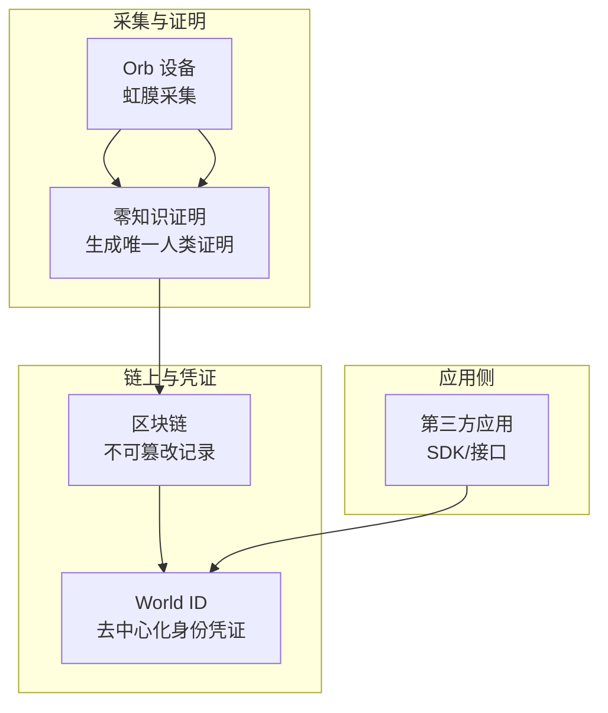
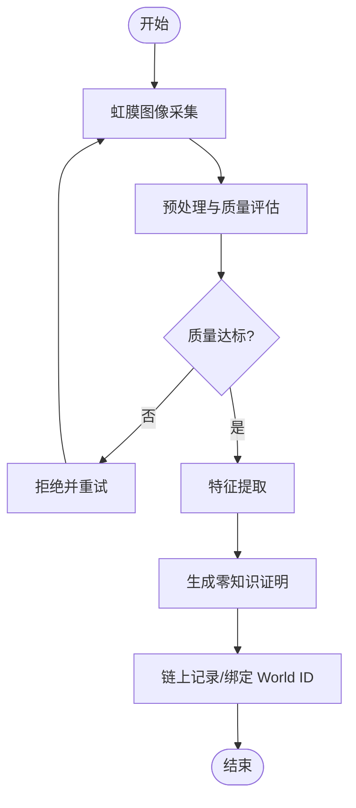
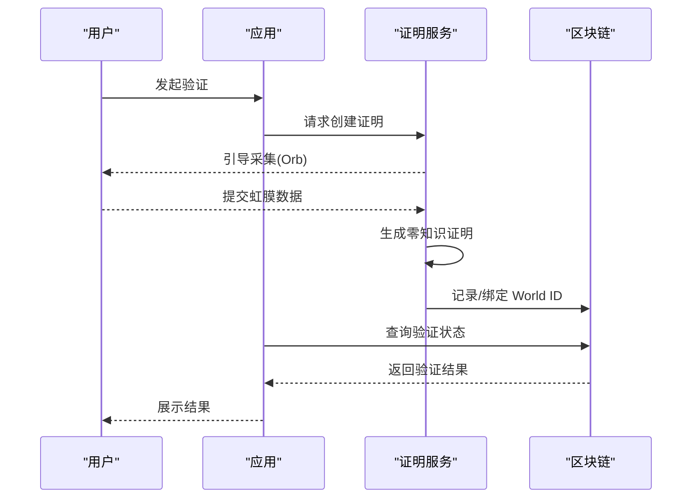
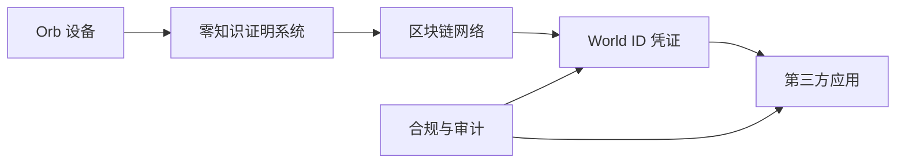

# Worldcoin - 生物识别数字身份

<cite>
**本文引用的文件**   
- [README.md](file://README.md)
</cite>

## 目录
1. [简介](#简介)
2. [项目结构](#项目结构)
3. [核心组件](#核心组件)
4. [架构总览](#架构总览)
5. [详细组件分析](#详细组件分析)
6. [依赖关系分析](#依赖关系分析)
7. [性能与安全考量](#性能与安全考量)
8. [故障排查指南](#故障排查指南)
9. [结论](#结论)
10. [附录](#附录)

## 简介
本文件基于仓库中的公开信息，对由 Sam Altman 参与创办的 Worldcoin 项目进行专业梳理与解读。Worldcoin 以“虹膜识别 + 区块链”为核心，提供全球可部署的数字身份方案（World ID），并围绕隐私保护、合规治理与规模化落地展开。本文聚焦其技术架构要点、隐私保护措施、全球部署策略、争议与监管挑战，以及生物识别数据的安全存储与验证机制说明，帮助读者在有限技术背景下理解该项目的关键设计与风险点。

## 项目结构
当前仓库为一份面向初创公司的清单文档，其中包含对 Worldcoin 的条目性描述。因此，本文档不映射到具体代码实现，而是依据仓库中提供的信息，结合通用技术知识进行结构化阐述，便于非技术读者理解。

图表来源
- [README.md:989-994](file://README.md#L989-L994)

章节来源
- [README.md:989-994](file://README.md#L989-L994)

## 核心组件
根据仓库内容，Worldcoin 的核心要素包括：
- 创始人背景：Sam Altman、Alex Blania
- 成立时间：2019 年
- 核心产品：虹膜识别 + World ID
- 估值与定位：估值约 $10B+；定位为“全球最大生物识别项目”，强调创新与争议并存

这些要点构成了后续技术分析与讨论的基础。

章节来源
- [README.md:989-994](file://README.md#L989-L994)

## 架构总览
Worldcoin 的技术架构通常包含以下层次（概念性示意）：
- 采集层：通过 Orb 设备完成虹膜图像采集与预处理
- 证明生成层：将虹膜特征转化为零知识证明（ZK Proof），确保仅输出“唯一人类”声明而不泄露原始生物特征
- 链上记录层：将证明与用户标识（World ID）关联，写入区块链以实现不可篡改的可验证凭证
- 应用集成层：第三方应用通过 SDK/接口校验 World ID，完成“人类唯一性”验证

图示说明
- 该图为概念性架构图，用于帮助理解“采集—证明—链上—应用”的整体流程，并非直接对应仓库中的具体代码或模块。

## 详细组件分析

### 虹膜识别与零知识证明
- 目标：在不暴露原始虹膜数据的前提下，生成可被全局验证的“唯一人类”证明
- 关键点：
  - 采集质量与防伪：需抵御照片/视频/模型等伪造攻击
  - 证明大小与验证成本：影响移动端与链上验证效率
  - 抗重放与抗克隆：确保证明不可复用、不可转移至他人

### World ID 凭证与应用集成
- 作用：作为可移植的去中心化身份凭证，供应用调用以验证“人类唯一性”
- 典型流程：
  - 用户在应用中发起验证
  - 应用引导完成采集与证明生成
  - 应用向链上或服务端请求验证结果
  - 返回“通过/失败”及必要元数据

### 隐私保护与合规设计
- 最小化原则：仅输出必要的“唯一人类”声明，避免上传原始生物特征
- 本地化处理：尽可能在设备端完成敏感数据处理，减少传输面
- 可撤销与可控共享：支持用户对凭证的使用范围与有效期进行控制
- 合规对齐：遵循各地数据保护法规（如 GDPR、CCPA 等），提供透明审计与退出机制

### 全球部署策略
- 设备网络：通过分布式 Orb 节点覆盖多地区，提升可访问性与容灾能力
- 多链兼容：在不同公链上部署合约，兼顾性能、成本与生态
- 合作伙伴：与政府、企业、开发者生态合作，推动标准化接入
- 渐进式开放：优先在合规友好地区试点，逐步扩展

### 争议与监管挑战
- 隐私担忧：公众对集中式生物识别数据库的顾虑
- 安全事件：若发生泄露或滥用，影响巨大且难以修复
- 法律合规：各国对生物识别数据的收集、存储、跨境传输有不同限制
- 社会接受度：需要透明的治理机制与独立的监督机构

## 依赖关系分析
从仓库条目可见，Worldcoin 处于“金融科技/加密”领域，并与 Web3 生态存在天然耦合。其依赖关系可概括为：
- 硬件依赖：Orb 设备的供应链与质量控制
- 密码学依赖：零知识证明系统与椭圆曲线等基础算法
- 区块链依赖：公链稳定性、Gas 成本、跨链互操作
- 应用生态依赖：SDK/API 的易用性与安全性
- 合规依赖：与监管机构沟通、认证与审计

## 性能与安全考量
- 性能
  - 证明生成延迟：优化证明大小与计算复杂度，降低用户等待时间
  - 链上验证成本：选择合适链与共识机制，平衡吞吐与费用
  - 并发与可扩展：水平扩展证明服务与索引层，支撑大规模验证
- 安全
  - 防注入与反作弊：强化采集端与传输链路安全
  - 密钥管理：采用硬件安全模块（HSM）、多方计算（MPC）等技术
  - 漏洞响应：建立快速补丁与回滚机制，定期渗透测试

## 故障排查指南
- 常见问题
  - 采集失败：检查设备校准、光照条件、用户配合度
  - 证明生成超时：评估网络状况与服务负载，必要时重试或降级
  - 链上确认慢：切换低拥堵时段或调整 Gas 策略
  - 应用集成错误：核对 SDK 版本、签名与回调处理
- 诊断步骤
  - 日志采集：保留端到端追踪 ID
  - 复现路径：最小化用例复现问题
  - 指标监控：关注成功率、延迟、错误码分布
  - 回归验证：修复后全链路回归测试

## 结论
Worldcoin 试图以“虹膜识别 + 零知识证明 + 区块链”构建全球可验证的数字身份体系。其优势在于可移植的身份凭证与强隐私保护潜力；挑战则集中在隐私信任、安全韧性、合规适配与规模化运营。未来发展方向应聚焦于：
- 持续优化证明效率与用户体验
- 强化独立审计与透明治理
- 深化与监管机构的协作与标准共建
- 拓展高质量应用场景，形成正向飞轮

## 附录
- 术语解释
  - 零知识证明（ZKP）：在不泄露任何额外信息的情况下，使验证者确信某陈述为真
  - 去中心化身份（DID）：由用户掌控、可跨平台使用的数字身份凭证
  - Orb：用于虹膜采集的设备
- 参考来源
  - 仓库中对 Worldcoin 的条目性描述（创始人、成立年份、核心产品、估值与定位）

章节来源
- [README.md:989-994](file://README.md#L989-L994)