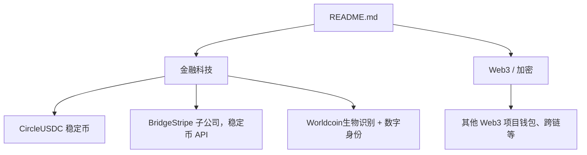
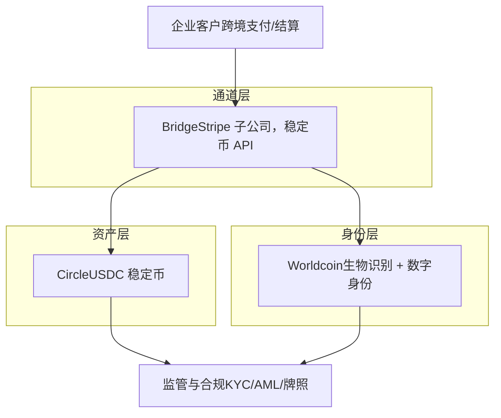
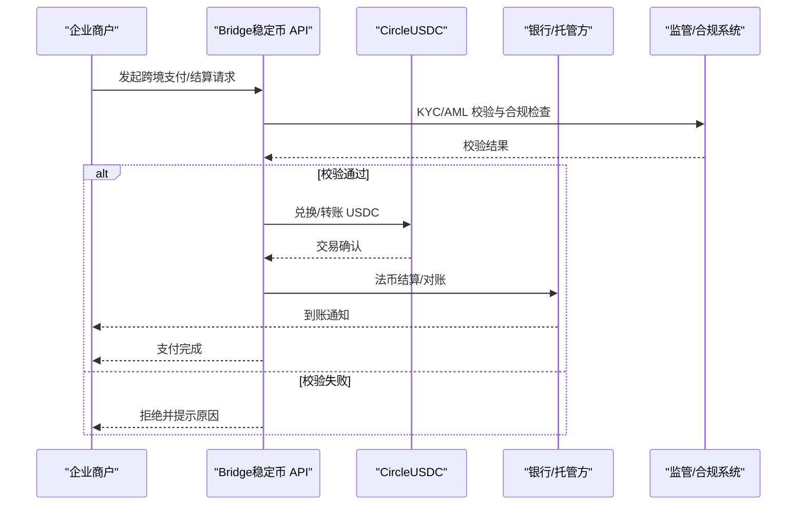
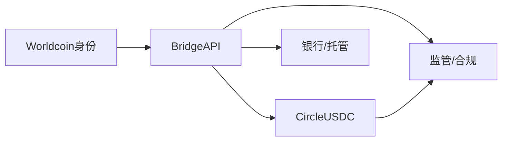

# 加密金融

<cite>
**本文引用的文件**
- [README.md](file://README.md)
</cite>

## 目录
1. [引言](#引言)
2. [项目结构](#项目结构)
3. [核心组件](#核心组件)
4. [架构总览](#架构总览)
5. [详细组件分析](#详细组件分析)
6. [依赖关系分析](#依赖关系分析)
7. [性能与合规考量](#性能与合规考量)
8. [故障排查指南](#故障排查指南)
9. [结论](#结论)
10. [附录](#附录)

## 引言
本文件聚焦加密金融领域的技术创新与商业模式，围绕稳定币、支付基础设施与数字身份三大主题展开。基于仓库中“金融科技”与“Web3/加密”板块的信息，重点剖析 Circle（USDC 稳定币）、Bridge（Stripe 子公司，稳定币 API）与 Worldcoin（生物识别+数字身份）的技术路径、商业落地与监管合规策略，并探讨稳定币在跨境支付与企业结算中的应用场景，最后给出风险评估与投资建议。

## 项目结构
该仓库以 Markdown 文档形式呈现，按赛道组织初创公司清单，其中“金融科技”与“Web3/加密”章节包含加密金融相关条目，为本文提供事实性背景与参考信息。

图表来源
- [README.md:716-771](file://README.md#L716-L771)
- [README.md:773-808](file://README.md#L773-L808)

章节来源
- [README.md:716-771](file://README.md#L716-L771)
- [README.md:773-808](file://README.md#L773-L808)

## 核心组件
- Circle（USDC 稳定币）：合规稳定币标杆，已上市，强调透明与合规的美元稳定资产发行与托管。
- Bridge（Stripe 子公司，稳定币 API）：被 Stripe 收购，提供稳定币 API，助力企业接入加密支付与结算。
- Worldcoin（Tools for Humanity）：虹膜识别与 World ID 的数字身份方案，面向全球大规模生物识别验证与去中心化身份。

章节来源
- [README.md:743-760](file://README.md#L743-L760)

## 架构总览
从产品与生态视角，三家公司分别覆盖“资产层（稳定币）—通道层（支付 API）—身份层（数字身份）”，形成端到端的企业级加密金融解决方案基础。

图表来源
- [README.md:743-760](file://README.md#L743-L760)

## 详细组件分析

### Circle（USDC 稳定币）
- 技术要点
  - 合规稳定币：强调储备透明、审计与托管合规，作为美元计价稳定资产的基础设施。
  - 多链部署：通常支持主流公链与联盟链，便于生态集成。
- 商业模式
  - 通过发行与赎回机制维持锚定；企业侧提供托管、清算与报表能力；机构市场提供流动性与风险管理工具。
- 应用场景
  - 跨境支付：降低汇兑成本与时效瓶颈，提升对账效率。
  - 企业结算：供应链上下游结算、B2B 批量付款、跨境贸易融资结算。
- 监管合规
  - KYC/AML：对接传统金融机构合规流程，满足反洗钱与制裁筛查要求。
  - 牌照与审计：遵循多地监管框架，定期披露储备与审计报告。
- 风险与建议
  - 风险：监管政策变化、托管方信用风险、链上安全事件。
  - 建议：优先选择具备强托管与审计能力的发行方；建立链上监控与预警机制。

章节来源
- [README.md:743-749](file://README.md#L743-L749)

### Bridge（Stripe 子公司，稳定币 API）
- 技术要点
  - 稳定币 API：封装稳定币收付、转换、路由与对账逻辑，简化企业接入复杂度。
  - 与 Stripe 支付网络协同：结合现有商户收单、风控与合规体系，实现“法币+加密”一体化。
- 商业模式
  - 向企业提供标准化接口与合规套件，按交易量或订阅收费；与 Stripe 生态深度绑定，拓展企业计费与结算场景。
- 应用场景
  - 跨境支付：实时结算、低摩擦汇率锁定、自动化对账。
  - 企业结算：供应商付款、平台分账、全球化薪酬发放。
- 监管合规
  - 依托母公司合规能力，提供可审计的交易流水与报告；支持地区化合规适配。
- 风险与建议
  - 风险：API 可用性、链拥堵与费用波动、合规地域限制。
  - 建议：设计降级与重试策略；配置费用上限与滑点保护；关注目标市场的准入与牌照要求。

章节来源
- [README.md:750-753](file://README.md#L750-L753)

### Worldcoin（生物识别 + 数字身份）
- 技术要点
  - 虹膜识别：通过生物特征采集生成唯一标识，结合零知识证明等技术实现隐私保护的身份验证。
  - World ID：去中心化身份凭证，支持跨应用与跨链的可验证身份。
- 商业模式
  - 面向开发者与企业提供身份验证服务；探索“人类唯一性”证明在空投、治理与反机器人场景的应用。
- 应用场景
  - 金融反欺诈：KYC 增强、重复注册与刷量治理。
  - 数字身份：跨境业务中的可信身份核验、合规数据共享。
- 监管合规
  - 生物识别数据敏感性强，需符合隐私法规（如 GDPR、CCPA）；本地化合规与用户授权是关键。
- 风险与建议
  - 风险：隐私争议、误识率与公平性、监管不确定性。
  - 建议：采用最小化数据采集与本地化处理；引入第三方审计与透明度报告；明确用户同意与退出机制。

章节来源
- [README.md:755-760](file://README.md#L755-L760)

### 稳定币在跨境支付与企业结算中的应用流程

图表来源
- [README.md:743-760](file://README.md#L743-L760)

## 依赖关系分析
- 资产与通道的耦合：Bridge 的稳定币 API 依赖 Circle 的 USDC 发行与托管能力，形成“通道—资产”的强耦合。
- 身份与支付的协同：Worldcoin 提供身份核验，可与 Bridge 的合规流程结合，强化 KYC/AML。
- 外部依赖：银行与托管方、监管系统、公链网络与节点服务。

图表来源
- [README.md:743-760](file://README.md#L743-L760)

章节来源
- [README.md:743-760](file://README.md#L743-L760)

## 性能与合规考量
- 性能
  - 链上吞吐与费用：在高并发场景下需考虑主网拥堵与 Gas 费用波动，必要时采用 Layer2 或侧链优化。
  - 对账与延迟：API 层应具备幂等性与重试机制，确保最终一致性。
- 合规
  - KYC/AML：统一身份核验与交易监控，支持黑名单与制裁名单筛查。
  - 牌照与地域：不同市场对稳定币与数字身份的监管差异较大，需本地化合规团队与法务支持。
  - 审计与披露：定期发布储备与审计报告，提升透明度与信任度。

[本节为通用指导，不直接分析具体文件]

## 故障排查指南
- 常见错误
  - 合规校验失败：检查 KYC/AML 数据完整性与规则配置。
  - 链上交易失败：确认网络状态、Gas 设置与地址有效性。
  - 对账不一致：核对 API 回调与本地记账时序，启用幂等键与补偿事务。
- 处理步骤
  - 日志与追踪：记录关键节点时间戳与错误码，定位问题链路。
  - 回滚与恢复：设计资金与状态的回滚策略，避免资损。
  - 升级与补丁：快速修复已知漏洞，更新依赖版本。

[本节为通用指导，不直接分析具体文件]

## 结论
- Circle 提供合规稳定的资产基础，Bridge 打通企业与加密世界的支付通道，Worldcoin 构建可信数字身份，三者共同构成企业级加密金融的关键基础设施。
- 在跨境支付与企业结算场景中，稳定币能显著降低成本与提升效率，但需重视监管合规与风险控制。
- 投资与使用建议：优先选择具备强托管、审计与合规能力的服务商；建立完善的链上监控与合规流程；关注各市场政策变化与技术演进。

[本节为总结性内容，不直接分析具体文件]

## 附录
- 数据来源与参考
  - 本文件基于仓库“金融科技”与“Web3/加密”章节的公司条目进行整理与分析。
  - 更多行业数据与趋势可参考仓库末尾列出的权威来源。

章节来源
- [README.md:870-888](file://README.md#L870-L888)