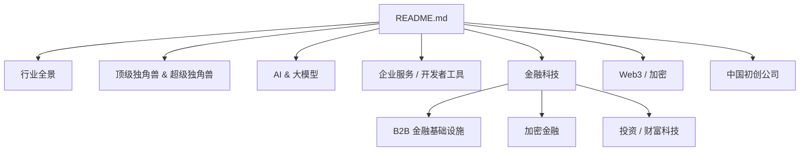
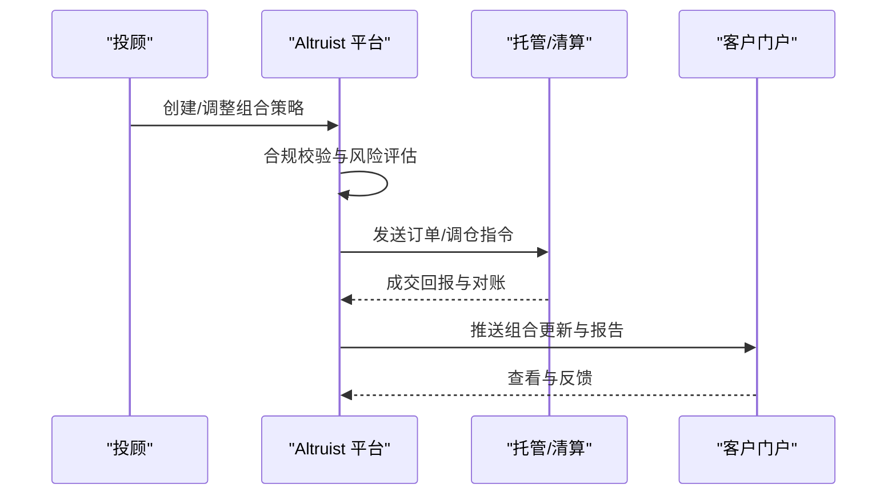
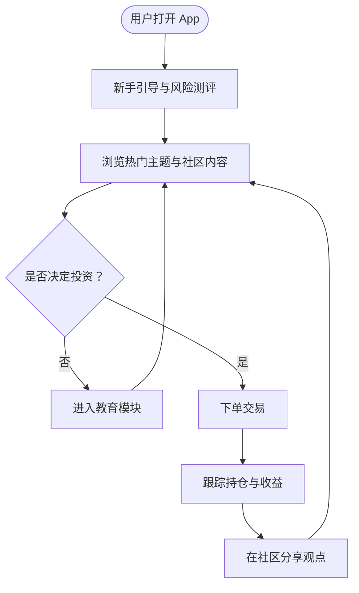
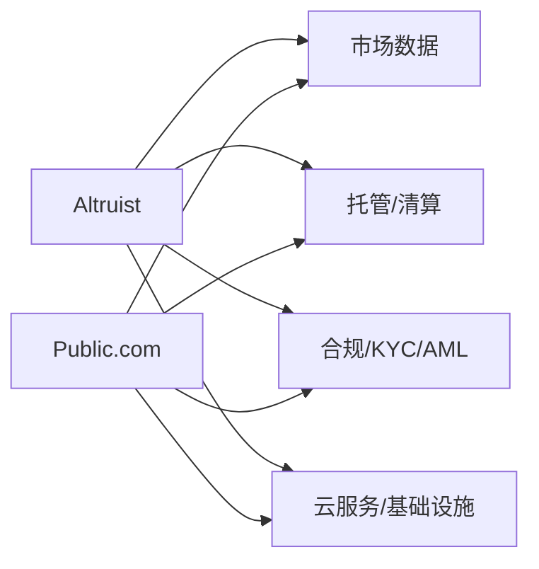

# 投资 / 财富科技

<cite>
**本文引用的文件**
- [README.md](file://README.md)
</cite>

## 目录
1. [引言](#引言)
2. [项目结构](#项目结构)
3. [核心组件](#核心组件)
4. [架构总览](#架构总览)
5. [详细组件分析](#详细组件分析)
6. [依赖关系分析](#依赖关系分析)
7. [性能与可扩展性考量](#性能与可扩展性考量)
8. [故障排查指南](#故障排查指南)
9. [结论](#结论)
10. [附录](#附录)

## 引言
本文件聚焦投资与财富科技领域的创新模式，围绕 Altruist（RIA 顾问平台）与 Public.com（社交化投资平台）展开，结合智能投顾、社交投资、移动端交易等趋势，系统梳理传统金融机构数字化转型的挑战与机遇，并沉淀投资者教育工具、资产配置算法与用户界面设计的最佳实践。内容基于仓库中“金融科技”板块的公开信息进行分析与归纳，旨在为从业者提供可操作的洞察与实践参考。

## 项目结构
该仓库以单文件 README 为主，按赛道组织初创公司清单，其中“金融科技”小节包含投资/财富科技条目，为本报告的核心信息来源。整体结构便于快速定位目标公司与关键信息点。

图表来源
- [README.md:1-945](file://README.md#L1-L945)

章节来源
- [README.md:1-945](file://README.md#L1-L945)

## 核心组件
- Altruist：RIA 顾问平台，打破传统 RIA 托管与运营垄断，提升投顾效率与体验。
- Public.com：社交化投资平台，强调社区互动与透明分享，推动“代际投资”理念。

上述两个产品分别代表财富管理的“专业投顾数字化”和“大众投资的社交化”两大方向，共同构成当前财富科技的关键拼图。

章节来源
- [README.md:761-770](file://README.md#L761-L770)

## 架构总览
从业务视角看，Altruist 与 Public.com 可抽象为两类平台：
- 专业投顾平台（Altruist）：面向注册投资顾问与企业客户，提供组合管理、合规、托管对接、报告与协作能力。
- 社交化交易平台（Public.com）：面向零售投资者，提供交易、持仓可视化、社区讨论、学习内容与激励机制。

[此图为概念性架构图，不直接映射具体源码文件]

## 详细组件分析

### Altruist（RIA 顾问平台）
- 角色与价值：为注册投资顾问提供一体化工作流，覆盖组合构建、执行、合规与报告，降低对传统托管平台的依赖，提升服务效率与透明度。
- 关键能力（基于公开信息的归纳）：
  - 组合建模与再平衡：支持多资产类别、因子与风险约束的组合优化。
  - 合规与风控：内置规则引擎，满足监管披露与适当性要求。
  - 托管与清算对接：与多家托管行/经纪商集成，实现自动化下单与对账。
  - 客户门户与报告：统一视图呈现净值、风险暴露与归因分析。
- 技术趋势契合：
  - 智能投顾：通过算法辅助资产配置与动态再平衡。
  - 移动端优先：投顾与客户均可在移动设备完成关键操作。
  - 开放生态：API 驱动的数据与流程集成。

[此序列图为概念性流程，不直接映射具体源码文件]

章节来源
- [README.md:761-770](file://README.md#L761-L770)

### Public.com（社交化投资平台）
- 角色与价值：将投资行为与社交互动结合，降低参与门槛，增强用户粘性与学习动力，推动“代际投资”。
- 关键能力（基于公开信息的归纳）：
  - 移动端交易：简洁的交易路径与低摩擦开户流程。
  - 持仓与收益可视化：实时展示盈亏、风险敞口与历史表现。
  - 社区与内容：用户讨论、观点分享与专家内容聚合。
  - 教育与激励：任务体系、徽章与排行榜，促进持续学习与理性决策。
  - 数据与推荐：基于行为与偏好的个性化推荐与风险提示。
- 技术趋势契合：
  - 社交投资：以社区驱动的内容传播与信任机制。
  - 移动端优先：全链路移动端体验设计。
  - 数据驱动：用数据指导内容与功能迭代。

[此流程图展示概念性用户旅程，不直接映射具体源码文件]

章节来源
- [README.md:761-770](file://README.md#L761-L770)

### 智能投顾、社交投资与移动端交易的技术趋势
- 智能投顾：
  - 资产配置算法：现代投资组合理论、风险平价、Black-Litterman、因子模型与机器学习增强的预测与优化。
  - 动态再平衡：阈值触发与事件驱动的自动调仓。
  - 合规内嵌：策略与披露自动化，降低人工错误。
- 社交投资：
  - 社区治理：内容审核、反操纵与利益冲突披露。
  - 数据隐私：匿名化与最小化采集原则。
  - 激励机制：避免短期博弈，鼓励长期持有与学习。
- 移动端交易：
  - 低延迟与高可用：弹性扩容与容灾设计。
  - 安全与风控：多因素认证、设备指纹与异常检测。
  - 用户体验：极简流程、无障碍设计与多语言支持。

[本节为通用趋势分析，不直接引用具体文件]

### 传统金融机构数字化转型的挑战与机遇
- 挑战：
  - 遗留系统改造成本高、周期长。
  - 数据孤岛与标准不一，影响分析与自动化。
  - 合规与风控要求严格，变更需审慎评估。
  - 人才结构与文化转型困难。
- 机遇：
  - 云原生与微服务提升敏捷交付能力。
  - AI/ML 赋能投研、客服与风控。
  - 开放 API 生态促进合作伙伴扩展。
  - 以用户为中心的产品重塑体验与粘性。

[本节为通用分析，不直接引用具体文件]

## 依赖关系分析
从业务层面看，Altruist 与 Public.com 均依赖以下外部能力：
- 市场数据与行情源：价格、新闻、基本面数据。
- 托管与清算：订单路由、结算与对账。
- 合规与KYC/AML：身份核验、适当性评估与审计留痕。
- 支付与资金通道：入金出金、账户管理与资金安全。
- 云服务与基础设施：计算、存储、网络与安全。

[此图为概念性依赖图，不直接映射具体源码文件]

## 性能与可扩展性考量
- 高并发与低延迟：移动端交易高峰期的弹性扩容与缓存策略。
- 数据一致性：跨系统对账与幂等处理，确保交易准确。
- 安全与隐私：端到端加密、访问控制与审计日志。
- 可观测性：指标、日志与追踪三位一体，快速定位问题。
- 成本优化：冷热数据分层、按需资源与批处理优化。

[本节为通用建议，不直接引用具体文件]

## 故障排查指南
- 常见问题定位：
  - 登录失败：检查多因素认证配置与设备信任状态。
  - 下单失败：核对市场状态、风控规则与资金可用性。
  - 数据不同步：核查数据源健康与同步任务状态。
  - 合规告警：审查策略参数与披露模板是否符合最新法规。
- 排障步骤建议：
  - 复现与隔离：最小化场景复现，逐步排除非相关因素。
  - 日志与指标：收集请求链路、错误码与性能指标。
  - 回滚与降级：必要时回滚变更或启用降级方案。
  - 复盘与改进：根因分析后完善监控与预案。

[本节为通用指导，不直接引用具体文件]

## 结论
Altruist 与 Public.com 代表了财富科技的两条主线：专业化投顾数字化与大众投资社交化。二者共同推动智能投顾、社交投资与移动端交易的普及，并为传统金融机构的数字化转型提供范式与借鉴。实践中应重视合规、安全与用户体验，借助数据与AI提升效率与质量，构建可持续的增长飞轮。

[本节为总结性内容，不直接引用具体文件]

## 附录
- 数据来源说明：本报告关于 Altruist 与 Public.com 的信息来源于仓库“金融科技”板块的公开条目。
- 进一步阅读：可结合行业报告与官方公告，持续跟踪产品演进与市场变化。

章节来源
- [README.md:761-770](file://README.md#L761-L770)