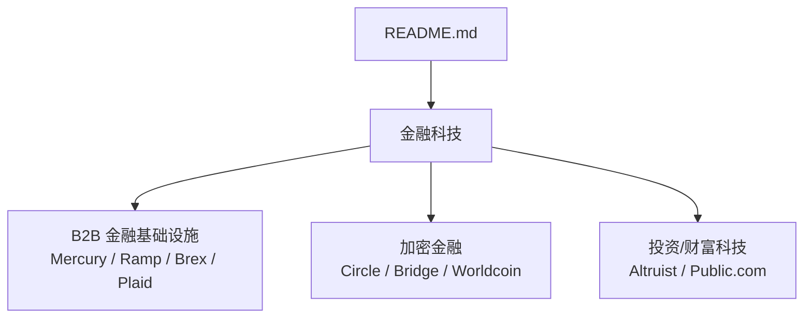
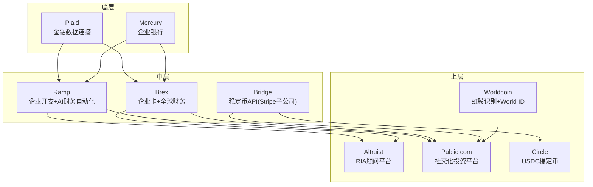
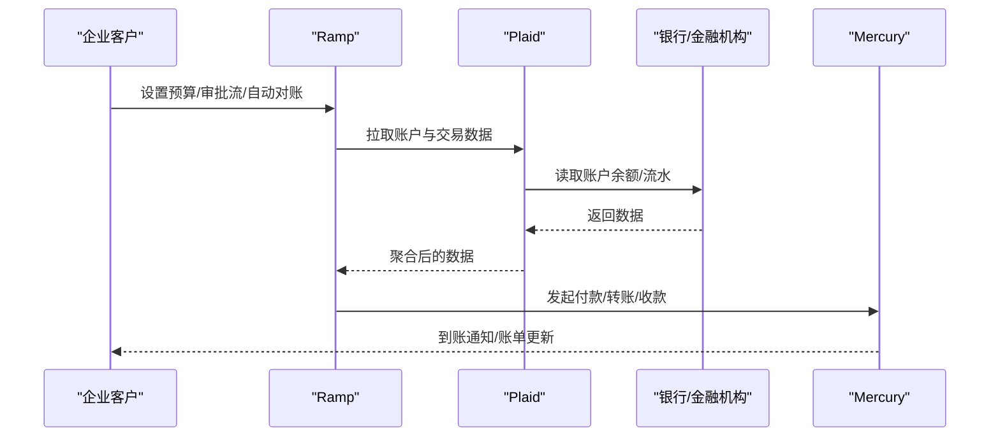
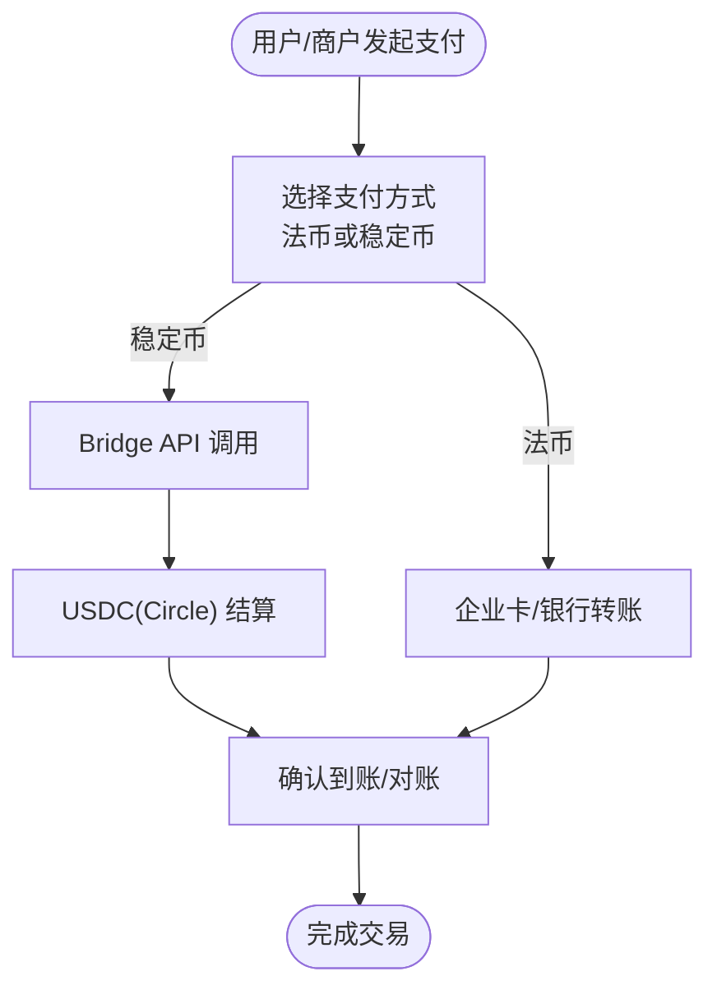
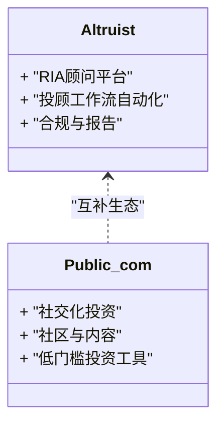
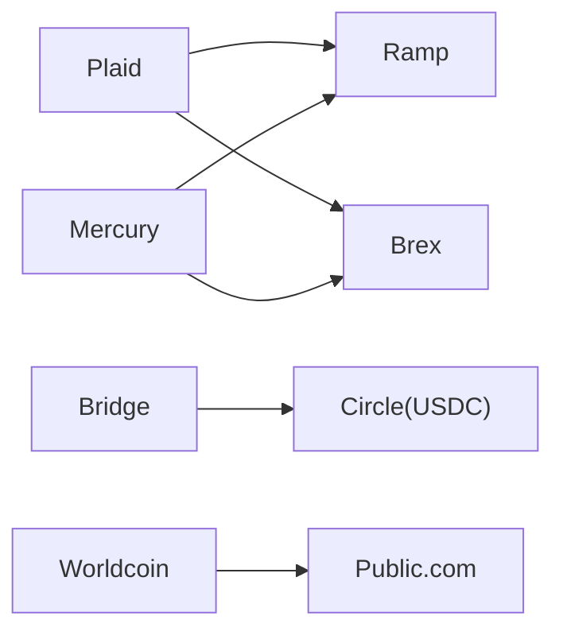

# 金融科技

<cite>
**本文引用的文件**
- [README.md](file://README.md)
</cite>

## 目录
1. [简介](#简介)
2. [项目结构](#项目结构)
3. [核心组件](#核心组件)
4. [架构总览](#架构总览)
5. [详细组件分析](#详细组件分析)
6. [依赖关系分析](#依赖关系分析)
7. [性能与合规考量](#性能与合规考量)
8. [故障排查指南](#故障排查指南)
9. [结论](#结论)
10. [附录](#附录)

## 简介
本文件基于仓库中的精选初创公司清单，聚焦金融科技领域，系统梳理B2B金融基础设施（Mercury、Ramp、Brex、Plaid）、加密金融（Circle、Bridge、Worldcoin）与投资财富管理（Altruist、Public.com）等细分市场的创新模式。文档同时讨论传统金融机构与金融科技公司的竞争关系、监管环境对行业的影响，并提供面向投资与使用的实用指导。内容严格来源于仓库中公开信息，避免臆测。

## 项目结构
仓库为单文件型知识清单，按赛道组织，其中“金融科技”章节涵盖目标公司及其关键事实（产品、融资、里程碑）。该结构便于快速检索与横向对比。

图表来源
- [README.md:716-770](file://README.md#L716-L770)

章节来源
- [README.md:716-770](file://README.md#L716-L770)

## 核心组件
- B2B 金融基础设施：为企业提供开户、企业卡、开支管理、财务自动化与银行数据连接等能力，典型代表包括 Mercury、Ramp、Brex、Plaid。
- 加密金融：围绕稳定币、跨链支付与身份验证的合规化与规模化落地，典型代表包括 Circle、Bridge（Stripe 子公司）、Worldcoin。
- 投资与财富管理：面向个人与投顾的数字化平台，典型代表包括 Altruist、Public.com。

章节来源
- [README.md:716-770](file://README.md#L716-L770)

## 架构总览
从业务视角看，上述三类组件构成现代金融数字化的“三层栈”：
- 底层：银行与账户、资金清算、合规与风控（如 Plaid 的数据连接、Mercury 的企业银行服务）
- 中层：支付与结算、企业支出与账务自动化（如 Ramp 的企业开支与自动化、Brex 的企业卡与全球财务）
- 上层：资产端与用户触达（如 Altruist 的 RIA 平台、Public.com 的社交化投资），以及加密金融桥接层（Circle 的稳定币、Bridge 的 API、Worldcoin 的身份）

图表来源
- [README.md:716-770](file://README.md#L716-L770)

## 详细组件分析

### B2B 金融基础设施
- Mercury：面向初创企业的银行账户与服务，提供高效开户与企业资金管理体验，服务于大量创业生态客户。
- Ramp：企业开支管理与AI驱动的财务自动化，覆盖费用控制、报销、发票与对账等环节，提升企业财务效率。
- Brex：企业卡与全球财务平台，支持多币种、合规与支出策略，已被 Capital One 收购，完成整合转型。
- Plaid：金融数据连接层，连接海量银行与金融机构，支撑众多金融科技公司获取账户与交易数据。

图表来源
- [README.md:716-742](file://README.md#L716-L742)

章节来源
- [README.md:716-742](file://README.md#L716-L742)

### 加密金融
- Circle：发行并运营合规稳定币 USDC，已在纽约证券交易所上市，成为合规稳定币的代表性标的。
- Bridge（Stripe 子公司）：提供稳定币相关API，被 Stripe 以较大金额收购，是 Stripe 切入加密支付的关键布局。
- Worldcoin：通过虹膜识别与 World ID 构建去中心化身份体系，兼具争议与创新，估值较高。

图表来源
- [README.md:743-759](file://README.md#L743-L759)

章节来源
- [README.md:743-759](file://README.md#L743-L759)

### 投资与财富管理
- Altruist：RIA（注册投资顾问）平台，帮助投顾机构提升运营效率，打破传统在RIA领域的垄断格局。
- Public.com：社交化投资平台，强调社区与透明，推动新一代投资者参与资本市场。

图表来源
- [README.md:761-770](file://README.md#L761-L770)

章节来源
- [README.md:761-770](file://README.md#L761-L770)

## 依赖关系分析
- 数据与账户依赖：Plaid 作为数据连接层，被多家金融科技公司依赖；Mercury 提供企业银行账户能力，常被企业卡与开支管理平台集成。
- 支付与结算依赖：Ramp、Brex 在企业支出与卡业务上高度依赖底层银行与清算网络；Bridge 与 Circle 在加密支付场景下形成稳定币结算链路。
- 身份与合规依赖：Worldcoin 提供的身份方案可能影响KYC/AML流程设计；合规稳定币（USDC）有助于降低监管不确定性。

图表来源
- [README.md:716-770](file://README.md#L716-L770)

章节来源
- [README.md:716-770](file://README.md#L716-L770)

## 性能与合规考量
- 性能维度：企业开支与对账需要高吞吐、低延迟的数据同步与处理；稳定币支付需关注网络拥堵与结算时间；RIA平台需保证报表生成与审计追踪的效率。
- 合规维度：稳定币与跨境支付涉及多国监管；企业卡与账户服务需满足反洗钱、消费者保护与数据安全要求；身份验证（如虹膜识别）需平衡隐私与可用性。

[本节为通用指导，不直接分析具体文件]

## 故障排查指南
- 数据连接失败（Plaid）：检查银行授权状态、网络连通性与错误码；必要时重试或引导用户重新授权。
- 企业卡交易失败（Ramp/Brex）：核对限额、商户类别限制与风控规则；查看银行拒付原因并调整策略。
- 稳定币支付异常（Bridge/Circle）：确认链上确认数、Gas费与目标网络兼容性；回退至法币通道或暂停路由。
- 身份验证问题（Worldcoin）：核验设备兼容性与生物识别质量；提供替代验证路径以满足合规要求。

[本节为通用指导，不直接分析具体文件]

## 结论
金融科技正通过“数据连接—支付结算—资产触达”的分层架构加速演进。B2B金融基础设施为企业财务数字化提供基础能力；加密金融在合规框架下拓展支付与身份边界；投资与财富管理则借助平台化与社交化提升可及性与参与度。传统金融机构与金融科技公司既竞争又合作，监管环境将深刻影响创新节奏与商业模式。对于投资者与使用者而言，应重点关注数据连接能力、合规稳定性与可扩展性。

[本节为总结性内容，不直接分析具体文件]

## 附录
- 数据来源与参考：本文件所有事实均来源于仓库中的精选清单，聚焦2025–2026年期间的融资与里程碑事件。
- 扩展阅读：可结合“关键数据来源”部分所列权威渠道，进一步跟踪行业动态与公司进展。

[本节为补充说明，不直接分析具体文件]