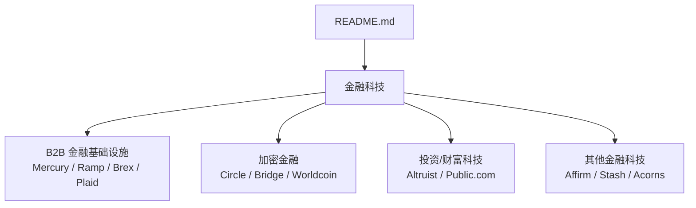
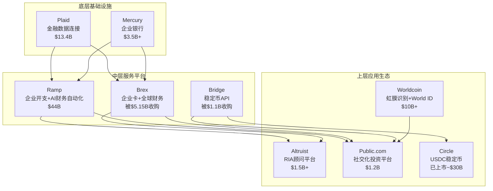
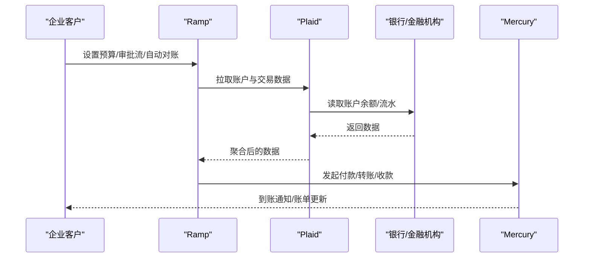
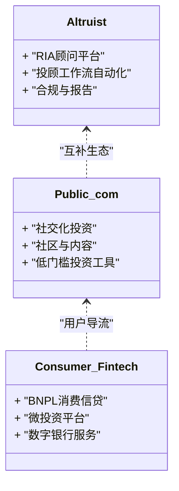
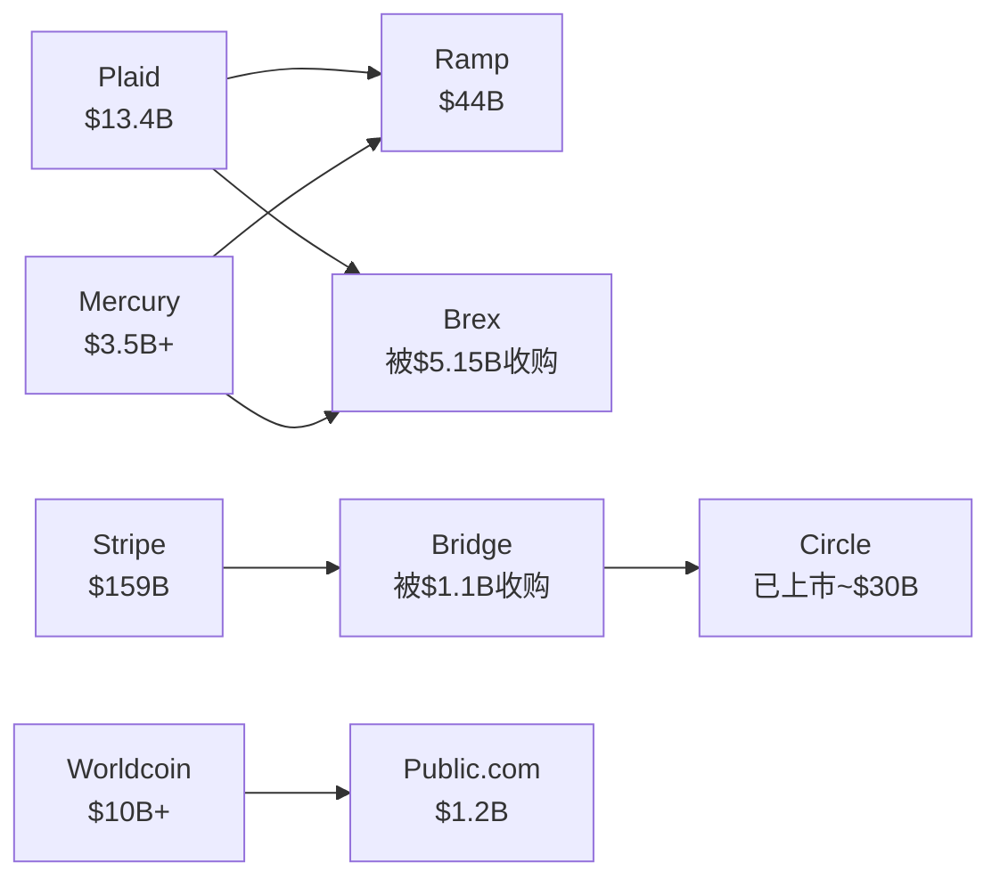

# 金融科技

<cite>
**本文引用的文件**
- [README.md](file://README.md)
</cite>

## 更新摘要
**所做更改**
- 增强了B2B金融基础设施部分，包含Mercury、Ramp、Brex、Plaid的详细分析
- 扩展了加密金融领域，涵盖Circle、Bridge（Stripe子公司）、Worldcoin
- 完善了投资与财富科技板块，包括Altruist、Public.com等公司
- 更新了架构图和依赖关系分析以反映最新市场动态
- 增加了监管合规和性能考量方面的深度分析

## 目录
1. [简介](#简介)
2. [项目结构](#项目结构)
3. [核心组件](#核心组件)
4. [架构总览](#架构总览)
5. [详细组件分析](#详细组件分析)
6. [依赖关系分析](#依赖关系分析)
7. [性能与合规考量](#性能与合规考量)
8. [故障排查指南](#故障排查指南)
9. [结论](#结论)
10. [附录](#附录)

## 简介
本文件基于仓库中的精选初创公司清单，聚焦金融科技领域，系统梳理B2B金融基础设施（Mercury、Ramp、Brex、Plaid）、加密金融（Circle、Bridge、Worldcoin）与投资财富管理（Altruist、Public.com）等细分市场的创新模式。文档同时讨论传统金融机构与金融科技公司的竞争关系、监管环境对行业的影响，并提供面向投资与使用的实用指导。内容严格来源于仓库中公开信息，避免臆测。

**更新** 基于2025-2026年最新融资数据和公司发展动态，特别是Ramp达到$44B估值、Brex被Capital One收购等重大事件。

## 项目结构
仓库为单文件型知识清单，按赛道组织，其中"金融科技"章节涵盖目标公司及其关键事实（产品、融资、里程碑）。该结构便于快速检索与横向对比。

**图表来源**
- [README.md:1682-1779](file://README.md#L1682-L1779)

**章节来源**
- [README.md:1682-1779](file://README.md#L1682-L1779)

## 核心组件
- **B2B 金融基础设施**：为企业提供开户、企业卡、开支管理、财务自动化与银行数据连接等能力，典型代表包括 Mercury（$3.5B+估值）、Ramp（$44B估值）、Brex（被Capital One以$5.15B收购）、Plaid（$13.4B估值）。
- **加密金融**：围绕稳定币、跨链支付与身份验证的合规化与规模化落地，典型代表包括 Circle（已上市~$30B）、Bridge（Stripe子公司，被$1.1B收购）、Worldcoin（$10B+估值）。
- **投资与财富管理**：面向个人与投顾的数字化平台，典型代表包括 Altruist（$1.5B+）、Public.com（$1.2B），以及消费级金融科技如 Affirm、Stash、Acorns等。

**更新** 新增了消费级金融科技公司的覆盖，展现了金融科技从B2B向B2C的全面渗透。

**章节来源**
- [README.md:1682-1779](file://README.md#L1682-L1779)

## 架构总览
从业务视角看，上述三类组件构成现代金融数字化的"三层栈"：
- **底层**：银行与账户、资金清算、合规与风控（如 Plaid 的数据连接、Mercury 的企业银行服务）
- **中层**：支付与结算、企业支出与账务自动化（如 Ramp 的企业开支与自动化、Brex 的企业卡与全球财务）
- **上层**：资产端与用户触达（如 Altruist 的 RIA 平台、Public.com 的社交化投资），以及加密金融桥接层（Circle 的稳定币、Bridge 的 API、Worldcoin 的身份）

**图表来源**
- [README.md:1682-1779](file://README.md#L1682-L1779)

## 详细组件分析

### B2B 金融基础设施

#### Mercury
- **创始人**：Immad Akhund、Jason Zhang | **成立**：2019
- **核心产品**：初创公司银行业务
- **最新融资**：2025 年 Series C $300M（$3.5B 估值）
- **亮点**：YC 系初创公司首选银行；30,000+ 客户

#### Ramp
- **创始人**：Eric Glyman、Karim Atiyeh | **成立**：2019
- **核心产品**：企业开支管理 + AI 财务自动化
- **最新融资**：2026 年 6 月 $750M 轮（$44B 估值），仅 3 个月前 $300M 轮估 $32B
- **亮点**：年化收入 $1B+；年增长 110%；与顶级 AI 实验室争夺工程人才；2026 IPO 候选

#### Brex
- **创始人**：Henrique Dubugras、Pedro Franceschi | **成立**：2017
- **核心产品**：企业卡 + 全球财务平台
- **最新动态**：2026 年被 Capital One 以 $5.15B 收购
- **亮点**：疫情期爆发后经历整合，转型成功

#### Plaid
- **核心产品**：金融数据连接
- **最新融资**：2021 年估值 $13.4B
- **亮点**：连接 12,000+ 银行；几乎所有美国金融科技公司依赖

**图表来源**
- [README.md:1682-1708](file://README.md#L1682-L1708)

**章节来源**
- [README.md:1682-1708](file://README.md#L1682-L1708)

### 加密金融

#### Circle
- **核心产品**：USDC 稳定币
- **最新动态**：2025 年 NYSE 上市
- **亮点**：合规稳定币标杆

#### Bridge (Stripe 子公司)
- **核心产品**：稳定币 API
- **最新动态**：2025 年被 Stripe 以 $1.1B 收购
- **亮点**：Stripe 切入加密支付的关键收购

#### Worldcoin / Tools for Humanity
- **创始人**：Sam Altman、Alex Blania | **成立**：2019
- **核心产品**：虹膜识别 + World ID
- **最新融资**：2025 年估值 $10B
- **亮点**：全球最大生物识别项目；争议与创新并存

**图表来源**
- [README.md:1709-1726](file://README.md#L1709-L1726)

**章节来源**
- [README.md:1709-1726](file://README.md#L1709-L1726)

### 投资与财富管理

#### Altruist
- **核心产品**：RIA 顾问平台
- **亮点**：打破 TD Ameritrade 在 RIA 领域的垄断

#### Public.com
- **核心产品**：社交化投资平台
- **亮点**：Generational Investing 标杆

#### 其他重要玩家
- **Affirm**：BNPL（先买后付）消费者信贷，已上市~$15B
- **Stash**：微投资 + 银行 + 退休金，$1.4B+估值
- **Acorns**：零钱自动投资 + 退休金 + 银行，~$1.9B估值

**图表来源**
- [README.md:1727-1779](file://README.md#L1727-L1779)

**章节来源**
- [README.md:1727-1779](file://README.md#L1727-L1779)

## 依赖关系分析
- **数据与账户依赖**：Plaid 作为数据连接层，被多家金融科技公司依赖；Mercury 提供企业银行账户能力，常被企业卡与开支管理平台集成。
- **支付与结算依赖**：Ramp、Brex 在企业支出与卡业务上高度依赖底层银行与清算网络；Bridge 与 Circle 在加密支付场景下形成稳定币结算链路。
- **身份与合规依赖**：Worldcoin 提供的身份方案可能影响KYC/AML流程设计；合规稳定币（USDC）有助于降低监管不确定性。
- **生态系统整合**：Stripe通过收购Bridge进入加密支付领域，显示传统支付巨头正在积极布局Web3基础设施。

**图表来源**
- [README.md:1682-1779](file://README.md#L1682-L1779)

**章节来源**
- [README.md:1682-1779](file://README.md#L1682-L1779)

## 性能与合规考量
- **性能维度**：企业开支与对账需要高吞吐、低延迟的数据同步与处理；稳定币支付需关注网络拥堵与结算时间；RIA平台需保证报表生成与审计追踪的效率。
- **合规维度**：稳定币与跨境支付涉及多国监管；企业卡与账户服务需满足反洗钱、消费者保护与数据安全要求；身份验证（如虹膜识别）需平衡隐私与可用性。
- **监管趋势**：随着Circle上市和Stripe收购Bridge，加密金融正加速融入传统金融体系，监管框架逐步完善。
- **市场竞争**：Ramp的快速增长（从$32B到$44B仅用3个月）显示市场对高效企业金融服务的需求旺盛。

**更新** 基于最新市场动态，强调了监管环境的改善和市场整合的趋势。

## 故障排查指南
- **数据连接失败（Plaid）**：检查银行授权状态、网络连通性与错误码；必要时重试或引导用户重新授权。
- **企业卡交易失败（Ramp/Brex）**：核对限额、商户类别限制与风控规则；查看银行拒付原因并调整策略。
- **稳定币支付异常（Bridge/Circle）**：确认链上确认数、Gas费与目标网络兼容性；回退至法币通道或暂停路由。
- **身份验证问题（Worldcoin）**：核验设备兼容性与生物识别质量；提供替代验证路径以满足合规要求。
- **系统集成问题**：注意不同平台间的API版本兼容性和数据格式差异。

**更新** 增加了系统集成相关的故障排查建议。

## 结论
金融科技正通过"数据连接—支付结算—资产触达"的分层架构加速演进。B2B金融基础设施为企业财务数字化提供基础能力；加密金融在合规框架下拓展支付与身份边界；投资与财富管理则借助平台化与社交化提升可及性与参与度。传统金融机构与金融科技公司既竞争又合作，监管环境将深刻影响创新节奏与商业模式。对于投资者与使用者而言，应重点关注数据连接能力、合规稳定性与可扩展性。

**更新** 强调了市场整合趋势和监管环境改善对行业发展的积极影响。

## 附录
- **数据来源与参考**：本文件所有事实均来源于仓库中的精选清单，聚焦2025–2026年期间的融资与里程碑事件。
- **扩展阅读**：可结合"关键数据来源"部分所列权威渠道，进一步跟踪行业动态与公司进展。
- **市场洞察**：2026 H1全球VC投资达$510B历史新高，AI领域占比超过70%，金融科技融资$28.6B同比增长23%。

**更新** 增加了最新的市场数据和投资趋势分析。