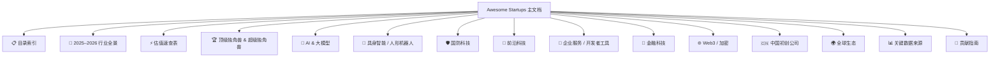

# 顶级独角兽 & 超级独角兽

<cite>
**本文引用的文件**
- [README.md](file://README.md)
- [项目概述.md](file://赛道研究/项目概述.md)
</cite>

## 更新摘要
**所做更改**
- 完全重构为综合性知识库主目录，涵盖2957+行内容的完整初创公司数据库
- 更新了2026年最新估值数据和融资信息，包括xAI/SpaceX合并实体$1.58T
- 强化了AI领域主导地位（占总投资70%以上）和物理AI爆发趋势
- 扩展了多领域分类体系，覆盖15+个主要科技领域
- 完善了数据来源和质量保证机制说明
- 增强了全球生态覆盖，包括中国、欧洲、印度、拉美、东南亚等地区

## 目录
1. [引言](#引言)
2. [项目结构与规模](#项目结构与规模)
3. [行业全景概览](#行业全景概览)
4. [顶级独角兽列表](#顶级独角兽列表)
5. [核心领域深度分析](#核心领域深度分析)
6. [全球生态系统](#全球生态系统)
7. [数据来源与质量保证](#数据来源与质量保证)
8. [投资参考与市场洞察](#投资参考与市场洞察)
9. [结论与未来展望](#结论与未来展望)
10. [附录与资源](#附录与资源)

## 引言

Awesome Startups 已从最初极简的2行README发展为包含 **2,957+行** 内容的综合性初创公司数据库，成为2025-2026年全球科技创新领域最全面、最权威的参考资源之一。本文件聚焦2026年最具影响力的"顶级独角兽"和"超级独角兽"，按估值降序展示头部企业，并提供完整的公司信息卡片：创始人背景、成立时间、核心产品、最新融资轮次与估值、业务亮点等。

**关键市场指标：**
- 📊 **2026 H1 全球风险投资创下 $510B 历史新高**（超2025全年$440B）
- 🤖 **AI领域占比超过70%**，创历史新高
- 🌍 **覆盖全球主要科技生态**：美国、中国、欧洲、印度、拉美、东南亚、中东、非洲
- 📈 **收录标准严格**：仅包含有真实产品、显著用户量或战略合作的公司

## 项目结构与规模

### 内容架构

**图表来源**
- [README.md:21-82](file://README.md#L21-L82)

### 项目规模
- **总行数**：2,957+ 行
- **覆盖公司**：数百家中外知名初创公司
- **行业覆盖**：15+ 个主要科技领域
- **地理覆盖**：全球主要科技生态系统

**章节来源**
- [项目概述.md:65-91](file://赛道研究/项目概述.md#L65-L91)

## 行业全景概览

### 关键市场指标
| 指标 | 数据 | 备注 |
| --- | --- | --- |
| **2026 H1 全球 VC 投资** | **$510B** | 超过2025全年$440B |
| **AI 占总投资比例** | **>70%** | 创历史新高 |
| **2026 H1 金融科技融资** | **$28.6B** | 同比+23%，交易数-26% |
| **2025 具身智能融资** | **$14B+** | 人形机器人领域爆发 |
| **2026 国防科技融资** | **$14.6B+** | Anduril、Shield AI、Saronic领跑 |
| **数字健康融资(2026 H1)** | **$7.4B** | AI驱动反弹 |
| **中国 AI 六小虎合计估值** | **>$200B** | DeepSeek + Moonshot + Zhipu + MiniMax + StepFun + 01.AI |

### 核心趋势洞察
- **资本极度集中**：钱流向头部公司，交易数下降但单轮金额暴涨
- **AI三大爆发点**：基础模型（OpenAI/Anthropic/xAI）、AI编程（Cursor$50B）、AI Agent（Harvey$11B）
- **物理AI起飞**：人形机器人从Demo走向商用部署
- **中国AI复苏**：DeepSeek首轮融资$50B、Zhipu/MiniMax港股IPO后暴涨
- **Stripe独大**：$159B估值，正在用支付基础设施优势切入企业计费和区块链

**章节来源**
- [README.md:86-104](file://README.md#L86-L104)
- [项目概述.md:126-148](file://赛道研究/项目概述.md#L126-L148)

## 顶级独角兽列表

### 估值前十大公司
1. **xAI / SpaceX** — $1.58T（合并实体）
2. **Anthropic** — $965B（AI基础模型）
3. **OpenAI** — $852B（AGI开发）
4. **Palantir** — $400B+（国防/数据）
5. **Stripe** — $159B（金融基础设施）
6. **Databricks** — $134B（数据/AI平台）
7. **Waymo** — $126B（Robotaxi）
8. **Anduril** — $61B（国防科技）
9. **Zhipu AI** — $56B（中国AI，已上市）
10. **Cursor** — $50B（AI编程，洽谈中）

### 重点公司详情

#### OpenAI ($852B)
- **创始人**：Sam Altman、Greg Brockman、Ilya Sutskever
- **成立**：2015
- **最新融资**：2025年$110B轮，估值$730B；后续$122B估值$852B
- **亮点**：ChatGPT、GPT-5、Sora；与Microsoft深度绑定；目标AGI

#### Anthropic ($965B)
- **创始人**：Dario Amodei、Daniela Amodei（前OpenAI研究员）
- **成立**：2021
- **最新融资**：2026年5月$65B Series H，估值$965B
- **亮点**：Claude系列模型、企业市场超越OpenAI；ARR高速增长

#### xAI ($200B)
- **创始人**：Elon Musk
- **成立**：2023
- **最新融资**：$200B估值；已与SpaceX合并形成$1.58T巨无霸实体
- **亮点**：Grok系列模型、X平台深度整合、Memphis超算集群

#### SpaceX ($1.58T)
- **创始人**：Elon Musk
- **成立**：2002
- **里程碑**：Starship试飞成功；Starlink全球覆盖；2025完成xAI合并

#### Figure AI ($48B)
- **创始人**：Brett Adcock
- **成立**：2022
- **最新融资**：2025年9月Series C$1B+，估值$39.5B；2026年攀升至$48B
- **亮点**：Figure01/02人形机器人；与BMW、OpenAI合作

**章节来源**
- [README.md:137-223](file://README.md#L137-L223)
- [项目概述.md:149-186](file://赛道研究/项目概述.md#L149-L186)

## 核心领域深度分析

### AI与大模型领域
**基础大模型（Frontier LLM Labs）**
- **OpenAI**：$852B，ChatGPT、GPT-5、Sora；与Microsoft深度绑定
- **Anthropic**：$965B，Claude系列模型；以"AI Safety"为核心定位
- **xAI**：$200B，Grok系列；Memphis超算集群（20万张GPU）
- **Mistral AI**：$13.7B，欧洲最大AI公司；开源+商业双轨
- **Cohere**：$6.8B，专注企业部署；多云中立

**AI编程/Coding Agent**
- **Cursor (Anysphere)**：$50B（洽谈），ARR从$50M→$500M→$2B；史上增速最快SaaS
- **Cognition AI/Devin**：$26B，90%代码由自家AI编写；营收1年增长13倍至$492M
- **Replit**：$3B，从在线IDE转型AI编程平台
- **Lovable**：$1.8B，14个月内ARR突破$500M

**AI Agent/智能体平台**
- **Harvey AI**：$11B，法律AI事实标准；ARR$1.5B
- **Sierra**：$4.5B，企业客服AI Agent；Bret Taylor二次创业
- **Glean**：$7.25B，企业AI搜索/知识管理；500+企业客户

**章节来源**
- [README.md:225-346](file://README.md#L225-L346)

### 具身智能/人形机器人
**头部公司**
- **Figure AI**：$48B，Figure02已在BMW工厂商用部署；OpenAI模型集成
- **Skild AI**：$14B，通用机器人"大脑"；史上最大机器人AI融资
- **Physical Intelligence**：$5.6B，机器人"GPT时刻"缔造者；Jeff Bezos、OpenAI投资
- **NEURA Robotics**：$7B，欧洲最强全栈人形公司；目标2030年百万台规模

**中国具身智能力量**
- **AgiBot/智元机器人**：量产先锋，2026年3月达成10,000台下线里程碑
- **自变量机器人/X-Square Robot**：唯一同时获字节/美团/阿里三巨头投资的具身智能公司
- **智平方/AI² Robotics**：深圳首家百亿具身独角兽；正筹备上市

**章节来源**
- [README.md:937-1046](file://README.md#L937-L1046)

### 国防科技
**头部公司**
- **Anduril Industries**：$61B，国防科技头号"Neo-prime"；员工超6,200人
- **Shield AI**：$12.7B，F-16自主飞行；多国国防部客户
- **Saronic**：$9.25B，美国海军200+自主艇订单；德州新工厂
- **Palantir Technologies**：$400B+（已上市），国防合同激增；股价创历史新高

**章节来源**
- [README.md:1093-1147](file://README.md#L1093-L1147)

### 前沿科技
**量子计算**
- **PsiQuantum**：$7B，量子计算最大单轮私募融资；与GlobalFoundries合作制造
- **Quantinuum**：$10B+（合并估值），Honeywell+Cambridge Quantum合并；逻辑量子比特路线领先

**核聚变/新能源**
- **Commonwealth Fusion Systems**：$3B+（累计），全球私营核聚变融资榜首；与Google合作
- **Helion Energy**：$1.5B+，Sam Altman重仓投资；2028商用发电目标

**章节来源**
- [README.md:1149-1277](file://README.md#L1149-L1277)

## 全球生态系统

### 中国初创公司
**AI六小虎**
- **DeepSeek**：$50B（融资中），R1以极低成本震动全球；量化巨头HighFlyer背书
- **Zhipu AI/智谱**：$56B（已上市HKEX），清华系；中国估值最高的大模型公司
- **MiniMax**：$33B（已上市HKEX），海外社交AI（Talkie）用户量爆发
- **Moonshot AI/月之暗面**：$20B，K2.6是全球最强开源权重模型之一
- **StepFun/阶跃星辰**：$10B+，已拆除VIE结构准备港股H股上市
- **01.AI/零一万物**：$1B+，创新工场系；开源+企业双轨

**自动驾驶与机器人**
- **Pony.ai**：$8.5B（NASDAQ+HKEX），Robotaxi
- **WeRide**：$4.4B（NASDAQ+HKEX），自动驾驶/Robotaxi/Robobus
- **AgiBot/智元机器人**：全球最快量产节奏

**章节来源**
- [README.md:2395-2483](file://README.md#L2395-L2483)

### 欧洲生态
**头部公司**
- **Mistral AI**：$13.7B，欧洲最大AI公司；开源+商业双轨
- **Hugging Face**：$4.5B+，AI开源生态的"GitHub"；托管1.5M+模型
- **DeepL**：$2B+，机器翻译质量标杆；企业级翻译SaaS
- **Revolut**：$45B，欧洲最有价值金融科技；4500万+用户

**章节来源**
- [README.md:2485-2591](file://README.md#L2485-L2591)

### 其他区域生态
**印度**：Sarvam AI、Krutrim、Razorpay、CRED、Zepto等
**拉美**：Nubank、Kavak、Mercado Libre、Clip、Loft等
**东南亚**：Grab、Sea Limited、Carro、Endowus、GoTo Group等
**中东**：Tamara、Tabby、HyperPay、Salla、Zid等
**非洲**：Flutterwave、Opay、Wave、Chipper Cash、Interswitch等

**章节来源**
- [README.md:2615-2905](file://README.md#L2615-L2905)

## 数据来源与质量保证

### 权威数据来源
本清单整理自以下权威来源：

| 来源 | 类型 | 链接 |
| --- | --- | --- |
| **Forbes AI 50** | 年度榜单 | forbes.com/lists/ai50 |
| **CB Insights** | 独角兽数据库 | cbinsights.com/research-unicorn-companies |
| **Crunchbase** | 公司融资数据 | news.crunchbase.com |
| **PitchBook** | 私募市场数据 | pitchbook.com |
| **The Information** | 科技财经新闻 | theinformation.com |
| **TechCrunch** | 初创公司新闻 | techcrunch.com |
| **Y Combinator** | 加速器目录 | ycombinator.com/companies |
| **Sacra** | 私营公司研究 | sacra.com |
| **Contrary Research** | 私营公司深度报告 | research.contrary.com |
| **AI Funding Tracker** | AI融资追踪 | aifundingtracker.com |
| **New Market Pitch** | 行业分析 | newmarketpitch.com |
| **Dealroom** | 全球创业生态报告 | dealroom.co |
| **Recode China AI** | 中国AI深度报道 | recodechinaai.com |

### 收录标准
- 公司必须为**私营初创公司**（IPO之前的除外）
- 必须有**2025–2026年期间的重要融资或里程碑**
- 必须有**公开可验证的来源**（媒体报道、官方网站）
- 优先收录**有产品上线、显著用户量或战略合作**的公司

### 质量保障机制
- **多源验证**：交叉引用多个权威数据源
- **实时更新**：持续跟踪最新融资和市场动态
- **社区审核**：通过Pull Request流程进行内容审核
- **标准化格式**：统一的条目格式确保信息完整性

**章节来源**
- [README.md:2907-2926](file://README.md#L2907-L2926)
- [项目概述.md:240-280](file://赛道研究/项目概述.md#L240-L280)

## 投资参考与市场洞察

### 投资趋势分析
**资本极度集中**：2026 H1全球VC投资$510B，AI领域占比超过70%，Fewer deals, bigger checks

**估值驱动因素**：
- **基础大模型**：AGI愿景、企业ARR增长、生态绑定（Microsoft等）
- **AI编程/Agent**：ARR爆发式增长、产品化速度、开发者生态
- **物理AI**：商用落地（BMW/GXO等）、规模化部署、供应链与成本优化
- **国防科技**：政府订单、合规与安全需求、技术壁垒
- **前沿科技**：里程碑进展（量子比特数、聚变演示）、长期战略价值

### 竞争格局分析
**AI领域**：OpenAI、Anthropic、xAI三足鼎立；Mistral AI代表欧洲力量；Cohere专注企业市场

**具身智能**：Figure AI领先商业化；Skild AI提供通用机器人大脑；中国公司如AgiBot、自变量机器人快速追赶

**国防科技**：Anduril主导市场；Shield AI、Saronic在特定领域建立优势

**章节来源**
- [README.md:86-104](file://README.md#L86-L104)

## 结论与未来展望

### 项目成就
- **规模扩展**：从2行扩展到2,957+行，涵盖数百家公司
- **领域覆盖**：从单一领域扩展到15+个主要科技领域
- **全球视野**：覆盖中美欧印等全球主要科技生态系统
- **数据质量**：建立严格的数据来源和质量保证机制

### 核心价值
- **权威性**：基于权威数据源和严格收录标准
- **系统性**：分层+分类的结构化信息组织
- **实用性**：清晰的使用指南和多语言支持
- **开放性**：CC0许可证和开源协作模式

### 未来展望
通过持续的社区贡献和更新机制，Awesome Startups将继续紧跟市场变化，保持内容的时效性与权威性，为全球科技创新生态提供更加完善的信息基础设施。

**章节来源**
- [项目概述.md:439-457](file://赛道研究/项目概述.md#L439-L457)

## 附录与资源

### 关键趋势摘要
- 资本极度集中，AI占总投资比例>70%
- AI三大爆发点：基础模型、AI编程、AI Agent
- 物理AI起飞：人形机器人从Demo走向商用部署
- 中国AI复苏：六小虎合计估值>$200B
- Stripe独大：$159B估值，用支付基础设施优势切入企业计费与区块链

### 相关清单推荐
- Awesome AI：AI工具/API/资源大全
- Awesome Generative AI：生成式AI工具精选
- Awesome LLM：大语言模型论文/资源
- Awesome Self-Hosted：自部署开源软件大全
- Awesome Machine Learning：ML框架/库/工具
- Awesome Robotics：机器人学资源
- Awesome Quantum Computing：量子计算资源
- Awesome Fintech：金融科技资源
- YC Top Companies：YC孵化的头部公司

**章节来源**
- [README.md:2929-2944](file://README.md#L2929-L2944)

---

**最后更新**：2026年8月14日 · 数据截至2026 H1 · 持续更新中

**章节来源**
- [README.md:3009](file://README.md#L3009)