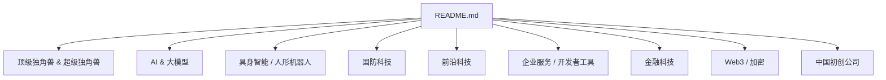
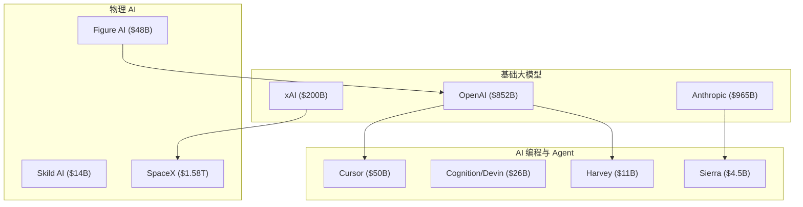
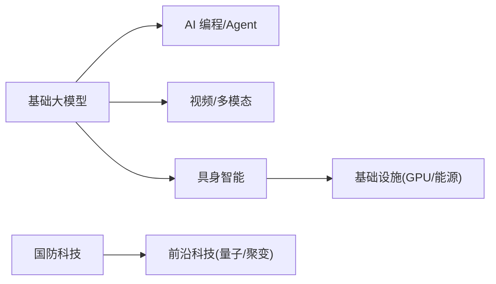

# 顶级独角兽 & 超级独角兽

<cite>
**本文引用的文件**
- [README.md](file://README.md)
</cite>

## 更新摘要
**所做更改**
- 更新了估值速查表，新增详细的 $10B+ 公司列表
- 强化了顶级独角兽和超级独角兽的详细信息
- 增加了最新融资轮次和估值的详细数据
- 完善了各公司的业务亮点和市场地位分析

## 目录
1. [引言](#引言)
2. [项目结构](#项目结构)
3. [核心组件](#核心组件)
4. [架构总览](#架构总览)
5. [详细组件分析](#详细组件分析)
6. [依赖关系分析](#依赖关系分析)
7. [性能与估值考量](#性能与估值考量)
8. [故障排查与数据校验指南](#故障排查与数据校验指南)
9. [结论](#结论)
10. [附录](#附录)

## 引言
本文件聚焦 2026 年最具影响力的"顶级独角兽"和"超级独角兽"，按估值降序展示头部企业，并为其提供完整公司信息卡片：创始人背景、成立时间、核心产品、最新融资轮次与估值、业务亮点等。同时总结这些超级独角兽的共同特征与发展模式，解释估值背后的商业逻辑与市场地位，并提供投资参考与竞争格局分析。

## 项目结构
该仓库为一份持续更新的精选初创公司清单，按赛道组织，并在"顶级独角兽 & 超级独角兽"章节中按估值从高到低排列头部公司。内容覆盖 AI 大模型、AI Agent、具身智能、国防科技、前沿科技、企业服务、金融科技、Web3/加密以及中国初创公司等。

**图表来源**
- [README.md:1-120](file://README.md#L1-L120)

**章节来源**
- [README.md:1-120](file://README.md#L1-L120)

## 核心组件
本节提炼"顶级独角兽 & 超级独角兽"的核心信息，包括公司基本信息卡与关键指标，便于快速对比与决策。

### 估值速查表（$10B+ 公司）

| # | 公司 | 估值 | 赛道 | 最新轮次 | 状态 |
| --- | --- | --- | --- | --- | --- |
| 1 | xAI / SpaceX | **$1.58T**（合并） | AI + 航天 | 合并实体 | 私营 |
| 2 | Anthropic | **$965B** | AI 基础模型 | $65B Series H (2026.05) | 私营 |
| 3 | OpenAI | **$852B** | AI 基础模型 | $122B (2026) | 私营 |
| 4 | Palantir | **$400B+** | 国防 / 数据 | — | 🇺🇸 上市 |
| 5 | Stripe | **$159B** | 金融科技 | Tender (2026.02) | 私营 |
| 6 | Databricks | **$134B** | 数据 / AI | Series K | 私营 |
| 7 | Waymo | **$126B** | Robotaxi | — | Alphabet 子公司 |
| 8 | Anduril | **$61B** | 国防科技 | Series F (2025) | 私营 |
| 9 | Zhipu AI | **$56B** | 中国 AI | IPO (2026.01) | 🇭🇰 上市 |
| 10 | Cursor (Anysphere) | **$50B**（洽谈） | AI 编程 | Series D (2025.11) | 私营 |

### 顶级独角兽详细信息

#### 1. OpenAI — $852B
- **创始人**：Sam Altman、Greg Brockman、Ilya Sutskever 等
- **成立**：2015
- **最新融资**：2025 年 $110B 轮（$730B 估值），后续 $122B 估值 $852B
- **核心产品**：ChatGPT、GPT-5、Sora、Operator 等
- **业务亮点**：与 Microsoft 深度绑定；目标 AGI；已成为史上最大初创公司之一

#### 2. Anthropic — $965B
- **创始人**：Dario Amodei、Daniela Amodei（前 OpenAI 研究员）
- **成立**：2021
- **最新融资**：2026 年 5 月 $65B Series H，估值 $965B（领投 Altimeter、Dragoneer）
- **核心产品**：Claude 系列模型、Claude Code
- **业务亮点**：以"AI Safety"为核心定位；企业市场份额超越 OpenAI；ARR 高速增长

#### 3. xAI — $200B
- **创始人**：Elon Musk
- **成立**：2023
- **最新融资**：$200B 估值；已与 SpaceX 合并形成 $1.58T 巨无霸实体
- **核心产品**：Grok 系列、Grok Code
- **业务亮点**：Memphis 超算集群（20 万张 GPU）；X 平台流量入口

#### 4. SpaceX（xAI 母公司）— $1.58T
- **创始人**：Elon Musk
- **成立**：2002
- **里程碑**：Starship 试飞成功；Starlink 全球覆盖；2025 完成 xAI 合并

#### 5. Databricks — $134B
- **创始人**：Ali Ghodsi、Reynold Xin 等
- **成立**：2013
- **最新融资**：Series K 等多轮融资，估值 $134B
- **核心产品**：Lakehouse 架构事实标准；MosaicML 收购后布局生成式 AI

#### 6. Waymo — $126B
- **母公司**：Alphabet
- **最新融资**：2025 年估值 $126B
- **核心产品**：Robotaxi 服务
- **业务亮点**：唯一商业化 Robotaxi 服务，每周 25 万+ 付费乘客

#### 7. Stripe — $159B
- **创始人**：Patrick Collison、John Collison
- **成立**：2010
- **最新融资**：2026 年 2 月 tender offer 估值 $159B（较 2025 年 9 月 $106.7B 上涨 49%）
- **核心产品**：支付基础设施
- **业务亮点**：年化支付额超 $1.9T；切入企业计费和区块链（收购 Bridge $1.1B）

#### 8. Figure AI — $48B
- **创始人**：Brett Adcock
- **成立**：2022
- **最新融资**：2025 年 9 月 Series C $1B+，估值 $39.5B；2026 年攀升至 $48B
- **核心产品**：Figure 01/02 人形机器人
- **业务亮点**：与 BMW、OpenAI 合作

#### 9. Perplexity AI — $20B
- **创始人**：Aravind Srinivas
- **成立**：2022
- **最新融资**：2025 年 9 月估值 $20B
- **核心产品**：AI 搜索
- **业务亮点**：月查询量 7.8 亿；Comet 浏览器；曾尝试收购 TikTok

#### 10. Mistral AI — $13.7B
- **创始人**：Arthur Mensch、Guillaume Lample 等
- **成立**：2023
- **最新融资**：Series C 后估值 $13.7B
- **核心产品**：Mistral Large、Mistral Small、Le Chat
- **业务亮点**：欧洲最大 AI 公司；开源+商业双轨

**章节来源**
- [README.md:137-222](file://README.md#L137-L222)

## 架构总览
从"顶级独角兽 & 超级独角兽"的视角看，2026 年的资本与技术演进呈现三大主线：基础大模型（OpenAI/Anthropic/xAI）、AI 编程与 Agent（Cursor/Devin/Harvey/Sierra）、物理 AI（人形机器人与航天）。这些领域共同推动估值飙升，并形成跨行业协同效应。

**图表来源**
- [README.md:137-222](file://README.md#L137-L222)
- [README.md:272-316](file://README.md#L272-L316)
- [README.md:937-998](file://README.md#L937-L998)

## 详细组件分析

### 基础大模型（Frontier LLM Labs）
- **OpenAI**
  - 创始人：Sam Altman 等 | 成立：2015
  - 核心产品：ChatGPT、GPT-5、o3、Sora、Operator
  - 最新融资：2025 年 $110B 轮（$730B 估值）；后续 $852B
  - 亮点：OpenAI 已成为史上最大初创公司之一，估值超越传统科技巨头

- **Anthropic**
  - 创始人：Dario & Daniela Amodei | 成立：2021
  - 核心产品：Claude 4.5 / Opus、Claude Code
  - 最新融资：2026 年 5 月 $65B Series H（$965B 估值）
  - 亮点：以 "AI Safety" 为核心定位；企业市场份额超 OpenAI；ARR 增长最快 AI 公司之一

- **xAI**
  - 创始人：Elon Musk | 成立：2023
  - 核心产品：Grok 系列、Grok Code
  - 亮点：Memphis 超算集群（20 万张 GPU）；X 平台流量入口；与 SpaceX 合并后估值达 $1.58T

- **Mistral AI**
  - 创始人：Arthur Mensch 等 | 成立：2023 | 总部：巴黎
  - 核心产品：Mistral Large、Mistral Small、Le Chat
  - 最新融资：2026 年估值 $13.7B
  - 亮点：欧洲 AI 龙头；开源+商业双轨；多模型路线

- **Cohere**
  - 创始人：Aidan Gomez 等 | 成立：2019
  - 核心产品：Command 系列、Embed、North 平台
  - 最新融资：2025 年估值 $6.8B
  - 亮点：Transformer 论文作者创办；专注企业部署；多云中立（AWS/Azure/Oracle）

**章节来源**
- [README.md:227-270](file://README.md#L227-L270)

### AI 编程 / Coding Agent
- **Anysphere / Cursor** — $50B
  - 创始人：Aman Sanger 等 | 成立：2022
  - 核心产品：Cursor AI 代码编辑器
  - 最新融资：2025 年 11 月 Series D $2.3B（$29.3B 估值）；2026 年正洽谈 $2B 新轮 @ $50B 估值
  - 亮点：ARR 从 $50M（2024.11）→ $500M（2025.06）→ $2B（2026.03）；史上增速最快的 SaaS 公司

- **Cognition AI / Devin** — $26B
  - 创始人：Scott Wu | 成立：2023
  - 核心产品：Devin（自主 AI 软件工程师）
  - 最新融资：2025 年 $1B+ 轮（$26B 估值）
  - 亮点：90% 代码由自家 AI 编写；营收 1 年增长 13 倍至 $492M

**章节来源**
- [README.md:272-316](file://README.md#L272-L316)

### AI Agent / 智能体平台
- **Harvey AI** — $11B
  - 创始人：Winston Weinberg、Gabriel Pereyra | 成立：2022
  - 核心产品：法律 AI 助手
  - 最新融资：2026 年 3 月 $200M Series G（$11B 估值）
  - 亮点：法律 AI 事实标准；ARR $1.5B；客户覆盖财富 500 强律所

- **Sierra** — $4.5B
  - 创始人：Bret Taylor、Clay Bavor | 成立：2024
  - 核心产品：企业客服 AI Agent
  - 最新融资：2026 年估值 $4.5B
  - 亮点：Bret Taylor（前 Salesforce COO、OpenAI 董事）二次创业；ARR 高速增长

**章节来源**
- [README.md:318-346](file://README.md#L318-L346)

### 具身智能 / 人形机器人
- **Figure AI** — $48B
  - 创始人：Brett Adcock | 成立：2022
  - 核心产品：Figure 02 人形机器人
  - 最新融资：2025 年 9 月 Series C $1B+（$39.5B 估值）；2026 年攀升 $48B
  - 亮点：Figure 02 已在 BMW 工厂商用部署；OpenAI 模型集成

- **Skild AI** — $14B
  - 创始人：Deepak Pathak、Agarwal Abhishek（CMU 教授）
  - 成立：2023
  - 核心产品：通用机器人 "大脑"（Skild Brain）
  - 最新融资：2026 年 1 月 Series C $1.4B（$14B 估值，软银领投）
  - 亮点：史上最大机器人 AI 融资；模型可跨硬件平台部署

**章节来源**
- [README.md:937-998](file://README.md#L937-L998)

### 国防科技
- **Anduril Industries** — $61B
  - 创始人：Palmer Luckey | 成立：2017
  - 核心产品：Lattice OS、Roadrunner、Fury、Sentry
  - 最新融资：2025 年 Series F $1.5B（$40B → $61B）
  - 亮点：国防科技头号 "Neo-prime"；员工超 6,200 人

- **Shield AI** — $12.7B
  - 创始人：Brandon Tseng、Ryan Tseng | 成立：2015
  - 核心产品：Hivemind、X-BAT 自主战机
  - 最新融资：2025 年估值 $12.7B
  - 亮点：F-16 自主飞行；多国国防部客户

**章节来源**
- [README.md:1045-1099](file://README.md#L1045-L1099)

### 前沿科技（量子计算、核聚变/新能源、航空航天）
- **PsiQuantum** — $7B
  - 总部：Palo Alto | 成立：2015
  - 核心产品：基于光子学的百万量子比特系统
  - 最新融资：2025 年 9 月 Series E $1B（BlackRock 领投，$7B 估值）
  - 亮点：量子计算最大单轮私募融资；与 GlobalFoundries 合作制造

- **Commonwealth Fusion Systems** — $3B+（累计）
  - 创始人：MIT 团队 | 成立：2018
  - 核心产品：高温超导托卡马克 SPARC
  - 最新融资：2025 年 8 月 Series B2 $863M
  - 亮点：全球私营核聚变融资榜首；与 Google 合作；目标 2027 演示

**章节来源**
- [README.md:1101-1261](file://README.md#L1101-L1261)

### 中国初创公司
- **DeepSeek** — $50B（融资中）
  - 创始人：梁文锋 | 成立：2023 | 总部：杭州
  - 核心产品：DeepSeek-V3、DeepSeek-R1、DeepSeek-V4
  - 最新融资：2026 年 5 月首次外部融资，目标从 $300M/$10B 升至 **$7B/$50B**
  - 亮点：R1 以极低成本震动全球；量化巨头 HighFlyer 背书；人才留存压力驱动首次融资

- **Zhipu AI / 智谱** — $56B（已上市 HKEX）
  - 创始人：唐杰、刘德兵 | 成立：2019 | 总部：北京
  - 核心产品：GLM 系列、ChatGLM、AutoGLM
  - 最新动态：2026 年 1 月港股 IPO，上市后股价飙升 600%+，市值约 **$56B**
  - 亮点：清华系；中国估值最高的大模型公司（超 7000 亿人民币）

**章节来源**
- [README.md:2341-2399](file://README.md#L2341-L2399)

## 依赖关系分析
- 基础大模型对上层应用（AI 编程、Agent、视频/多模态）具有强依赖关系：模型能力决定产品体验与商业化速度。
- 物理 AI（人形机器人、航天）依赖算力与能源基础设施（CoreWeave、Crusoe Energy 等），并与基础大模型生态协作（如 Figure AI 集成 OpenAI 模型）。
- 国防科技与前沿科技（量子计算、核聚变）受政策与政府订单驱动，具备长周期、高壁垒特征。

**图表来源**
- [README.md:137-222](file://README.md#L137-L222)
- [README.md:347-438](file://README.md#L347-L438)
- [README.md:1045-1099](file://README.md#L1045-L1099)
- [README.md:1101-1261](file://README.md#L1101-L1261)

## 性能与估值考量
- **资本极度集中**：2026 H1 全球 VC 投资 $510B，AI 占比 >70%，Fewer deals, bigger checks。
- **估值驱动因素**：
  - 基础大模型：AGI 愿景、企业 ARR 增长、生态绑定（Microsoft 等）。
  - AI 编程/Agent：ARR 爆发式增长、产品化速度、开发者生态。
  - 物理 AI：商用落地（BMW/GXO 等）、规模化部署、供应链与成本优化。
  - 国防科技：政府订单、合规与安全需求、技术壁垒。
  - 前沿科技：里程碑进展（量子比特数、聚变演示）、长期战略价值。
- **市场地位**：头部公司在各自赛道形成事实标准或生态主导（如 Lakehouse、Robotaxi、国防操作系统）。

**章节来源**
- [README.md:86-104](file://README.md#L86-L104)

## 故障排查与数据校验指南
- **数据来源与更新频率**：清单来自 Forbes AI 50、CB Insights、Crunchbase、PitchBook、The Information、TechCrunch、Y Combinator、Sacra、Contrary Research、AI Funding Tracker、New Market Pitch 等权威来源。
- **验证建议**：
  - 核对公司官网与官方公告（融资轮次、估值、里程碑）。
  - 交叉比对多家媒体与数据库（避免单一信源偏差）。
  - 关注时间戳（截至 2026 H1，持续更新中）。
- **常见问题**：
  - 估值波动：私募市场估值可能随市场情绪变化而调整。
  - 并购与重组：如 xAI 与 SpaceX 合并，需关注实体变更。
  - 公开披露限制：部分公司仅通过员工股权交易或内部消息披露估值。

**章节来源**
- [README.md:2853-2872](file://README.md#L2853-L2872)

## 结论
2026 年的顶级与超级独角兽集中在基础大模型、AI 编程与 Agent、物理 AI、国防科技与前沿科技五大方向。其共同特征是：技术壁垒高、生态绑定深、商业化速度快、资本高度集中。估值背后是明确的商业逻辑：模型能力转化为 ARR、产品化速度决定市场份额、物理 AI 的商用落地带来规模效应、国防与前沿科技的长期战略价值支撑高估值。投资参考应关注：ARR 增速、生态合作、商用落地进度、政策与监管环境、供应链与算力保障。

## 附录
- **关键趋势摘要**：
  - 资本极度集中，AI 占总投资比例 >70%。
  - AI 三大爆发点：基础模型、AI 编程、AI Agent。
  - 物理 AI 起飞：人形机器人从 Demo 走向商用部署。
  - 中国 AI 复苏：六小虎合计估值 >$200B。
  - Stripe 独大：$159B 估值，用支付基础设施优势切入企业计费与区块链。

**章节来源**
- [README.md:86-104](file://README.md#L86-L104)