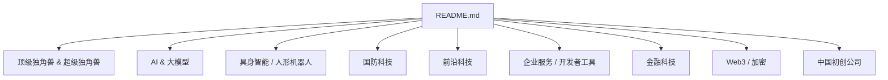
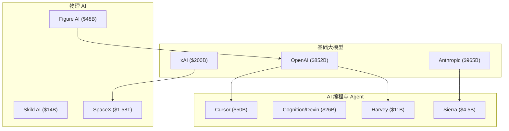
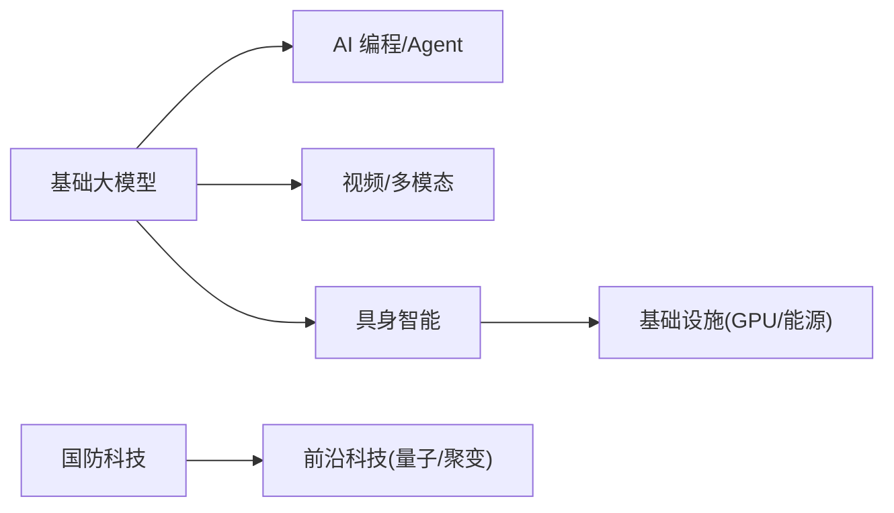

# 顶级独角兽 & 超级独角兽

<cite>
**本文引用的文件**
- [README.md](file://README.md)
</cite>

## 目录
1. [引言](#引言)
2. [项目结构](#项目结构)
3. [核心组件](#核心组件)
4. [架构总览](#架构总览)
5. [详细组件分析](#详细组件分析)
6. [依赖关系分析](#依赖关系分析)
7. [性能与估值考量](#性能与估值考量)
8. [故障排查与数据校验指南](#故障排查与数据校验指南)
9. [结论](#结论)
10. [附录](#附录)

## 引言
本文件聚焦 2026 年最具影响力的“顶级独角兽”和“超级独角兽”，按估值降序展示头部企业，并为其提供完整公司信息卡片：创始人背景、成立时间、核心产品、最新融资轮次与估值、业务亮点等。同时总结这些超级独角兽的共同特征与发展模式，解释估值背后的商业逻辑与市场地位，并提供投资参考与竞争格局分析。

## 项目结构
该仓库为一份持续更新的精选初创公司清单，按赛道组织，并在“顶级独角兽 & 超级独角兽”章节中按估值从高到低排列头部公司。内容覆盖 AI 大模型、AI Agent、具身智能、国防科技、前沿科技、企业服务、金融科技、Web3/加密以及中国初创公司等。

图表来源
- [README.md:1-120](file://README.md#L1-L120)

章节来源
- [README.md:1-120](file://README.md#L1-L120)

## 核心组件
本节提炼“顶级独角兽 & 超级独角兽”的核心信息，包括公司基本信息卡与关键指标，便于快速对比与决策。

- OpenAI — $852B
  - 创始人：Sam Altman、Greg Brockman、Ilya Sutskever 等
  - 成立：2015
  - 最新融资：2025 年 $110B 轮（$730B 估值），后续 $122B 估值 $852B
  - 核心产品：ChatGPT、GPT-5、Sora、Operator 等
  - 业务亮点：与 Microsoft 深度绑定；目标 AGI

- Anthropic — $965B
  - 创始人：Dario Amodei、Daniela Amodei（前 OpenAI 研究员）
  - 成立：2021
  - 最新融资：2026 年 5 月 $65B Series H，估值 $965B（领投 Altimeter、Dragoneer）
  - 核心产品：Claude 系列模型、Claude Code
  - 业务亮点：以“AI Safety”为核心定位；企业市场份额超越 OpenAI；ARR 高速增长

- xAI — $200B
  - 创始人：Elon Musk
  - 成立：2023
  - 最新融资：$200B 估值；已与 SpaceX 合并形成 $1.58T 巨无霸实体
  - 核心产品：Grok 系列、Grok Code
  - 业务亮点：Memphis 超算集群（20 万张 GPU）；X 平台流量入口

- SpaceX（xAI 母公司）— $1.58T
  - 创始人：Elon Musk
  - 成立：2002
  - 里程碑：Starship 试飞成功；Starlink 全球覆盖；2025 完成 xAI 合并

- Databricks — $134B
  - 创始人：Ali Ghodsi、Reynold Xin 等
  - 成立：2013
  - 最新融资：Series K 等多轮融资，估值 $134B
  - 核心产品：Lakehouse 架构事实标准；MosaicML 收购后布局生成式 AI

- Waymo — $126B
  - 母公司：Alphabet
  - 最新融资：2025 年估值 $126B
  - 核心产品：Robotaxi 服务
  - 业务亮点：唯一商业化 Robotaxi 服务，每周 25 万+ 付费乘客

- Stripe — $90B+
  - 创始人：Patrick Collison、John Collison
  - 成立：2010
  - 最新融资：2025 年员工股权交易估值约 $90B
  - 核心产品：支付基础设施
  - 业务亮点：年化支付额超 $1.9T；与 Bridge（稳定币）合作切入加密支付

- Figure AI — $48B
  - 创始人：Brett Adcock
  - 成立：2022
  - 最新融资：2025 年 9 月 Series C $1B+，估值 $39.5B；2026 年攀升至 $48B
  - 核心产品：Figure 01/02 人形机器人
  - 业务亮点：与 BMW、OpenAI 合作

- Perplexity AI — $20B
  - 创始人：Aravind Srinivas
  - 成立：2022
  - 最新融资：2025 年 9 月估值 $20B
  - 核心产品：AI 搜索
  - 业务亮点：月查询量 7.8 亿；Comet 浏览器；曾尝试收购 TikTok

- Mistral AI — $13.7B
  - 创始人：Arthur Mensch、Guillaume Lample 等
  - 成立：2023
  - 最新融资：Series C 后估值 $13.7B
  - 核心产品：Mistral Large、Mistral Small、Le Chat
  - 业务亮点：欧洲最大 AI 公司；开源+商业双轨

- Cohere — $6.8B
  - 创始人：Aidan Gomez、Ivan Zhang、Nick Frosst（Transformer 论文作者之一）
  - 成立：2019
  - 最新融资：2025 年估值 $6.8B
  - 核心产品：Command 系列、Embed、North 平台
  - 业务亮点：专注企业部署；多云中立（AWS/Azure/Oracle）

- CoreWeave — $35B
  - 创始人：Michael Intrator
  - 成立：2017
  - 最新融资：2025 年估值 $35B
  - 核心产品：GPU 云服务
  - 业务亮点：NVIDIA 重仓；专为 AI 训练打造的数据中心

章节来源
- [README.md:69-155](file://README.md#L69-L155)

## 架构总览
从“顶级独角兽 & 超级独角兽”的视角看，2026 年的资本与技术演进呈现三大主线：基础大模型（OpenAI/Anthropic/xAI）、AI 编程与 Agent（Cursor/Devin/Harvey/Sierra）、物理 AI（人形机器人与航天）。这些领域共同推动估值飙升，并形成跨行业协同效应。

图表来源
- [README.md:69-155](file://README.md#L69-L155)
- [README.md:203-283](file://README.md#L203-L283)
- [README.md:371-430](file://README.md#L371-L430)

## 详细组件分析

### 基础大模型（Frontier LLM Labs）
- OpenAI
  - 创始人：Sam Altman 等 | 成立：2015
  - 核心产品：ChatGPT、GPT-5、o3、Sora、Operator
  - 最新融资：2025 年 $110B 轮（$730B 估值）；后续 $852B
  - 亮点：已成为史上最大初创公司之一，估值超越传统科技巨头

- Anthropic
  - 创始人：Dario & Daniela Amodei | 成立：2021
  - 核心产品：Claude 4.5 / Opus、Claude Code
  - 最新融资：2026 年 5 月 $65B Series H（$965B 估值）
  - 亮点：以 “AI Safety” 为核心定位；企业市场份额超 OpenAI；ARR 增长最快 AI 公司之一

- xAI
  - 创始人：Elon Musk | 成立：2023
  - 核心产品：Grok 系列、Grok Code
  - 亮点：Memphis 超算集群（20 万张 GPU）；X 平台流量入口；与 SpaceX 合并后估值达 $1.58T

- Mistral AI
  - 创始人：Arthur Mensch 等 | 成立：2023 | 总部：巴黎
  - 核心产品：Mistral Large、Mistral Small、Le Chat
  - 最新融资：2026 年估值 $13.7B
  - 亮点：欧洲 AI 龙头；开源+商业双轨；多模型路线

- Cohere
  - 创始人：Aidan Gomez 等 | 成立：2019
  - 核心产品：Command 系列、Embed、North 平台
  - 最新融资：2025 年估值 $6.8B
  - 亮点：Transformer 论文作者创办；专注企业部署；多云中立（AWS/Azure/Oracle）

- Sakana AI
  - 创始人：David Ha、Lionel Jones | 成立：2023 | 总部：东京
  - 核心产品：日语优化大模型、EfficientLLM
  - 最新融资：2025 年 11 月 $135M Series B（$2.65B 估值）
  - 亮点：日本 AI 国家队代表；“模型合并”等高效训练方法研究领先

- DeepSeek
  - 创始人：梁文锋 | 成立：2023 | 总部：杭州
  - 核心产品：DeepSeek-V3、DeepSeek-R1
  - 亮点：R1 模型以低成本训练震惊全球；中国 AGI 先锋；首次重大外部融资估值约 $300B

章节来源
- [README.md:157-200](file://README.md#L157-L200)

### AI 编程 / Coding Agent
- Anysphere / Cursor — $50B
  - 创始人：Aman Sanger 等 | 成立：2022
  - 核心产品：Cursor AI 代码编辑器
  - 最新融资：2025 年 11 月 Series D $2.3B（$29.3B 估值）；正洽谈新一轮 $50B 估值
  - 亮点：ARR 一年从 $50M → $500M（10 倍）；估值两月翻倍

- Cognition AI / Devin — $26B
  - 创始人：Scott Wu | 成立：2023
  - 核心产品：Devin（自主 AI 软件工程师）
  - 最新融资：2025 年 $1B+ 轮（$26B 估值）
  - 亮点：90% 代码由自家 AI 编写；营收 1 年增长 13 倍至 $492M

- Replit — $3B
  - 创始人：Amjad Masad | 成立：2016
  - 核心产品：Replit Agent（云端 AI 开发环境）
  - 亮点：从在线 IDE 转型 AI 编程平台；Agent 模式大获成功

- Lovable — $1.8B
  - 创始人：Anton Osika | 成立：2024 | 总部：斯德哥尔摩
  - 核心产品：AI 全栈 Web 应用生成
  - 最新融资：2025 年估值 $1.8B
  - 亮点：14 个月内 ARR 突破 $500M；YC W25 明星项目

- Bolt.new — $700M
  - 创始人：Eric Simons | 成立：2024
  - 核心产品：StackBlitz 旗下 AI Web 开发平台
  - 亮点：基于 WebContainers 浏览器内运行；2025 年估值 $700M

- Codeium / Windsurf — $1.25B
  - 核心产品：Windsurf AI IDE
  - 亮点：曾估值 $1.25B；2025 年被 Cognition 收购整合至 Devin

- Factory — $120M+
  - 核心产品：AI 软件工程 Agent（Droids）
  - 亮点：Droid 系列在企业 DevOps 场景落地

- v0 by Vercel — $9.3B（母公司 Vercel）
  - 核心产品：AI UI 生成器
  - 亮点：日生成量超百万组件；与 Vercel 部署深度集成

章节来源
- [README.md:203-246](file://README.md#L203-L246)

### AI Agent / 智能体平台
- Harvey AI — $11B
  - 创始人：Winston Weinberg、Gabriel Pereyra | 成立：2022
  - 核心产品：法律 AI 助手
  - 最新融资：2026 年 3 月 $200M 轮（$11B 估值）
  - 亮点：法律 AI 事实标准；ARR $1.5B；客户覆盖财富 500 强律所

- Sierra — $4.5B
  - 创始人：Bret Taylor、Clay Bavor | 成立：2024
  - 核心产品：企业客服 AI Agent
  - 最新融资：2026 年估值 $4.5B
  - 亮点：Bret Taylor（前 Salesforce COO、OpenAI 董事）二次创业；ARR 高速增长

- Decagon — $1.5B
  - 核心产品：客服 AI Agent 平台
  - 最新融资：2025 年 6 月 $131M Series C（$1.5B 估值）
  - 亮点：从 challenger 跃升头部；客户包括多家 Fortune 500

- Glean — $7.25B
  - 创始人：Arvind Jain | 成立：2019
  - 核心产品：企业 AI 搜索 / 知识管理
  - 最新融资：2025 年估值 $7.25B
  - 亮点：500+ 企业客户（含 Nasdaq、Pixar）

- Manus AI — $500M+
  - 创始人：肖弘、季逸超 | 成立：2024 | 总部：中国
  - 核心产品：通用 AI Agent
  - 亮点：2025 年 GAIA 基准 SOTA；中国 AGI 独角兽

- Lindy AI — $100M+
  - 核心产品：个人 AI 助理 Agent
  - 亮点：被誉为 “个人 AI 员工”；YC 明星项目

章节来源
- [README.md:249-283](file://README.md#L249-L283)

### 具身智能 / 人形机器人
- Figure AI — $48B
  - 创始人：Brett Adcock | 成立：2022
  - 核心产品：Figure 02 人形机器人
  - 最新融资：2025 年 9 月 Series C $1B+（$39.5B 估值）；2026 年攀升 $48B
  - 亮点：Figure 02 已在 BMW 工厂商用部署；OpenAI 模型集成

- Skild AI — $14B
  - 创始人：Deepak Pathak、Agarwal Abhishek（CMU 教授）
  - 成立：2023
  - 核心产品：通用机器人 “大脑”（Skild Brain）
  - 最新融资：2026 年 1 月 Series C $1.4B（$14B 估值，软银领投）
  - 亮点：史上最大机器人 AI 融资；模型可跨硬件平台部署

- Physical Intelligence — $5.6B
  - 创始人：Sergey Levine 等 | 成立：2024
  - 核心产品：机器人基础模型 π（pi）
  - 最新融资：2025 年 $400M（$5.6B 估值）
  - 亮点：机器人 “GPT 时刻” 缔造者；含 Jeff Bezos、OpenAI 等投资

- 1X Technologies — $1B+
  - 创始人：Bernt Børnich | 成立：2014 | 总部：挪威
  - 核心产品：Neo Beta 人形机器人
  - 最新融资：2025 年 9 月拟融资 $1B（$10B 估值）
  - 亮点：家用机器人领军；OPENAI 早期投资

- Apptronik — $1.5B
  - 创始人：Jeff Cardenas | 成立：2016
  - 核心产品：Apollo 人形机器人
  - 最新融资：2025 年 Series A $350M（$1.5B 估值，Google 参投）
  - 亮点：与 Google DeepMind 合作；Mercedes-Benz 工厂测试

- NEURA Robotics — $1.2B+
  - 总部：德国 | 成立：2019
  - 核心产品：4NE-1 人形机器人
  - 最新融资：2025 年 Series B $1.2B+
  - 亮点：欧洲人形机器人代表；专注工业场景

- Agility Robotics — $1B+
  - 核心产品：Digit 双足机器人
  - 亮点：与 Amazon GXO 合作；Ford 测试

- Sanctuary AI — $140M+
  - 总部：加拿大 | 核心产品：Phoenix 人形机器人
  - 亮点：Carbon 控制系统；加拿大 BC 省总部

- Unitree Robotics — $1.7B（估）
  - 总部：杭州 | 成立：2016
  - 核心产品：H1、G1 人形机器人
  - 亮点：全球最大消费级机器人公司；G1 售价 $16,000

- Galbot — $1B+
  - 总部：北京
  - 核心产品：Galbot G1
  - 亮点：中国人形机器人新势力；北京大学孵化

章节来源
- [README.md:371-430](file://README.md#L371-L430)

### 国防科技
- Anduril Industries — $61B
  - 创始人：Palmer Luckey | 成立：2017
  - 核心产品：Lattice OS、Roadrunner、Fury、Sentry
  - 最新融资：2025 年 Series F $1.5B（$40B → $61B）
  - 亮点：国防科技头号 “Neo-prime”；员工超 6,200 人

- Shield AI — $12.7B
  - 创始人：Brandon Tseng、Ryan Tseng | 成立：2015
  - 核心产品：Hivemind、X-BAT 自主战机
  - 最新融资：2025 年估值 $12.7B
  - 亮点：F-16 自主飞行；多国国防部客户

- Saronic — $4B
  - 核心产品：Spyglass、Cutlass 自主无人艇
  - 最新融资：2026 年估值 $4B（最新一轮在谈 $9.25B）
  - 亮点：美国海军 200+ 自主艇订单；德州新工厂

- Palantir Technologies — $400B+（已上市）
  - 创始人：Peter Thiel、Alex Karp
  - 核心产品：Gotham、Foundry、AIP
  - 亮点：已上市，但 2025–2026 国防合同激增；股价创历史新高

- Hadrian — $2.6B
  - 核心产品：国防零部件智能制造
  - 最新融资：2026 年估值 $2.6B
  - 亮点：AI 驱动的国防供应链；工厂 24/7 自主生产

- Chaos Industries — $2B
  - 创始人：John Hering、Brett Cummings | 成立：2023
  - 核心产品：感应 / 干扰系统
  - 最新融资：2025 年 Series C $510M（$2B 估值）
  - 亮点：硅谷国防新星；2025 年员工翻 4 倍

- Epirus — $1.5B
  - 核心产品：Leonidas 高功率微波武器
  - 亮点：无人机蜂群对抗；美国国防部订单

- Castelion — $1B+
  - 核心产品：超声速武器（HAWC）
  - 亮点：Anduril 联合创始人 Brian Schimpf 创办

- Vannevar Labs — $700M+
  - 核心产品：AI 国防情报平台
  - 亮点：OSINT / SIGINT AI 分析；国防部核心供应商

- Rebellion Defense — $1B+（估）
  - 创始人：Chris Lynch | 成立：2019
  - 核心产品：Ganos AI 国防操作系统
  - 亮点：国防 AI 软件代表

章节来源
- [README.md:432-486](file://README.md#L432-L486)

### 前沿科技（量子计算、核聚变/新能源、航空航天）
- PsiQuantum — $7B
  - 总部：Palo Alto | 成立：2015
  - 核心产品：基于光子学的百万量子比特系统
  - 最新融资：2025 年 9 月 Series E $1B（BlackRock 领投，$7B 估值）
  - 亮点：量子计算最大单轮私募融资；与 GlobalFoundries 合作制造

- Quantinuum — $10B+（合并估值）
  - 核心产品：H 系列离子阱量子计算机
  - 最新融资：2025 年 9 月 $600M（$10B 估值）；2026 年 6 月又一轮共 $1.68B
  - 亮点：Honeywell + Cambridge Quantum 合并；逻辑量子比特路线领先

- IonQ — 已上市 $8B+
  - 核心产品：Forte、IonQ Tempo
  - 亮点：第一家纯量子计算上市公司

- QuEra Computing — $200M+
  - 总部：Boston | 核心产品：中性原子量子计算机
  - 亮点：Google Ventures 投资；2026 年 Q2 估值快速攀升

- Atom Computing — $300M+
  - 核心产品：中性原子（铷）量子计算
  - 亮点：2024 年首次实现 1,000+ 量子比特

- Rigetti Computing — 已上市
  - 核心产品：超导量子计算
  - 亮点：第一家全栈量子计算上市公司

- D-Wave Systems — 已上市
  - 核心产品：量子退火机
  - 亮点：商业化最久的量子计算公司；专注优化问题

- Commonwealth Fusion Systems — $3B+（累计）
  - 创始人：MIT 团队 | 成立：2018
  - 核心产品：高温超导托卡马克 SPARC
  - 最新融资：2025 年 8 月 Series B2 $863M
  - 亮点：全球私营核聚变融资榜首；与 Google 合作；目标 2027 演示

- Helion Energy — $1.5B+
  - 创始人：David Kirtley | 成立：2013
  - 核心产品：脉冲磁惯性核聚变
  - 最新融资：2025 年 1 月 $425M
  - 亮点：Sam Altman 重仓投资；2028 商用发电目标；与 Microsoft 签 PPA

- TAE Technologies — $1.2B+
  - 核心产品：Field-Reversed Configuration 核聚变
  - 亮点：与 Google 合作；目标 2030 商用

- Form Energy — $1.5B+
  - 核心产品：100 小时铁-空气电池
  - 最新融资：2023 年 Series F $450M（$2.7B 估值）
  - 亮点：储能技术里程碑；与多家美国电力公司签约

- Boston Metal — $300M+
  - 核心产品：绿色钢铁电解
  - 亮点：模块化 MOE 技术；去碳化重工业

- Relativity Space — $5B+
  - 创始人：Tim Ellis、Jordan Noone | 成立：2015
  - 核心产品：Terran R / Terran 1 可回收火箭
  - 亮点：3D 打印火箭；Terran 1 成功入轨

- Rocket Lab — 已上市 ~$30B
  - 创始人：Peter Beck | 成立：2006
  - 核心产品：Electron、Neutron 火箭
  - 亮点：2025 年完成 21 次发射；与 MDA Space 合作

- Planet Labs — 已上市
  - 核心业务：卫星成像 / 地球观测
  - 亮点：200+ 卫星组成的星座；与 Google 合作

- Firefly Aerospace — 已上市 $10B+
  - 核心产品：Alpha 火箭、Blue Ghost 月球着陆器
  - 亮点：2025 年成功登月（Blue Ghost Mission 1）

- Axiom Space — $2.6B+
  - 核心产品：商业空间站、AxH1 任务
  - 亮点：ISS 商业模块；NASA 阿尔忒弥斯合作伙伴

- Sierra Space — $5B+
  - 核心产品：Dream Chaser 太空飞机、LIFE 充气模块
  - 亮点：与 NASA 签订多份 ISS 合同

章节来源
- [README.md:488-613](file://README.md#L488-L613)

### 企业服务 / 开发者工具、金融科技、Web3/加密、中国初创公司
- 企业服务/开发者工具：Vercel、Supabase、Linear、Wiz、Snyk、Cyera、Tailscale、Hex、dbt Labs、Fivetran、Deel、Remote、Rippling、Clay、Gong、Attio
- 金融科技：Mercury、Ramp、Brex、Plaid、Circle、Bridge (Stripe 子公司)、Worldcoin / Tools for Humanity、Altruist、Public.com
- Web3/加密：Pump.fun、Phantom Wallet、LayerZero Labs、Story Protocol、Monad、Berachain、Polygon Labs
- 中国初创公司：DeepSeek、Moonshot AI、Zhipu AI、StepFun、01.AI、Baichuan AI、MiniMax、Pony.ai、WeRide

章节来源
- [README.md:615-857](file://README.md#L615-L857)

## 依赖关系分析
- 基础大模型对上层应用（AI 编程、Agent、视频/多模态）具有强依赖关系：模型能力决定产品体验与商业化速度。
- 物理 AI（人形机器人、航天）依赖算力与能源基础设施（CoreWeave、Crusoe Energy 等），并与基础大模型生态协作（如 Figure AI 集成 OpenAI 模型）。
- 国防科技与前沿科技（量子计算、核聚变）受政策与政府订单驱动，具备长周期、高壁垒特征。

图表来源
- [README.md:69-155](file://README.md#L69-L155)
- [README.md:285-321](file://README.md#L285-L321)
- [README.md:432-486](file://README.md#L432-L486)
- [README.md:488-613](file://README.md#L488-L613)

## 性能与估值考量
- 资本极度集中：2026 H1 全球 VC 投资 $510B，AI 占比 >70%，Fewer deals, bigger checks。
- 估值驱动因素：
  - 基础大模型：AGI 愿景、企业 ARR 增长、生态绑定（Microsoft 等）。
  - AI 编程/Agent：ARR 爆发式增长、产品化速度、开发者生态。
  - 物理 AI：商用落地（BMW/GXO 等）、规模化部署、供应链与成本优化。
  - 国防科技：政府订单、合规与安全需求、技术壁垒。
  - 前沿科技：里程碑进展（量子比特数、聚变演示）、长期战略价值。
- 市场地位：头部公司在各自赛道形成事实标准或生态主导（如 Lakehouse、Robotaxi、国防操作系统）。

章节来源
- [README.md:48-66](file://README.md#L48-L66)

## 故障排查与数据校验指南
- 数据来源与更新频率：清单来自 Forbes AI 50、CB Insights、Crunchbase、PitchBook、The Information、TechCrunch、Y Combinator、Sacra、Contrary Research、AI Funding Tracker、New Market Pitch 等权威来源。
- 验证建议：
  - 核对公司官网与官方公告（融资轮次、估值、里程碑）。
  - 交叉比对多家媒体与数据库（避免单一信源偏差）。
  - 关注时间戳（截至 2026 H1，持续更新中）。
- 常见问题：
  - 估值波动：私募市场估值可能随市场情绪变化而调整。
  - 并购与重组：如 xAI 与 SpaceX 合并，需关注实体变更。
  - 公开披露限制：部分公司仅通过员工股权交易或内部消息披露估值。

章节来源
- [README.md:859-876](file://README.md#L859-L876)

## 结论
2026 年的顶级与超级独角兽集中在基础大模型、AI 编程与 Agent、物理 AI、国防科技与前沿科技五大方向。其共同特征是：技术壁垒高、生态绑定深、商业化速度快、资本高度集中。估值背后是明确的商业逻辑：模型能力转化为 ARR、产品化速度决定市场份额、物理 AI 的商用落地带来规模效应、国防与前沿科技的长期战略价值支撑高估值。投资参考应关注：ARR 增速、生态合作、商用落地进度、政策与监管环境、供应链与算力保障。

## 附录
- 关键趋势摘要：
  - 资本极度集中，AI 占总投资比例 >70%。
  - AI 三大爆发点：基础模型、AI 编程、AI Agent。
  - 物理 AI 起飞：人形机器人从 Demo 走向商用部署。
  - 中国 AI 复苏：六小虎合计估值 >$200B。
  - Stripe 独大：$159B 估值，用支付基础设施优势切入企业计费与区块链。

章节来源
- [README.md:48-66](file://README.md#L48-L66)