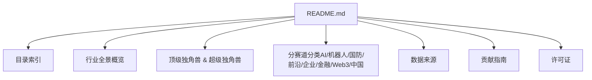
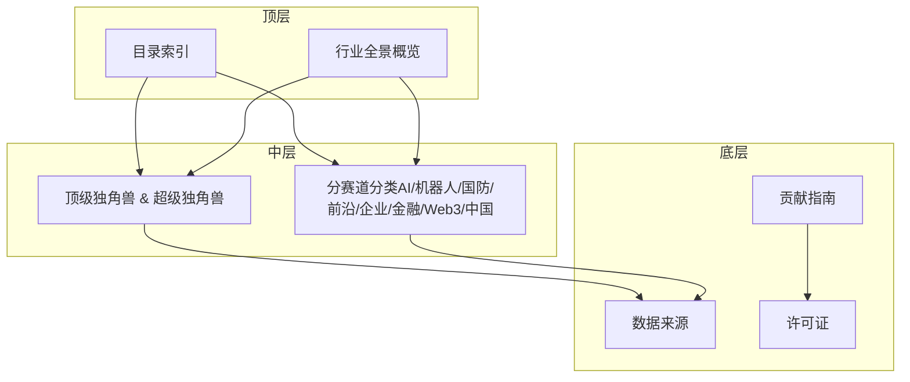
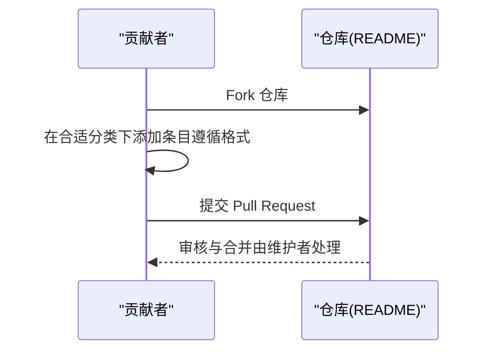
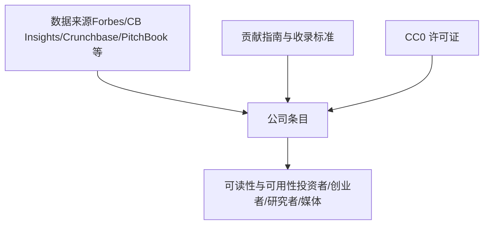

# 项目概述

<cite>
**本文引用的文件**
- [README.md](file://README.md)
</cite>

## 目录
1. [简介](#简介)
2. [项目结构](#项目结构)
3. [核心组件](#核心组件)
4. [架构总览](#架构总览)
5. [详细组件分析](#详细组件分析)
6. [依赖关系分析](#依赖关系分析)
7. [性能与更新机制](#性能与更新机制)
8. [故障排查指南](#故障排查指南)
9. [结论](#结论)
10. [附录：使用指南与多语言支持](#附录使用指南与多语言支持)

## 简介
Awesome Startups 是一份持续更新的精选初创公司清单，聚焦 2025–2026 年间最受资本、市场与媒体关注的初创公司，并按热门赛道系统化整理。其价值主张在于为投资者、创业者、研究人员与媒体提供一份权威、可验证、按行业全景与顶级独角兽排序的参考清单，帮助快速把握全球前沿创新与融资趋势。

- 目标受众
  - 投资者：快速定位头部公司与赛道热度，辅助投资决策
  - 创业者：对标竞品与生态位，了解融资节奏与标杆案例
  - 研究人员：获取行业数据与趋势洞察，支撑研究与报告
  - 媒体：引用权威来源与结构化信息，提升报道质量
- 核心价值
  - 行业全景概览：以关键指标与趋势总结呈现宏观格局
  - 顶级独角兽列表：按估值/融资规模排序，突出影响力公司
  - 多领域分类整理：AI、具身智能、国防科技、前沿科技、企业服务、金融科技、Web3、中国初创公司等
  - 开放协作：CC0 许可证，鼓励自由使用与贡献

章节来源
- [README.md:1-17](file://README.md#L1-L17)

## 项目结构
仓库采用极简结构，核心内容集中在 README 中，通过多级标题组织内容，便于阅读与导航。整体结构如下：

图表来源
- [README.md:21-45](file://README.md#L21-L45)
- [README.md:48-87](file://README.md#L48-L87)
- [README.md:69-155](file://README.md#L69-L155)
- [README.md:157-805](file://README.md#L157-L805)
- [README.md:859-932](file://README.md#L859-L932)

章节来源
- [README.md:21-45](file://README.md#L21-L45)

## 核心组件
- 行业全景概览：汇总关键指标（如 VC 投资规模、AI 占比、细分赛道融资等），并提炼核心趋势，帮助读者快速理解市场全貌
- 顶级独角兽 & 超级独角兽：按估值降序排列头部公司，标注创始人、成立时间、最新融资与亮点，形成“榜单式”参考
- 多领域分类整理：将公司按赛道归类，覆盖 AI 大模型、AI Agent、AI 基础设施、视频/多模态生成、具身智能、国防科技、量子计算、AI 制药、核聚变/新能源、航空航天、企业服务、安全、数据、HR、营销销售、金融科技、加密/Web3、中国初创公司等
- 数据来源与可信度：列出 Forbes、CB Insights、Crunchbase、PitchBook、The Information、TechCrunch、Y Combinator、Sacra、Contrary Research、AI Funding Tracker、New Market Pitch 等权威来源，确保条目可追溯
- 贡献指南与收录标准：明确如何 Fork、提交 PR、格式规范；规定收录标准（私营初创、近期重要融资或里程碑、公开可验证来源、优先产品/用户/合作）、排除范围（已上市大型科技公司、仅概念阶段、无法验证的 PPT 公司）
- 许可证：采用 CC0 1.0 通用许可证，允许自由使用、修改与分发，无需署名

章节来源
- [README.md:48-66](file://README.md#L48-L66)
- [README.md:69-155](file://README.md#L69-L155)
- [README.md:157-805](file://README.md#L157-L805)
- [README.md:859-876](file://README.md#L859-L876)
- [README.md:879-908](file://README.md#L879-L908)
- [README.md:911-919](file://README.md#L911-L919)

## 架构总览
从内容组织角度，项目采用“分层+分类”的结构化文档架构：顶层为目录索引与全景概览，中层为顶级独角兽与分赛道分类，底层为数据来源、贡献指南与许可证。该架构便于读者按需检索，也利于社区协作维护。

图表来源
- [README.md:21-45](file://README.md#L21-L45)
- [README.md:48-87](file://README.md#L48-L87)
- [README.md:69-155](file://README.md#L69-L155)
- [README.md:157-805](file://README.md#L157-L805)
- [README.md:859-932](file://README.md#L859-L932)

## 详细组件分析

### 行业全景概览
- 作用：提供关键指标与趋势总结，帮助读者建立对 2025–2026 年创投市场的整体认知
- 内容要点：VC 投资规模、AI 占比、金融科技与数字健康融资、具身智能爆发、国防科技融资、中国 AI 六小虎合计估值等
- 趋势提炼：资本集中、AI 三大爆发点、物理 AI 起飞、中国 AI 复苏、Stripe 独大等

章节来源
- [README.md:48-66](file://README.md#L48-L66)

### 顶级独角兽 & 超级独角兽
- 作用：按估值降序展示最具影响力的初创公司，便于快速识别头部标的
- 内容要点：公司名、赛道、创始人、成立年份、最新融资与估值、亮点（产品/合作/里程碑）
- 示例覆盖：OpenAI、Anthropic、xAI、SpaceX、Databricks、Waymo、Stripe、Figure AI、Perplexity AI、Mistral AI、Cohere、CoreWeave 等

章节来源
- [README.md:69-155](file://README.md#L69-L155)

### 分赛道分类（AI/机器人/国防/前沿/企业/金融/Web3/中国）
- 作用：将公司按赛道系统归类，便于按兴趣或需求定向检索
- 内容要点：每个子赛道包含若干代表性公司，标注核心产品、最新融资与亮点
- 覆盖范围：基础大模型、AI 编程/Coding Agent、AI Agent、AI 基础设施、AI 视频/多模态生成、具身智能/人形机器人、国防科技、量子计算、AI 制药/生物科技、核聚变/新能源、航空航天、企业服务/开发者工具、安全、数据/分析、HR/招聘、营销/销售、金融科技、加密/Web3、中国初创公司

章节来源
- [README.md:157-805](file://README.md#L157-L805)

### 数据来源与质量保证
- 数据来源：Forbes AI 50、CB Insights、Crunchbase、PitchBook、The Information、TechCrunch、Y Combinator、Sacra、Contrary Research、AI Funding Tracker、New Market Pitch
- 收录标准：私营初创公司；2025–2026 期间的重要融资或里程碑；公开可验证来源；优先有产品上线、显著用户量或战略合作的公司
- 排除范围：已上市大型科技公司（除非刚拆分子公司）；仅有概念阶段无实际产品的项目；无法验证信息的“PPT 公司”

章节来源
- [README.md:859-876](file://README.md#L859-L876)
- [README.md:879-908](file://README.md#L879-L908)

### 贡献流程（Pull Request 工作流）

图表来源
- [README.md:879-894](file://README.md#L879-L894)

章节来源
- [README.md:879-894](file://README.md#L879-L894)

## 依赖关系分析
- 内容依赖：各赛道与公司条目依赖外部权威数据源（Forbes、CB Insights、Crunchbase、PitchBook 等）进行事实校验
- 协作依赖：贡献者依赖贡献指南与收录标准，确保新增条目符合质量要求
- 许可依赖：CC0 许可证使内容可被自由使用与再分发，降低法律门槛

图表来源
- [README.md:859-876](file://README.md#L859-L876)
- [README.md:879-908](file://README.md#L879-L908)
- [README.md:911-919](file://README.md#L911-L919)

章节来源
- [README.md:859-876](file://README.md#L859-L876)
- [README.md:879-908](file://README.md#L879-L908)
- [README.md:911-919](file://README.md#L911-L919)

## 性能与更新机制
- 更新频率：项目声明“持续更新”，并以时间戳标注最后更新日期与数据截至期（例如“最后更新：2026 年 8 月 13 日 · 数据截至 2026 H1 · 持续更新中”）
- 更新策略：通过社区贡献（Fork + PR）与维护者审核，保证条目时效性与准确性
- 质量保障：依据收录标准与数据来源，避免不可验证信息与过时内容

章节来源
- [README.md:879-908](file://README.md#L879-L908)
- [README.md:923-931](file://README.md#L923-L931)

## 故障排查指南
- 常见问题
  - 条目不符合收录标准：检查是否满足“私营初创、近期重要融资/里程碑、公开可验证来源”的要求
  - 格式不规范：按照贡献指南中的条目格式补充“创始人、成立、核心产品、最新融资、亮点”
  - 无法验证信息来源：补充官方链接或权威媒体报道链接
- 解决步骤
  - 对照收录标准自查
  - 修正格式与信息完整性
  - 提交 PR 并在 Issues/Discussions 中沟通

章节来源
- [README.md:879-908](file://README.md#L879-L908)

## 结论
Awesome Startups 以清晰的分层结构与严谨的数据来源，构建了面向 2025–2026 年的初创公司全景与顶级独角兽清单。其多赛道分类、严格的收录标准与开放的 CC0 许可证，使其成为投资者、创业者、研究人员与媒体的高效参考工具。通过持续的社区贡献与更新机制，项目能够紧跟市场变化，保持内容的时效性与权威性。

## 附录：使用指南与多语言支持
- 基本使用指南
  - 浏览目录索引，快速定位感兴趣赛道
  - 查看行业全景概览，把握宏观趋势
  - 查阅顶级独角兽列表，了解头部公司
  - 根据分赛道分类，深入特定领域
  - 参考数据来源，交叉验证信息
  - 参与贡献：遵循贡献指南与收录标准，提交 PR
- 多语言支持
  - 提供英文、简体中文、繁体中文、日文版本，便于不同地区读者使用

章节来源
- [README.md:15-17](file://README.md#L15-L17)
- [README.md:21-45](file://README.md#L21-L45)
- [README.md:879-908](file://README.md#L879-L908)