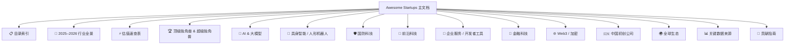
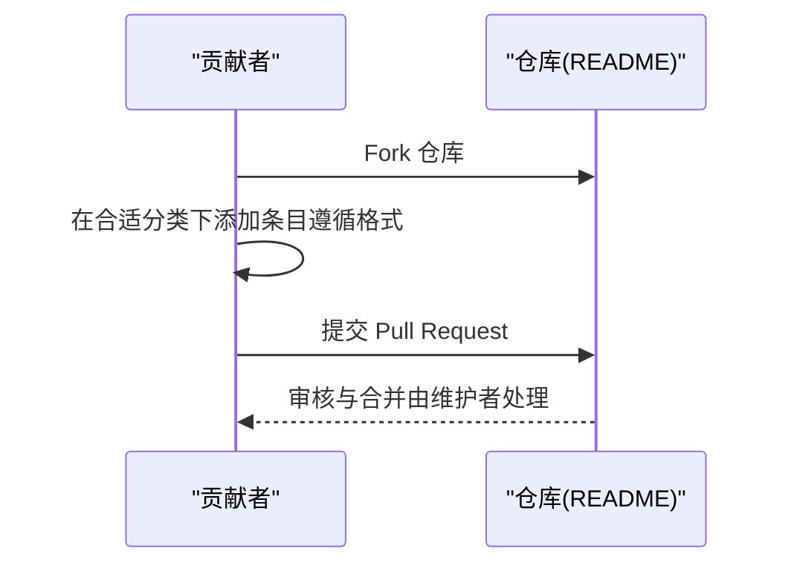

# 项目概述

<cite>
**本文引用的文件**
- [README.md](file://README.md)
</cite>

## 更新摘要
**所做更改**
- 完全重构了项目概述，从简单的2行README描述转变为全面的项目介绍
- 新增了详细的行业分析和估值数据章节
- 扩展了多领域分类覆盖范围
- 增强了数据来源和质量保证机制说明
- 更新了目标受众和使用场景描述
- 完善了开源协作模式和许可证信息

## 目录
1. [项目简介](#项目简介)
2. [核心价值主张](#核心价值主张)
3. [项目规模与结构](#项目规模与结构)
4. [核心功能特性](#核心功能特性)
5. [行业全景概览](#行业全景概览)
6. [顶级独角兽列表](#顶级独角兽列表)
7. [多领域分类体系](#多领域分类体系)
8. [数据来源与质量保证](#数据来源与质量保证)
9. [目标受众与使用场景](#目标受众与使用场景)
10. [开源协作模式](#开源协作模式)
11. [多语言支持](#多语言支持)
12. [使用指南](#使用指南)

## 项目简介

Awesome Startups 是一份持续更新的精选初创公司清单，专注于 **2025–2026** 年间最受资本、市场与媒体关注的初创公司，按热门赛道系统化整理。该项目已从最初极简的2行README发展为包含 **2957+行** 内容的综合性初创公司数据库，涵盖全球范围内最具影响力的初创企业。

作为一份权威的行业参考工具，Awesome Startups 为投资者、创业者、研究人员与媒体提供了一份可验证、按行业全景与顶级独角兽排序的参考清单，帮助快速把握全球前沿创新与融资趋势。

**关键指标：**
- 📊 **2026 H1 全球风险投资创下 $510B 历史新高**（超 2025 全年 $440B）
- 🤖 **AI 领域占比超过 70%**，创历史新高
- 🌍 **覆盖全球主要科技生态**：美国、中国、欧洲、印度、拉美、东南亚、中东、非洲
- 📈 **收录标准严格**：仅包含有真实产品、显著用户量或战略合作的公司

## 核心价值主张

### 权威性
- 基于 Forbes AI 50、CB Insights、Crunchbase、PitchBook 等权威来源
- 严格的收录标准确保数据质量和可信度
- 持续更新机制保持内容时效性

### 系统性
- 分层+分类的结构化文档架构
- 从宏观行业全景到微观公司详情的完整信息链
- 多维度数据分析：估值、融资、技术路线、市场定位

### 实用性
- 清晰的导航结构和搜索友好格式
- 标准化的公司信息模板
- 多语言支持便于全球用户使用

### 开放性
- CC0 1.0 通用许可证，允许自由使用、修改与分发
- 鼓励社区贡献和协作维护
- 透明的贡献流程和收录标准

## 项目规模与结构

### 内容规模
- **总行数**：2,957+ 行
- **覆盖公司**：数百家中外知名初创公司
- **行业覆盖**：15+ 个主要科技领域
- **地理覆盖**：全球主要科技生态系统

### 文档结构


**图表来源**
- [README.md:21-82](file://README.md#L21-L82)

## 核心功能特性

### 行业全景概览
提供关键指标与趋势总结，帮助读者建立对 2025–2026 年创投市场的整体认知：
- VC 投资规模、AI 占比、金融科技与数字健康融资
- 具身智能爆发、国防科技融资、中国 AI 复苏
- 资本集中趋势、AI 三大爆发点、物理 AI 起飞

### 顶级独角兽 & 超级独角兽
按估值降序展示最具影响力的初创公司：
- xAI/SpaceX ($1.58T)、Anthropic ($965B)、OpenAI ($852B)
- Palantir ($400B+)、Stripe ($159B)、Databricks ($134B)
- Waymo ($126B)、Anduril ($61B)、Zhipu AI ($56B)

### 多领域分类整理
将公司按赛道系统归类，覆盖以下主要领域：
- **AI & 大模型**：基础大模型、AI编程、AI Agent、AI基础设施、AI芯片、AI视频生成
- **具身智能**：人形机器人、自动驾驶、Robotaxi
- **国防科技**：无人机、自主武器、网络安全
- **前沿科技**：量子计算、AI制药、核聚变、脑机接口、航空航天
- **企业服务**：开发者工具、网络安全、数据平台、HR招聘
- **金融科技**：支付、借贷、财富管理、保险科技
- **Web3/加密**：区块链、DeFi、NFT、跨链协议
- **区域生态**：中国、欧洲、印度、拉美、东南亚、中东、非洲

**章节来源**
- [README.md:86-134](file://README.md#L86-L134)
- [README.md:137-223](file://README.md#L137-L223)
- [README.md:225-2957](file://README.md#L225-L2957)

## 行业全景概览

### 关键市场指标
| 指标 | 数据 | 备注 |
| --- | --- | --- |
| **2026 H1 全球 VC 投资** | **$510B** | 超过 2025 全年 $440B |
| **AI 占总投资比例** | **>70%** | 创历史新高 |
| **2026 H1 金融科技融资** | **$28.6B** | 同比 +23%，交易数 -26% |
| **2025 具身智能融资** | **$14B+** | 人形机器人领域爆发 |
| **2026 国防科技融资** | **$14.6B+** | Anduril、Shield AI、Saronic 领跑 |
| **数字健康融资 (2026 H1)** | **$7.4B** | AI 驱动反弹 |
| **中国 AI 六小虎合计估值** | **>$200B** | DeepSeek + Moonshot + Zhipu + MiniMax + StepFun + 01.AI |

### 核心趋势洞察
- **资本极度集中**：钱流向头部公司，交易数下降但单轮金额暴涨
- **AI 三大爆发点**：基础模型（OpenAI/Anthropic/xAI）、AI 编程（Cursor $50B）、AI Agent（Harvey $11B）
- **物理 AI 起飞**：人形机器人从 Demo 走向商用部署
- **中国 AI 复苏**：DeepSeek 首轮融资 $50B、Zhipu/MiniMax 港股 IPO 后暴涨
- **Stripe 独大**：$159B 估值，正在用支付基础设施优势切入企业计费和区块链

**章节来源**
- [README.md:86-104](file://README.md#L86-L104)

## 顶级独角兽列表

### 估值前十大公司
1. **xAI / SpaceX** — $1.58T（合并实体）
2. **Anthropic** — $965B（AI 基础模型）
3. **OpenAI** — $852B（AGI 开发）
4. **Palantir** — $400B+（国防/数据）
5. **Stripe** — $159B（金融基础设施）
6. **Databricks** — $134B（数据/AI 平台）
7. **Waymo** — $126B（Robotaxi）
8. **Anduril** — $61B（国防科技）
9. **Zhipu AI** — $56B（中国 AI，已上市）
10. **Cursor** — $50B（AI 编程，洽谈中）

### 重点公司详情

#### OpenAI ($852B)
- **创始人**：Sam Altman、Greg Brockman、Ilya Sutskever
- **成立**：2015
- **最新融资**：2025 年 $110B 轮，估值 $730B；后续 $122B 估值 $852B
- **亮点**：ChatGPT、GPT-5、Sora；与 Microsoft 深度绑定；目标 AGI

#### Anthropic ($965B)
- **创始人**：Dario Amodei、Daniela Amodei（前 OpenAI 研究员）
- **成立**：2021
- **最新融资**：2026 年 5 月 $65B Series H，估值 $965B
- **亮点**：Claude 系列模型、企业市场超越 OpenAI；ARR 高速增长

#### Figure AI ($48B)
- **创始人**：Brett Adcock
- **成立**：2022
- **最新融资**：2025 年 9 月 Series C $1B+，估值 $39.5B；2026 年攀升至 $48B
- **亮点**：Figure 01/02 人形机器人；与 BMW、OpenAI 合作

**章节来源**
- [README.md:107-134](file://README.md#L107-L134)
- [README.md:137-223](file://README.md#L137-L223)

## 多领域分类体系

### AI & 大模型领域
- **基础大模型**：OpenAI、Anthropic、xAI、Mistral AI、Cohere、DeepSeek
- **AI 编程**：Cursor、Cognition AI、Replit、Lovable、Bolt.new
- **AI Agent**：Sierra、Decagon、Glean、Manus AI、Lindy AI
- **AI 基础设施**：CoreWeave、Lambda、Together AI、Fireworks AI
- **AI 芯片**：Cerebras、Groq、SambaNova、Tenstorrent、Astera Labs
- **AI 视频生成**：Runway、Pika、ElevenLabs、Luma AI、Suno

### 具身智能领域
- **人形机器人**：Figure AI、Skild AI、Physical Intelligence、NEURA Robotics
- **自动驾驶**：Waymo、Wayve、Nuro、Gatik、Kodiak Robotics
- **Robotaxi**：Waymo、Motional、Cruise

### 国防科技领域
- **无人机系统**：Anduril、Shield AI、Saronic
- **网络安全**：Palantir、Hadrian、Chaos Industries
- **先进武器**：Epirus、Castelion、Vannevar Labs

### 前沿科技领域
- **量子计算**：PsiQuantum、Quantinuum、IonQ、QuEra Computing
- **AI 制药**：Isomorphic Labs、Recursion Pharmaceuticals、insitro
- **核聚变**：Commonwealth Fusion Systems、Helion Energy、TAE Technologies
- **脑机接口**：Neuralink、Synchron、Precision Neuroscience

### 企业服务领域
- **开发者工具**：Linear、Wiz、Snyk、Cyera、Tailscale
- **数据安全**：Chainguard、OneTrust、Arctic Wolf、Hunters
- **数据平台**：Hex、dbt Labs、Fivetran

### 金融科技领域
- **支付处理**：Mercury、Ramp、Brex、Plaid
- **加密货币**：Circle、Bridge、Worldcoin
- **投资管理**：Altruist、Public.com、Affirm

### Web3/加密领域
- **公链协议**：Monad、Berachain、Polygon Labs、Aptos
- **DeFi 协议**：Uniswap、MakerDAO、dYdX、Aave
- **基础设施**：Chainlink、Pyth Network、The Graph、Alchemy

### 区域生态
- **中国初创公司**：DeepSeek、Zhipu AI、MiniMax、Moonshot、StepFun
- **欧洲生态**：DeepL、Wayve、Celus、Spotify、Revolut
- **印度生态**：Sarvam AI、Krutrim、Razorpay、CRED、Zepto
- **拉美生态**：Nubank、Kavak、Mercado Libre、Clip、Loft
- **东南亚生态**：Grab、Sea Limited、Carro、Endowus、GoTo Group
- **中东生态**：Tamara、Tabby、HyperPay、Salla、Zid
- **非洲生态**：Flutterwave、Opay、Wave、Chipper Cash、Interswitch

**章节来源**
- [README.md:225-2957](file://README.md#L225-L2957)

## 数据来源与质量保证

### 权威数据来源
本清单整理自以下权威来源：

| 来源 | 类型 | 链接 |
| --- | --- | --- |
| **Forbes AI 50** | 年度榜单 | forbes.com/lists/ai50 |
| **CB Insights** | 独角兽数据库 | cbinsights.com/research-unicorn-companies |
| **Crunchbase** | 公司融资数据 | news.crunchbase.com |
| **PitchBook** | 私募市场数据 | pitchbook.com |
| **The Information** | 科技财经新闻 | theinformation.com |
| **TechCrunch** | 初创公司新闻 | techcrunch.com |
| **Y Combinator** | 加速器目录 | ycombinator.com/companies |
| **Sacra** | 私营公司研究 | sacra.com |
| **Contrary Research** | 私营公司深度报告 | research.contrary.com |
| **AI Funding Tracker** | AI 融资追踪 | aifundingtracker.com |
| **New Market Pitch** | 行业分析 | newmarketpitch.com |
| **Dealroom** | 全球创业生态报告 | dealroom.co |
| **Recode China AI** | 中国 AI 深度报道 | recodechinaai.com |

### 收录标准
- 公司必须为**私营初创公司**（IPO 之前的除外）
- 必须有 **2025–2026 年期间的重要融资或里程碑**
- 必须有 **公开可验证的来源**（媒体报道、官方网站）
- 优先收录**有产品上线、显著用户量或战略合作**的公司

### 排除范围
- 已上市大型科技公司（除非刚刚被拆分出来的子公司）
- 仅有概念阶段、无实际产品的项目
- 无法验证信息的"PPT 公司"

### 质量保障机制
- **多源验证**：交叉引用多个权威数据源
- **实时更新**：持续跟踪最新融资和市场动态
- **社区审核**：通过 Pull Request 流程进行内容审核
- **标准化格式**：统一的条目格式确保信息完整性

**章节来源**
- [README.md:2853-2872](file://README.md#L2853-L2872)
- [README.md:2921-2933](file://README.md#L2921-L2933)

## 目标受众与使用场景

### 主要目标受众

#### 投资者
- **用途**：快速定位头部公司与赛道热度，辅助投资决策
- **价值**：了解市场趋势、识别投资机会、评估竞争格局
- **使用场景**：尽职调查、投资组合构建、市场研究

#### 创业者
- **用途**：对标竞品与生态位，了解融资节奏与标杆案例
- **价值**：学习成功模式、发现市场机会、制定发展战略
- **使用场景**：竞品分析、融资准备、战略规划

#### 研究人员
- **用途**：获取行业数据与趋势洞察，支撑研究与报告
- **价值**：权威数据来源、结构化信息、历史对比分析
- **使用场景**：学术研究、行业报告、政策制定

#### 媒体
- **用途**：引用权威来源与结构化信息，提升报道质量
- **价值**：准确数据、专业术语、行业背景
- **使用场景**：新闻报道、专题文章、市场分析

### 典型使用场景

#### 市场扫描
- 快速了解特定领域的头部公司和最新融资动态
- 识别新兴技术趋势和投资热点
- 分析竞争格局和市场集中度

#### 投资分析
- 评估目标公司的市场地位和竞争优势
- 了解同行业其他公司的估值和融资情况
- 分析行业发展趋势和未来潜力

#### 战略规划
- 制定产品路线图和市场进入策略
- 识别潜在合作伙伴和收购目标
- 调整业务模式以应对市场变化

#### 学术研究
- 收集行业数据和案例研究材料
- 分析技术创新和商业模式的演进
- 支撑学术论文和政策研究报告

## 开源协作模式

### 贡献流程


**图表来源**
- [README.md:2903-2919](file://README.md#L2903-L2919)

### 贡献指南
1. **Fork** 本仓库
2. 在合适分类下添加条目，格式：
   ```markdown
   #### [公司名](https://公司网址) — $估值
   - **创始人**：xxx | **成立**：xxxx | **总部**：xxx
   - **核心产品**：xxx
   - **最新融资**：xxxx（日期、金额、领投方）
   - **亮点**：xxx
   ```
3. 提交 **Pull Request**
4. 确保条目附有 **公开可验证的来源链接**

### 社区治理
- **透明决策**：所有变更通过 Pull Request 流程进行
- **质量标准**：严格的收录标准和格式要求
- **持续改进**：根据社区反馈不断优化内容和结构
- **开放许可**：CC0 1.0 许可证确保最大程度的自由使用

### 许可证
```
Creative Commons CC0 1.0 Universal

本作品采用 CC0 1.0 通用许可证发布。
您可以自由使用、修改、分发，无需署名。
详见：https://creativecommons.org/publicdomain/zero/1.0/
```

**章节来源**
- [README.md:2903-2944](file://README.md#L2903-L2944)

## 多语言支持

Awesome Startups 提供多语言版本，便于不同地区读者使用：

- **English**: [README_EN.md](./README_EN.md)
- **简体中文**: [README.md](./README.md)
- **繁體中文**: [README_TW.md](./README_TW.md)
- **日本語**: [README_JA.md](./README_JA.md)

这种多语言支持确保了全球范围内的可访问性和易用性，使不同地区的投资者、创业者和研究人员都能方便地获取最新的初创公司动态。

**章节来源**
- [README.md:15](file://README.md#L15)

## 使用指南

### 基本使用方法

#### 1. 浏览目录索引
- 使用顶部的目录索引快速定位感兴趣的领域
- 重点关注"2025–2026 行业全景"了解整体市场状况
- 查看"估值速查表"快速了解头部公司

#### 2. 深入特定领域
- 根据兴趣选择相应的技术领域（AI、机器人、国防等）
- 阅读该领域的详细公司信息和最新动态
- 关注融资数据、产品亮点和发展趋势

#### 3. 数据分析
- 利用估值数据进行投资分析
- 通过融资时间线了解行业发展节奏
- 比较同领域公司的竞争力和市场地位

#### 4. 参与贡献
- 遵循贡献指南添加新的公司条目
- 确保信息来源的可靠性和时效性
- 通过 Pull Request 参与社区建设

### 高级使用技巧

#### 搜索优化
- 使用浏览器查找功能搜索特定关键词
- 结合多个关键词提高搜索精度
- 关注最新更新时间确保信息时效性

#### 数据交叉验证
- 对照多个数据来源验证信息准确性
- 关注官方公告和权威媒体报道
- 利用相关清单获取更多背景信息

#### 趋势分析
- 跟踪特定领域的融资趋势
- 分析头部公司的战略动向
- 预测未来可能出现的投资机会

### 注意事项
- 估值数据可能存在滞后性，建议结合最新市场信息
- 部分早期公司数据可能不够完整，需要进一步调研
- 投资建议仅供参考，不构成投资建议

**章节来源**
- [README.md:15-82](file://README.md#L15-L82)
- [README.md:2903-2919](file://README.md#L2903-L2919)

## 结论

Awesome Startups 已经从最初的极简 README 发展成为一份包含 2957+ 行内容的综合性初创公司数据库，成为 2025-2026 年全球科技创新领域最全面、最权威的参考资源之一。

### 项目成就
- **规模扩展**：从 2 行扩展到 2957+ 行，涵盖数百家公司
- **领域覆盖**：从单一领域扩展到 15+ 个主要科技领域
- **全球视野**：覆盖中美欧印等全球主要科技生态系统
- **数据质量**：建立严格的数据来源和质量保证机制

### 核心价值
- **权威性**：基于权威数据源和严格收录标准
- **系统性**：分层+分类的结构化信息组织
- **实用性**：清晰的使用指南和多语言支持
- **开放性**：CC0 许可证和开源协作模式

### 未来展望
通过持续的社区贡献和更新机制，Awesome Startups 将继续紧跟市场变化，保持内容的时效性与权威性，为全球科技创新生态提供更加完善的信息基础设施。

---

**最后更新**：2026 年 8 月 14 日 · 数据截至 2026 H1 · 持续更新中

**章节来源**
- [README.md:2955](file://README.md#L2955)