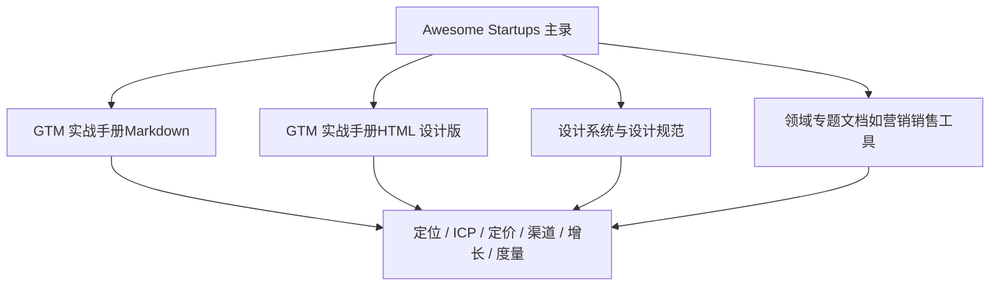
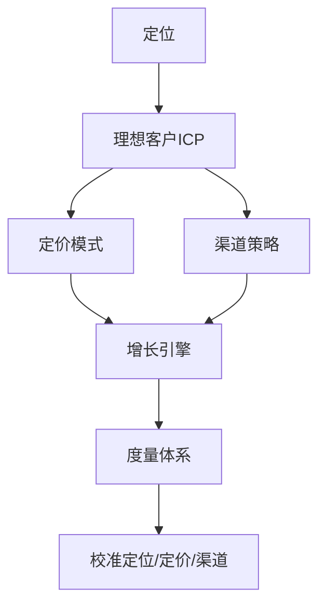
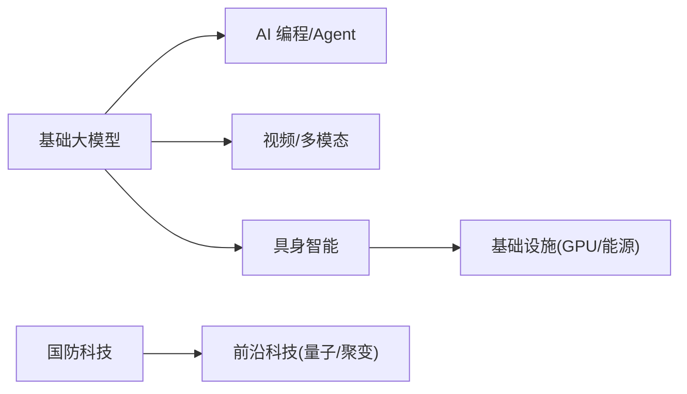

# Go-To-Market 方法论框架

<cite>
**本文引用的文件**
- [README.md](file://README.md)
- [gtm/README.md](file://gtm/README.md)
- [gtm/index.html](file://gtm/index.html)
- [DESIGN.md](file://DESIGN.md)
- [项目概述.md](file://项目概述.md)
- [营销销售工具.md](file://企业服务 _ 开发者工具/营销销售工具/营销销售工具.md)
</cite>

## 目录
1. [引言](#引言)
2. [项目结构](#项目结构)
3. [核心组件](#核心组件)
4. [架构总览](#架构总览)
5. [详细组件分析](#详细组件分析)
6. [依赖关系分析](#依赖关系分析)
7. [性能与度量考量](#性能与度量考量)
8. [故障排查指南](#故障排查指南)
9. [结论](#结论)
10. [附录](#附录)

## 引言
本文件以“投资备忘录”的视角，系统化梳理 Go-To-Market（GTM）方法论框架，并基于仓库中的真实公司与数据，将定位、理想客户（ICP）、定价、渠道、增长、度量六大模块串联为可执行的实战手册。该框架强调：每条论点都应有可回查的真实数字支撑；每个决策都应服务于“让使用本身变成证据”的增长飞轮。

## 项目结构
仓库围绕“Awesome Startups 主录”构建，GTM 手册作为独立章节存在，既可在 Markdown 阅读，也可通过设计版 HTML 页面沉浸式浏览。整体结构如下：

图表来源
- [gtm/README.md:19-27](file://gtm/README.md#L19-L27)
- [gtm/index.html:374-383](file://gtm/index.html#L374-L383)
- [DESIGN.md:55-68](file://DESIGN.md#L55-L68)

章节来源
- [gtm/README.md:1-14](file://gtm/README.md#L1-L14)
- [gtm/index.html:358-383](file://gtm/index.html#L358-L383)
- [DESIGN.md:55-68](file://DESIGN.md#L55-L68)

## 核心组件
- 定位：回答“你替代了谁”，用动词+旧选项+新数量级三要素形成记忆点，并收敛后续定价与渠道选择。
- 理想客户（ICP）：不是泛画像，而是“谁已经在付钱、为什么付”的筛选清单；越窄越锋利。
- 定价：模式即杠杆——免费增值买规模、订阅买效率、按结果买产出。
- 渠道：先跑通一条再谈多渠道；依据是“ICP 在哪里做购买决策”。
- 增长：让使用本身成为证据；为每条渠道设一个北极星指标，产品把指标可视化。
- 度量：需求（查询/注册）、收入（ARR）、资本（估值）三组数字同屏校准叙事与兑现。

章节来源
- [gtm/README.md:30-86](file://gtm/README.md#L30-L86)
- [gtm/index.html:388-473](file://gtm/index.html#L388-L473)

## 架构总览
下图展示 GTM 六模块如何协同驱动从市场进入到规模化增长的闭环：定位决定 ICP 与价值主张；ICP 指导渠道与定价；渠道带来增长信号；增长沉淀为可度量的 ARR；最终用资本与收入校准战略节奏。

[此图为概念性架构图，不直接映射具体源码文件]

## 详细组件分析

### 定位：回答“你替代了谁”
- 论点：定位不是口号，而是对“被替代对象”的清晰定义；写法=动词+旧选项+新数量级。
- 案例批注：
  - Cursor（Anysphere）：将“AI 软件工程师”写入叙事，ARR 从 $50M→$500M→$2B，Series D $2.3B（2025.11），估值 $29.3B。
  - Lovable：“人人都能造应用”，14 个月 ARR $500M，估值 $1.8B（YC W25）。
- 实践要点：定位成立后，定价与渠道自然收敛；避免“更好的编辑器”式模糊表达。

章节来源
- [gtm/README.md:30-39](file://gtm/README.md#L30-L39)
- [gtm/index.html:388-398](file://gtm/index.html#L388-L398)
- [README.md:276-297](file://README.md#L276-L297)

### 理想客户（ICP）：写成一张筛选清单
- 论点：ICP 是“谁在付钱、为什么付”的清单；越窄越锋利，太宽会漏光。
- 案例批注：
  - Harvey AI：锁定律所与咨询机构（Allen & Overy、PwC），ARR $1.5B，估值 $11B，2026.03 完成 $200M Series G。
  - Glean：企业知识检索，500+ 企业客户（Nasdaq、Pixar），估值 $7.25B。
- 实践要点：先聚焦付费者，再用标杆背书横向扩张。

章节来源
- [gtm/README.md:41-48](file://gtm/README.md#L41-L48)
- [gtm/index.html:401-411](file://gtm/index.html#L401-L411)
- [README.md:610-638](file://README.md#L610-L638)

### 定价：模式即增长杠杆
- 论点：免费增值买规模、订阅买效率、按结果买产出；选错模式，渠道替你交学费。
- 案例对照：
  - 免费增值：Apollo.io（$1.6B），免费层驱动增长。
  - 订阅/席位：Cursor（ARR $2B，2026.03）。
  - 按结果付费：Sierra（$4.5B），企业客服 Agent，按结果付费即 GTM 叙事。
- 实践要点：将定价写进商业模式，使“付费方式”成为传播点。

章节来源
- [gtm/README.md:50-60](file://gtm/README.md#L50-L60)
- [gtm/index.html:414-434](file://gtm/index.html#L414-L434)
- [README.md:318-324](file://README.md#L318-L324)

### 渠道：先跑通一条，再谈多渠道
- 论点：渠道是排序题；判断依据是“ICP 在哪里做购买决策”。
- 案例对照：
  - 自助产品：Lovable（浏览器内获客，14 个月 ARR $500M）。
  - 企业系统：Harvey、Glean（直销，高客单价与长决策链）。
  - 免费入口即渠道：Perplexity（月查询 7.8 亿，估值 $20B）。
- 实践要点：单渠道打透后再扩展；不同 ICP 对应不同触达路径。

章节来源
- [gtm/README.md:62-68](file://gtm/README.md#L62-L68)
- [gtm/index.html:437-447](file://gtm/index.html#L437-L447)
- [README.md:195-200](file://README.md#L195-L200)

### 增长：让使用本身变成证据
- 论点：为每条渠道只设一个北极星指标（查询量/注册数/ARR），产品把指标变成可见证据。
- 案例对照：
  - Cognition/Devin：以演示驱动口碑，营收 1 年增长 13 倍至 $492M，估值 $26B。
  - ElevenLabs：社区与标杆滚动，ARR $330M（2025），估值 $11B。
- 实践要点：增长复利来自“使用即证据”的正反馈循环。

章节来源
- [gtm/README.md:70-77](file://gtm/README.md#L70-L77)
- [gtm/index.html:450-459](file://gtm/index.html#L450-L459)
- [README.md:282-286](file://README.md#L282-L286)

### 度量：三组数字校准 GTM
- 论点：需求（查询/注册）、收入（ARR）、资本（估值）三者同屏读，才能看出叙事与兑现的距离。
- 对照样本：
  - Outreach：ARR $300M+，估值 $4.4B（传统 SaaS 十年路径的基准线）。
  - 2026 H1 全球风投：$510B（历史新高），AI 占比 >70%。
- 实践要点：用宏观资本密度与微观 ARR 共同校准 GTM 节奏。

章节来源
- [gtm/README.md:79-86](file://gtm/README.md#L79-L86)
- [gtm/index.html:463-473](file://gtm/index.html#L463-L473)
- [README.md:86-104](file://README.md#L86-L104)

## 依赖关系分析
- 基础大模型对上层应用（AI 编程、Agent、视频/多模态）具有强依赖关系；模型能力决定产品体验与商业化速度。
- 物理 AI（人形机器人、航天）依赖算力与能源基础设施，并与基础大模型生态协作。
- 国防科技与前沿科技受政策与政府订单驱动，具备长周期、高壁垒特征。

图表来源
- [README.md:137-222](file://README.md#L137-L222)
- [README.md:347-438](file://README.md#L347-L438)
- [README.md:1045-1099](file://README.md#L1045-L1099)
- [README.md:1101-1261](file://README.md#L1101-L1261)

章节来源
- [README.md:137-222](file://README.md#L137-L222)
- [README.md:347-438](file://README.md#L347-L438)
- [README.md:1045-1099](file://README.md#L1045-L1099)
- [README.md:1101-1261](file://README.md#L1101-L1261)

## 性能与度量考量
- 外联规模与速率控制：合理设置发送频率与冷却时间，避免触发反垃圾策略。
- 对话处理吞吐：批量转写与异步分析，结合缓存与增量更新降低延迟。
- CRM 写入批量化：批量写入与幂等键设计，减少重复与冲突。
- 监控与告警：对关键链路（发送、转写、写入）建立 SLO 与错误率阈值。
- 指标对齐：为每条渠道设定单一北极星指标，确保增长可度量、可归因。

[本节为通用指导，不直接分析具体文件]

## 故障排查指南
- 常见问题定位
  - 外联未送达：检查域名信誉、SPF/DKIM/DMARC、收件箱策略与黑名单。
  - 对话未识别：确认音频质量、语言/口音配置、领域词典与关键词库。
  - CRM 不同步：核对 API Key、权限范围、字段映射与去重规则。
- 诊断步骤
  - 日志采集与链路追踪；抽样回放关键事件；灰度发布与回滚策略。
- 恢复与预防
  - 降级策略（切换供应商）、重试与补偿、定期演练与容量压测。

[本节为通用指导，不直接分析具体文件]

## 结论
本 GTM 框架以“投资备忘录”的方式组织内容，强调定位—ICP—定价—渠道—增长—度量六个环节的闭环联动，并以真实公司数据作为论据。实践中应坚持：
- 用“被替代对象”定义定位；
- 用“付费者清单”定义 ICP；
- 用“付费模式”放大增长；
- 用“单渠道打透”验证渠道；
- 用“使用即证据”驱动增长；
- 用“需求/收入/资本”三组数字校准节奏。

[本节为总结性内容，不直接分析具体文件]

## 附录

### 设计系统与视觉世界（投资备忘录风格）
- 主题色：奶油纸 #F7F5F0、墨色 #1A1815、牛血红 #8C2F1B；暗色模式为暖深纸 #211D18、陶土红 #D97F60。
- 排版：单一衬线家族（Noto Serif SC），层级靠字重与尺度区分；金额与日期使用等宽数字。
- 交互：页内主题切换；唯一入场动效为“机密章盖章”；移动端批注并入正文下方。
- 原则：连续文档流、发丝线分隔、点线引导目次、红色稀缺纪律。

章节来源
- [DESIGN.md:55-68](file://DESIGN.md#L55-L68)
- [DESIGN.md:70-100](file://DESIGN.md#L70-L100)
- [DESIGN.md:105-141](file://DESIGN.md#L105-L141)
- [gtm/index.html:13-43](file://gtm/index.html#L13-L43)
- [gtm/index.html:488-503](file://gtm/index.html#L488-L503)

### 领域专题：营销与销售工具（Clay/Gong/Attio）
- 端到端流程：线索获取—互动—转化—复盘；Clay 负责外联自动化，Gong 沉淀对话洞察，Attio 提供 CRM 工作流。
- 关键能力：外联编排与个性化、通话转写与意图识别、CRM 自动化与预测。
- 指标优化：打开率、回复率、预约率、Win Rate、Deal Size、Forecast Accuracy。

章节来源
- [营销销售工具.md:20-24](file://企业服务 _ 开发者工具/营销销售工具/营销销售工具.md#L20-L24)
- [营销销售工具.md:49-68](file://企业服务 _ 开发者工具/营销销售工具/营销销售工具.md#L49-L68)
- [营销销售工具.md:75-104](file://企业服务 _ 开发者工具/营销销售工具/营销销售工具.md#L75-L104)
- [营销销售工具.md:106-133](file://企业服务 _ 开发者工具/营销销售工具/营销销售工具.md#L106-L133)
- [营销销售工具.md:135-159](file://企业服务 _ 开发者工具/营销销售工具/营销销售工具.md#L135-L159)