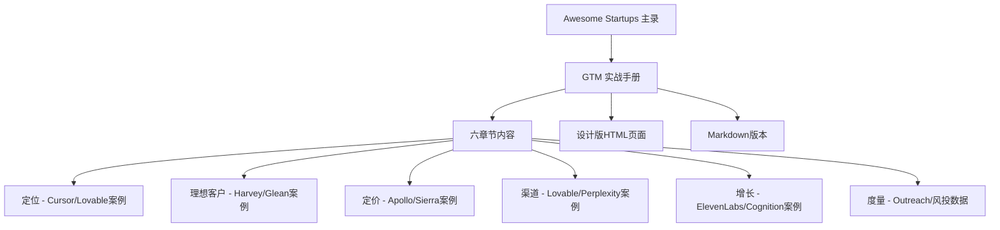

# Go-To-Market 实战手册

<cite>
**本文引用的文件**
- [README.md](file://README.md)
- [gtm/README.md](file://gtm/README.md)
- [gtm/index.html](file://gtm/index.html)
- [DESIGN.md](file://项目规范/DESIGN.md)
- [PRODUCT.md](file://项目规范/PRODUCT.md)
</cite>

## 更新摘要
**所做更改**
- 将方法论框架升级为实战手册，采用投资备忘录形式呈现
- 新增六个章节结构：定位、理想客户、定价、渠道、增长、度量
- 添加2025-2026年真实公司案例和数据支撑
- 实现双版本交付：Markdown版本和设计版HTML页面
- 建立完整的视觉设计系统和用户体验规范

## 目录
1. [引言](#引言)
2. [文档架构](#文档架构)
3. [六大核心章节](#六大核心章节)
4. [实战案例分析](#实战案例分析)
5. [设计系统与体验](#设计系统与体验)
6. [数据驱动方法](#数据驱动方法)
7. [实施指南](#实施指南)
8. [结论](#结论)

## 引言
本文件已从传统的方法论框架升级为**Go-To-Market实战手册**，采用投资备忘录的形式呈现。手册包含六个核心章节，每条论点都附有2025-2026年真实公司的真实数字，全部引自Awesome Startups主录。该手册强调实践导向，为创始人、早期团队和求职者提供可执行的GTM策略指导。

**核心特点：**
- 📊 **真实数据支撑**：2026 H1全球风险投资创下$510B历史新高，AI领域占比超过70%
- 🎯 **实战导向**：每个章节都配有真实公司案例和具体执行步骤
- 📱 **双版本交付**：支持Markdown阅读和沉浸式HTML设计版浏览
- 🔍 **可追溯性**：所有数据和案例都可回查至主录原文

## 文档架构
手册采用投资备忘录的视觉风格，通过奶油纸背景、墨色文字和牛血红批注营造专业感。整体架构如下：

**图表来源**
- [gtm/README.md:19-27](file://gtm/README.md#L19-L27)
- [gtm/index.html:374-383](file://gtm/index.html#L374-L383)

**章节来源**
- [gtm/README.md:1-14](file://gtm/README.md#L1-L14)
- [gtm/index.html:358-383](file://gtm/index.html#L358-L383)

## 六大核心章节

### 01 定位：回答"你替代了谁"
**论点**：定位不是一句slogan，而是对"被替代对象"的清晰定义；写法=动词+旧选项+新数量级。

**实战案例：**
- **Cursor（Anysphere）**：将"AI软件工程师"写入叙事，ARR从$50M→$500M→$2B，Series D $2.3B（2025.11），估值$29.3B
- **Lovable**："人人都能造应用"，14个月ARR$500M，估值$1.8B（YC W25）

**实践要点**：定位成立后，定价与渠道自然收敛；避免"更好的编辑器"式模糊表达。

**章节来源**
- [gtm/README.md:30-39](file://gtm/README.md#L30-L39)
- [gtm/index.html:388-398](file://gtm/index.html#L388-L398)

### 02 理想客户：写成一张筛选清单
**论点**：ICP不是泛画像，而是"谁已经在付钱、为什么付"的筛选清单；越窄越锋利。

**实战案例：**
- **Harvey AI**：锁定律所与咨询机构（Allen & Overy、PwC），ARR$1.5B，估值$11B，2026.03完成$200M Series G
- **Glean**：企业知识检索，500+企业客户（Nasdaq、Pixar），估值$7.25B

**实践要点**：先聚焦付费者，再用标杆背书横向扩张。

**章节来源**
- [gtm/README.md:41-48](file://gtm/README.md#L41-L48)
- [gtm/index.html:401-411](file://gtm/index.html#L401-L411)

### 03 定价：模式即增长杠杆
**论点**：免费增值买规模、订阅买效率、按结果买产出；选错模式，渠道替你交学费。

**模式对照表：**
| 模式 | 适用场景 | 案例 |
|------|----------|------|
| 免费增值 | 自助获客、数据飞轮 | Apollo.io — $1.6B |
| 订阅/席位 | 个人到团队的效率工具 | Cursor — ARR $2B（2026.03） |
| 按结果付费 | 产出可量化的Agent | Sierra — $4.5B |

**实践要点**：将定价写进商业模式，使"付费方式"成为传播点。

**章节来源**
- [gtm/README.md:50-60](file://gtm/README.md#L50-L60)
- [gtm/index.html:414-434](file://gtm/index.html#L414-L434)

### 04 渠道：先跑通一条，再谈多渠道
**论点**：渠道是排序题；判断依据是"ICP在哪里做购买决策"。

**渠道策略：**
- **自助产品**：Lovable在浏览器内获客，14个月ARR$500M
- **企业系统**：Harvey、Glean走直销，高客单价与长决策链
- **免费入口**：Perplexity月查询7.8亿，估值$20B

**实践要点**：单渠道打透后再扩展；不同ICP对应不同触达路径。

**章节来源**
- [gtm/README.md:62-68](file://gtm/README.md#L62-L68)
- [gtm/index.html:437-447](file://gtm/index.html#L437-L447)

### 05 增长：让使用本身变成证据
**论点**：为每条渠道只设一个北极星指标（查询量/注册数/ARR），产品把指标可视化。

**增长案例：**
- **Cognition/Devin**：以演示驱动口碑，营收1年增长13倍至$492M，估值$26B
- **ElevenLabs**：社区与标杆滚动，ARR$330M（2025），估值$11B

**实践要点**：增长复利来自"使用即证据"的正反馈循环。

**章节来源**
- [gtm/README.md:70-77](file://gtm/README.md#L70-L77)
- [gtm/index.html:450-459](file://gtm/index.html#L450-L459)

### 06 度量：三组数字校准GTM
**论点**：需求（查询/注册）、收入（ARR）、资本（估值）三组数字同屏校准叙事与兑现。

**度量基准：**
- **Outreach**：ARR$300M+，估值$4.4B（传统SaaS十年路径基准线）
- **2026 H1全球风投**：$510B（历史新高），AI占比>70%

**实践要点**：用宏观资本密度与微观ARR共同校准GTM节奏。

**章节来源**
- [gtm/README.md:79-86](file://gtm/README.md#L79-L86)
- [gtm/index.html:463-473](file://gtm/index.html#L463-L473)

## 实战案例分析

### 成功案例模式识别

#### 快速成长模式
- **Cursor**：从$50M到$2B ARR仅用2年，展示AI编程工具的爆发力
- **Lovable**：14个月达到$500M ARR，体现低代码平台的巨大市场

#### 垂直深耕模式
- **Harvey AI**：专注法律科技，服务顶级律所，建立行业壁垒
- **Glean**：企业知识管理专家，500+企业客户验证价值

#### 平台生态模式
- **Apollo.io**：通过免费增值模式构建275M+联系人数据库
- **Perplexity**：月查询7.8亿次，证明搜索入口的价值

**章节来源**
- [README.md:122-128](file://README.md#L122-L128)
- [README.md:195-200](file://README.md#L195-L200)

## 设计系统与体验

### 视觉设计原则
手册采用投资备忘录风格的视觉设计，营造专业感和权威感：

**色彩系统：**
- **奶油纸** #F7F5F0：页面背景，模拟真实纸张质感
- **墨色** #1A1815：正文与标题，确保阅读舒适度
- **牛血红** #8C2F1B：批注、编号、印章，稀缺使用增强权威性

**排版规范：**
- **字体家族**：Noto Serif SC（宋体衬线），营造公文感
- **层级体系**：通过字重（900/700/400）和尺度区分层次
- **数字处理**：等宽数字（tabular-nums）确保金额对齐

**交互设计：**
- **主题切换**：支持明暗双模式，适应不同阅读环境
- **响应式布局**：移动端自动调整批注栏位置
- **无障碍访问**：符合WCAG标准的对比度和焦点管理

**章节来源**
- [DESIGN.md:55-68](file://项目规范/DESIGN.md#L55-L68)
- [DESIGN.md:70-100](file://项目规范/DESIGN.md#L70-L100)
- [DESIGN.md:105-141](file://项目规范/DESIGN.md#L105-L141)

### 用户体验优化

**信息架构：**
- **目次导航**：点线引导的章节列表，便于快速跳转
- **批注边栏**：右侧案例批注，与正文形成互补关系
- **交叉引用**：章节间通过§符号相互链接

**内容组织：**
- **论点先行**：每节开头明确核心观点
- **案例支撑**：真实公司数据作为论据
- **实践指导**：具体的执行建议和注意事项

**章节来源**
- [gtm/index.html:185-234](file://gtm/index.html#L185-L234)
- [gtm/index.html:236-325](file://gtm/index.html#L236-L325)

## 数据驱动方法

### 数据来源与验证
手册中的所有数据和案例都来自Awesome Startups主录，确保信息的准确性和可追溯性：

**数据范围：**
- **时间跨度**：2025-2026年最新数据
- **覆盖范围**：全球顶级初创公司，涵盖AI、金融科技、企业服务等领域
- **数据类型**：估值、融资、ARR、用户数等关键指标

**验证机制：**
- **单一事实源**：所有数据引自主录，避免信息不一致
- **实时更新**：随主录同步更新，保持时效性
- **可回查性**：每个案例都提供原文链接，便于深入调研

### 分析方法论

**趋势识别：**
- **资本流向**：关注AI领域占比超过70%的投资趋势
- **增长速度**：识别ARR增长最快的公司模式
- **市场验证**：通过客户数量和付费意愿验证产品价值

**模式提炼：**
- **成功要素**：从案例中提炼可复制的成功模式
- **失败教训**：分析失败案例的共同特征
- **最佳实践**：总结经过验证的执行方法

**章节来源**
- [README.md:86-104](file://README.md#L86-L104)
- [README.md:107-134](file://README.md#L107-L134)

## 实施指南

### 启动阶段建议

**定位制定：**
1. **明确替代对象**：确定你要替代的传统解决方案
2. **量化价值主张**：用具体数字说明改进程度
3. **验证市场需求**：通过小规模测试验证定位有效性

**ICP定义：**
1. **付费者画像**：明确谁在付钱以及为什么付
2. **早期客户**：找到最容易转化的种子用户群体
3. **扩展路径**：规划从早期客户到主流市场的演进路线

**章节来源**
- [gtm/README.md:30-48](file://gtm/README.md#L30-L48)

### 增长阶段策略

**渠道选择：**
1. **单渠道突破**：先集中资源验证一个有效渠道
2. **数据驱动**：建立完善的渠道效果评估体系
3. **规模化准备**：在验证成功后考虑多渠道扩展

**增长引擎：**
1. **产品内增长**：让使用过程产生传播效应
2. **社区建设**：培养忠实用户和 advocates
3. **合作伙伴**：寻找战略性的渠道合作伙伴

**章节来源**
- [gtm/README.md:62-77](file://gtm/README.md#L62-L77)

### 成熟阶段优化

**度量体系：**
1. **关键指标**：建立需求、收入、资本的完整度量体系
2. **实时监测**：搭建数据监控和预警机制
3. **持续优化**：基于数据反馈不断调整策略

**组织能力建设：**
1. **团队配置**：根据发展阶段调整团队结构
2. **流程标准化**：建立可复制的增长流程
3. **文化塑造**：培养数据驱动和实验精神

**章节来源**
- [gtm/README.md:79-86](file://gtm/README.md#L79-L86)

## 结论

本GTMT实战手册通过将方法论与真实案例结合，为创业者提供了可执行的GTM策略指导。手册的核心价值在于：

**实践导向**：每个章节都配有真实公司案例，避免空洞的理论说教
**数据支撑**：所有论点都有具体数据支撑，增强说服力
**可操作性**：提供具体的执行步骤和注意事项
**时效性强**：基于2025-2026年最新市场数据

**核心原则：**
- 用"被替代对象"定义定位
- 用"付费者清单"定义ICP  
- 用"付费模式"放大增长
- 用"单渠道打透"验证渠道
- 用"使用即证据"驱动增长
- 用"需求/收入/资本"三组数字校准节奏

**未来展望：**
随着AI技术的快速发展和资本市场的变化，GTM策略需要持续迭代。建议读者定期回顾本手册，结合最新的市场动态和公司实际情况，不断优化自己的GTM策略。

---

*本手册仅供学习与复盘，不构成投资建议。所有数据均来自公开信息，可能存在滞后或不准确的情况。*