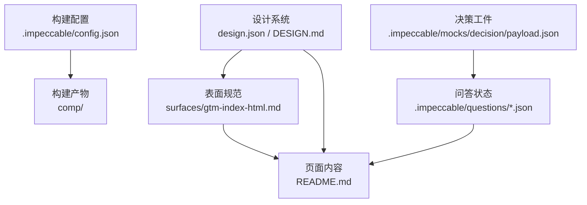
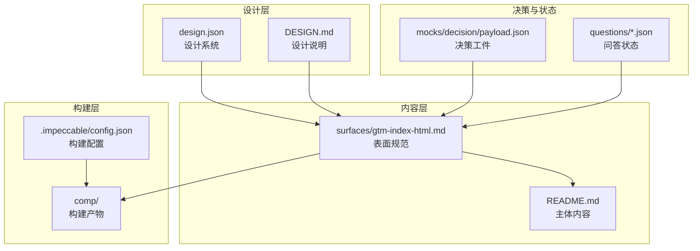
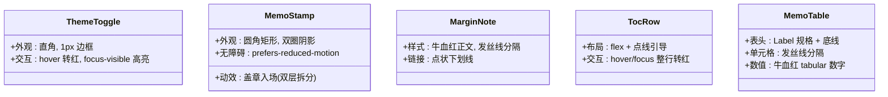
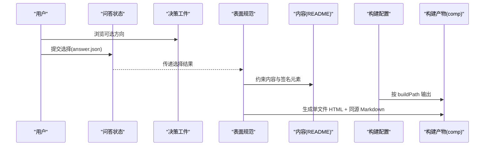
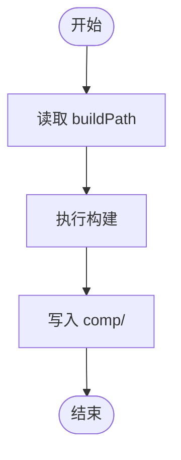
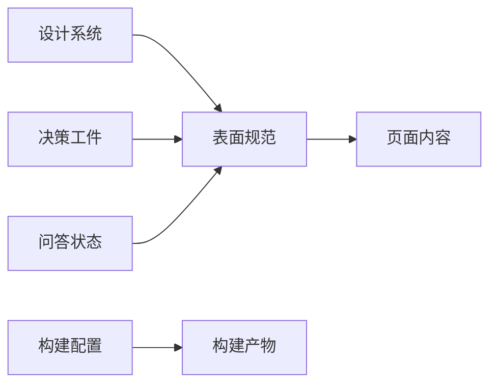

# Impeccable 配置与工具链

<cite>
**本文引用的文件**
- [config.json](file://.impeccable/config.json)
- [design.json](file://.impeccable/design.json)
- [DESIGN.md](file://DESIGN.md)
- [README.md](file://README.md)
- [payload.json](file://.impeccable/mocks/decision/payload.json)
- [answer.json](file://.impeccable/questions/e9366d58.answer.json)
- [state.json](file://.impeccable/questions/e9366d58.state.json)
- [gtm-index-html.md](file://.impeccable/surfaces/gtm-index-html.md)
</cite>

## 目录
1. [简介](#简介)
2. [项目结构](#项目结构)
3. [核心组件](#核心组件)
4. [架构总览](#架构总览)
5. [详细组件分析](#详细组件分析)
6. [依赖关系分析](#依赖关系分析)
7. [性能考量](#性能考量)
8. [故障排查指南](#故障排查指南)
9. [结论](#结论)
10. [附录](#附录)

## 简介
本仓库以“投资备忘录”为设计世界，围绕 GTM（Go-To-Market）实战手册构建一套可复用的设计与工程化配置。Impeccable 工具链通过声明式的设计系统、决策工件与表面规范，将内容、视觉与构建流程解耦：设计系统定义色彩、排版、组件与动效；决策工件记录方向选择与备选方案；表面规范约束最终产物形态；构建配置统一输出路径。该体系确保长文阅读体验、数据可信度与品牌一致性。

## 项目结构
- .impeccable/config.json：构建输出路径配置，集中管理产物目录。
- .impeccable/design.json：设计系统 JSON 描述，包含颜色、字体、动效、断点与组件实现片段。
- DESIGN.md：人类可读的设计系统说明，覆盖色彩、排版、布局、组件与规则。
- README.md：项目主文档，承载行业全景、估值速查表与公司条目等主体内容。
- .impeccable/mocks/decision/payload.json：决策工件，记录方向选项、论据、风险与构建路径。
- .impeccable/questions/*.json：问答状态与答案，记录用户选择与运行态信息。
- .impeccable/surfaces/gtm-index-html.md：表面规范，约束 GTM 手册的形态、受众与签名元素。

图表来源
- [design.json:1-180](file://.impeccable/design.json#L1-L180)
- [DESIGN.md:1-155](file://DESIGN.md#L1-L155)
- [config.json:1-4](file://.impeccable/config.json#L1-L4)
- [payload.json:1-96](file://.impeccable/mocks/decision/payload.json#L1-L96)
- [answer.json:1-2](file://.impeccable/questions/e9366d58.answer.json#L1-L2)
- [state.json:1-1](file://.impeccable/questions/e9366d58.state.json#L1-L1)
- [gtm-index-html.md:1-17](file://.impeccable/surfaces/gtm-index-html.md#L1-L17)
- [README.md:1-800](file://README.md#L1-L800)

章节来源
- [config.json:1-4](file://.impeccable/config.json#L1-L4)
- [design.json:1-180](file://.impeccable/design.json#L1-L180)
- [DESIGN.md:1-155](file://DESIGN.md#L1-L155)
- [README.md:1-800](file://README.md#L1-L800)
- [payload.json:1-96](file://.impeccable/mocks/decision/payload.json#L1-L96)
- [answer.json:1-2](file://.impeccable/questions/e9366d58.answer.json#L1-L2)
- [state.json:1-1](file://.impeccable/questions/e9366d58.state.json#L1-L1)
- [gtm-index-html.md:1-17](file://.impeccable/surfaces/gtm-index-html.md#L1-L17)

## 核心组件
- 设计系统（Design System）
  - 色彩：奶油纸/夜读纸、墨色/夜读墨、弱化墨/夜读弱化墨、牛血红/陶土红。
  - 排版：Display/Headline/Body/Label 四级层级，单一衬线家族，数字使用等宽。
  - 动效：仅“机密章”盖章入场，其余静默。
  - 断点：notes-collapse（900px）、toc-single（720px）。
  - 组件：主题切换按钮、机密章、批注边栏、目次行、备忘录表格。
- 构建配置
  - buildPath 指向 comp，统一构建产物目录。
- 决策工件
  - 提供多套视觉方向（行情终端、投资备忘录、案例年鉴、战报海报、手绘小报），含论据、风险与构建路径。
- 问答状态
  - 记录用户选择、本地预览端口与心跳时间戳。
- 表面规范
  - 明确 GTM 手册的受众、内容合同、形态（单文件 HTML + 同源 Markdown）、签名元素与未决事项。

章节来源
- [design.json:1-180](file://.impeccable/design.json#L1-L180)
- [DESIGN.md:1-155](file://DESIGN.md#L1-L155)
- [config.json:1-4](file://.impeccable/config.json#L1-L4)
- [payload.json:1-96](file://.impeccable/mocks/decision/payload.json#L1-L96)
- [answer.json:1-2](file://.impeccable/questions/e9366d58.answer.json#L1-L2)
- [state.json:1-1](file://.impeccable/questions/e9366d58.state.json#L1-L1)
- [gtm-index-html.md:1-17](file://.impeccable/surfaces/gtm-index-html.md#L1-L17)

## 架构总览
下图展示从设计系统到页面内容的装配关系，以及构建产物的输出路径。

图表来源
- [design.json:1-180](file://.impeccable/design.json#L1-L180)
- [DESIGN.md:1-155](file://DESIGN.md#L1-L155)
- [gtm-index-html.md:1-17](file://.impeccable/surfaces/gtm-index-html.md#L1-L17)
- [payload.json:1-96](file://.impeccable/mocks/decision/payload.json#L1-L96)
- [answer.json:1-2](file://.impeccable/questions/e9366d58.answer.json#L1-L2)
- [state.json:1-1](file://.impeccable/questions/e9366d58.state.json#L1-L1)
- [config.json:1-4](file://.impeccable/config.json#L1-L4)
- [README.md:1-800](file://README.md#L1-L800)

## 详细组件分析

### 设计系统组件
- 主题切换按钮
  - 直角边框、Label 声部、hover 转牛血红，focus-visible 高亮。
- 机密章
  - 全页唯一动效载体，双层动画拆分（外层 opacity、内层 scale），旋转角度固定，prefers-reduced-motion 下禁用。
- 批注边栏
  - 牛血红正文条目，45% 透明度红发丝线分隔，公司名加粗，来源链接点状下划线。
- 目次行
  - flex + 点线引导，编号为牛血红 tabular 数字，尾部灰色案例名，hover/focus 整行转红。
- 备忘录表格
  - th Label 规格 + 1.5px 墨色底线，td 1px 发丝线，金额列牛血红 tabular 数字不换行。

图表来源
- [design.json:97-138](file://.impeccable/design.json#L97-L138)
- [DESIGN.md:120-141](file://DESIGN.md#L120-L141)

章节来源
- [design.json:97-138](file://.impeccable/design.json#L97-L138)
- [DESIGN.md:120-141](file://DESIGN.md#L120-L141)

### 决策与问答流程
- 决策工件提供多个方向选项，每个选项包含论点、风险、材料与视口示意。
- 问答状态记录用户选择、本地预览地址与心跳时间戳。
- 表面规范基于已批准的方向约束最终产物形态。

图表来源
- [payload.json:1-96](file://.impeccable/mocks/decision/payload.json#L1-L96)
- [answer.json:1-2](file://.impeccable/questions/e9366d58.answer.json#L1-L2)
- [state.json:1-1](file://.impeccable/questions/e9366d58.state.json#L1-L1)
- [gtm-index-html.md:1-17](file://.impeccable/surfaces/gtm-index-html.md#L1-L17)
- [config.json:1-4](file://.impeccable/config.json#L1-L4)
- [README.md:1-800](file://README.md#L1-L800)

章节来源
- [payload.json:1-96](file://.impeccable/mocks/decision/payload.json#L1-L96)
- [answer.json:1-2](file://.impeccable/questions/e9366d58.answer.json#L1-L2)
- [state.json:1-1](file://.impeccable/questions/e9366d58.state.json#L1-L1)
- [gtm-index-html.md:1-17](file://.impeccable/surfaces/gtm-index-html.md#L1-L17)
- [config.json:1-4](file://.impeccable/config.json#L1-L4)
- [README.md:1-800](file://README.md#L1-L800)

### 构建与输出
- 构建路径由 config.json 的 buildPath 控制，统一输出至 comp 目录。
- 表面规范要求产物为单文件 HTML（明暗双模式）+ 同源 Markdown，并遵循签名元素与内容合同。

图表来源
- [config.json:1-4](file://.impeccable/config.json#L1-L4)
- [gtm-index-html.md:1-17](file://.impeccable/surfaces/gtm-index-html.md#L1-L17)

章节来源
- [config.json:1-4](file://.impeccable/config.json#L1-L4)
- [gtm-index-html.md:1-17](file://.impeccable/surfaces/gtm-index-html.md#L1-L17)

## 依赖关系分析
- 设计系统对页面内容具有强约束力：色彩、排版、组件与动效均来源于 design.json 与 DESIGN.md。
- 表面规范将设计系统与具体页面绑定，规定 GTM 手册的形态与内容契约。
- 决策工件影响方向选择，进而影响表面规范与最终呈现。
- 问答状态维护运行期上下文（本地预览地址、心跳），便于调试与联调。
- 构建配置独立于内容与设计，仅负责输出路径。

图表来源
- [design.json:1-180](file://.impeccable/design.json#L1-L180)
- [DESIGN.md:1-155](file://DESIGN.md#L1-L155)
- [payload.json:1-96](file://.impeccable/mocks/decision/payload.json#L1-L96)
- [answer.json:1-2](file://.impeccable/questions/e9366d58.answer.json#L1-L2)
- [state.json:1-1](file://.impeccable/questions/e9366d58.state.json#L1-L1)
- [gtm-index-html.md:1-17](file://.impeccable/surfaces/gtm-index-html.md#L1-L17)
- [config.json:1-4](file://.impeccable/config.json#L1-L4)
- [README.md:1-800](file://README.md#L1-L800)

章节来源
- [design.json:1-180](file://.impeccable/design.json#L1-L180)
- [DESIGN.md:1-155](file://DESIGN.md#L1-L155)
- [payload.json:1-96](file://.impeccable/mocks/decision/payload.json#L1-L96)
- [answer.json:1-2](file://.impeccable/questions/e9366d58.answer.json#L1-L2)
- [state.json:1-1](file://.impeccable/questions/e9366d58.state.json#L1-L1)
- [gtm-index-html.md:1-17](file://.impeccable/surfaces/gtm-index-html.md#L1-L17)
- [config.json:1-4](file://.impeccable/config.json#L1-L4)
- [README.md:1-800](file://README.md#L1-L800)

## 性能考量
- 动效最小化：仅“机密章”有入场动效，其余部分保持静默，降低渲染开销。
- 字体与排版：单一衬线家族与三档字重，减少字体加载复杂度。
- 响应式断点：notes-collapse 与 toc-single 两个断点优化移动端与小屏阅读。
- 构建产物：单文件 HTML 减少请求次数，利于缓存与首屏加载。

[本节为通用指导，不直接分析具体文件]

## 故障排查指南
- 本地预览异常
  - 检查 questions/state.json 中的端口与 URL 是否可用，确认心跳时间戳是否更新。
- 构建路径错误
  - 核对 config.json 的 buildPath 是否与预期一致，确认 comp 目录存在且可写。
- 设计不一致
  - 对照 design.json 与 DESIGN.md 的颜色、字体、组件实现，确保页面引用正确。
- 内容不一致
  - 依据 surfaces/gtm-index-html.md 的内容合同，校验 README.md 中案例数字与来源标注的一致性。

章节来源
- [state.json:1-1](file://.impeccable/questions/e9366d58.state.json#L1-L1)
- [config.json:1-4](file://.impeccable/config.json#L1-L4)
- [design.json:1-180](file://.impeccable/design.json#L1-L180)
- [DESIGN.md:1-155](file://DESIGN.md#L1-L155)
- [gtm-index-html.md:1-17](file://.impeccable/surfaces/gtm-index-html.md#L1-L17)
- [README.md:1-800](file://README.md#L1-L800)

## 结论
本工具链以“投资备忘录”为核心设计世界，通过声明式设计系统、决策工件与表面规范，将内容、视觉与构建流程清晰解耦。其优势在于：
- 一致性：设计系统约束色彩、排版与组件，确保品牌与阅读体验统一。
- 可追溯：决策工件与问答状态记录方向选择与运行上下文，便于审计与回溯。
- 可构建：构建配置集中管理输出路径，保证产物稳定可复用。
建议在生产环境中持续对齐设计系统与页面实现，严格遵循内容合同与签名元素，以保持长文阅读的可信度与清晰度。

[本节为总结性内容，不直接分析具体文件]

## 附录
- 关键规则摘要
  - The Red Ink Rule：牛血红仅用于批注、编号、印章，占比 <10%。
  - The One Voice Rule：全页单一衬线家族，层级靠字重与尺度。
  - The Two-Weight Rule：结构线仅两种（1px 发丝线与 2.5px 抬头边界）。
- 断点与布局
  - notes-collapse（900px）：批注并入正文下方。
  - toc-single（720px）：目次单列，隐藏案例名。
- 组件清单
  - 主题切换按钮、机密章、批注边栏、目次行、备忘录表格。

章节来源
- [DESIGN.md:85-114](file://DESIGN.md#L85-L114)
- [design.json:92-95](file://.impeccable/design.json#L92-L95)
- [design.json:97-138](file://.impeccable/design.json#L97-L138)