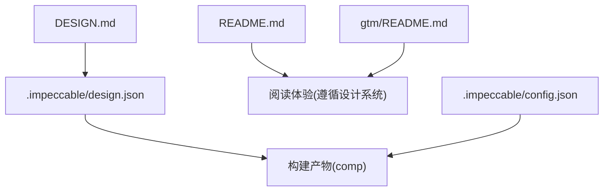
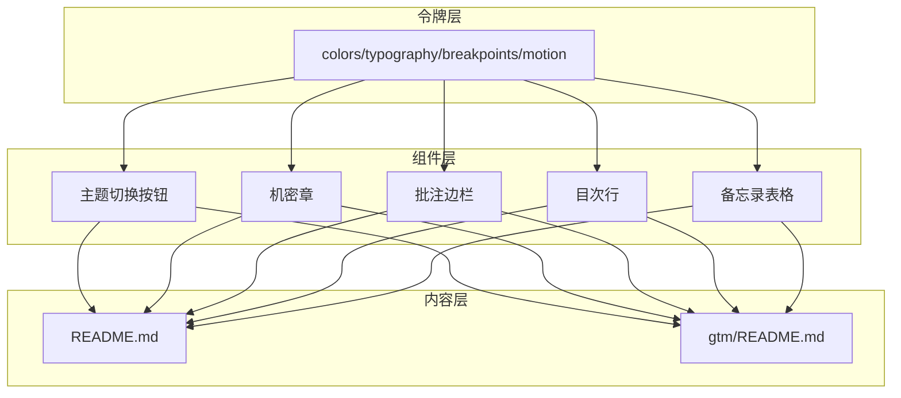
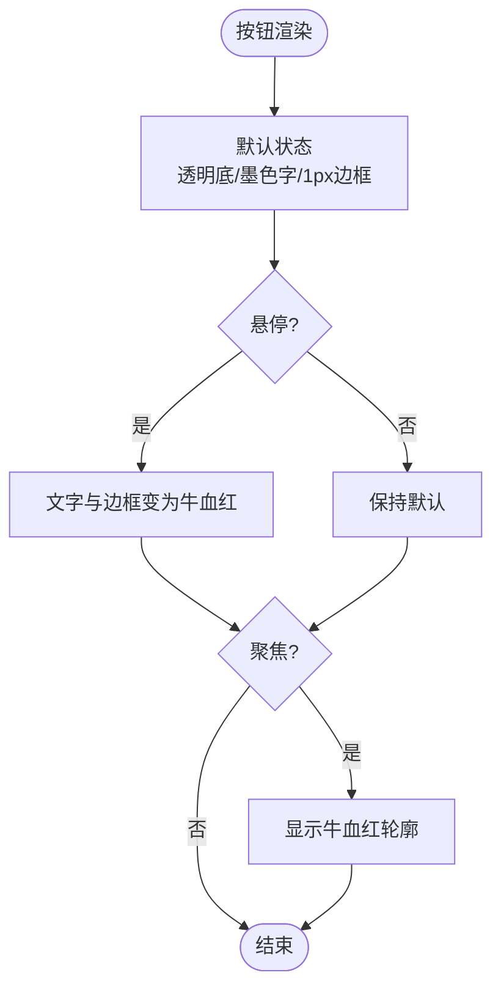
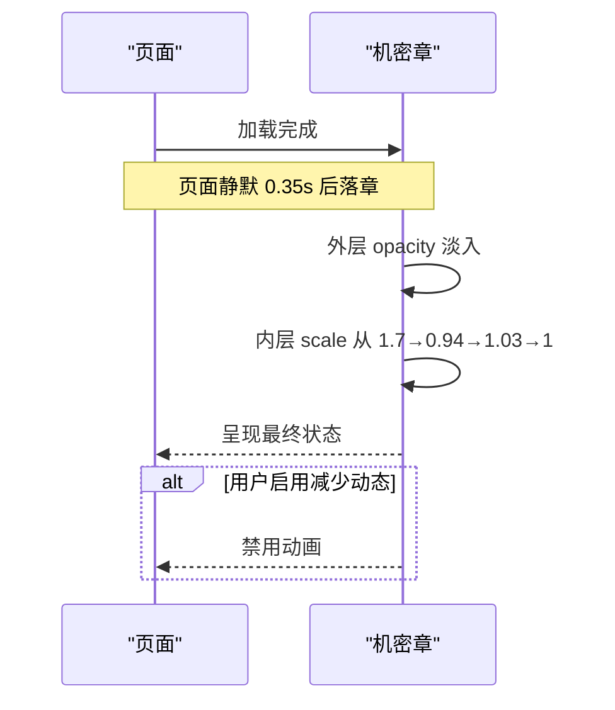
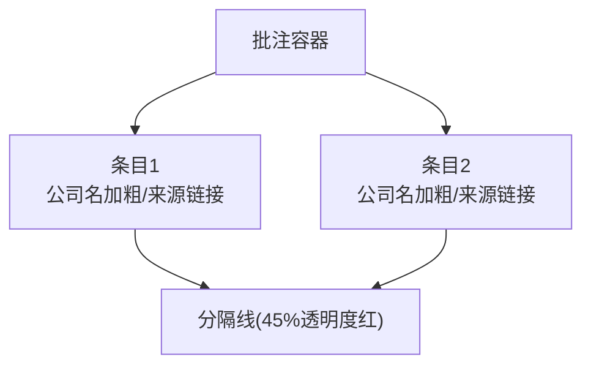
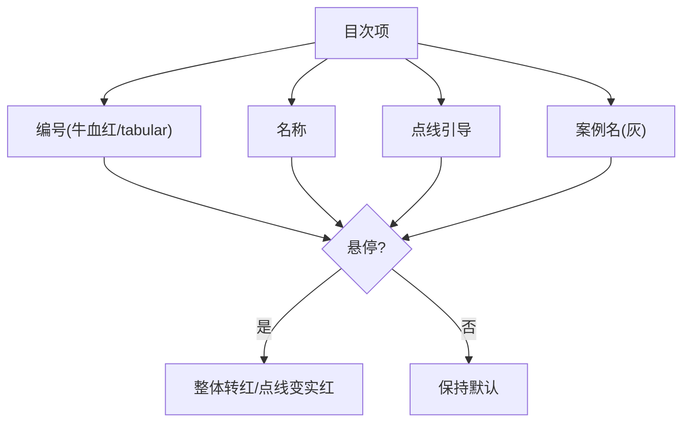
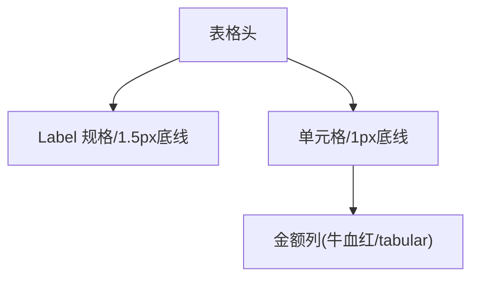
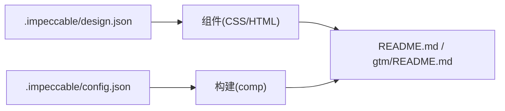

# 设计系统规范

<cite>
**本文引用的文件**
- [DESIGN.md](file://DESIGN.md)
- [.impeccable/design.json](file://.impeccable/design.json)
- [.impeccable/config.json](file://.impeccable/config.json)
- [README.md](file://README.md)
- [gtm/README.md](file://gtm/README.md)
</cite>

## 目录
1. [引言](#引言)
2. [项目结构](#项目结构)
3. [核心组件](#核心组件)
4. [架构总览](#架构总览)
5. [详细组件分析](#详细组件分析)
6. [依赖关系分析](#依赖关系分析)
7. [性能与可访问性考量](#性能与可访问性考量)
8. [故障排查指南](#故障排查指南)
9. [结论](#结论)
10. [附录](#附录)

## 引言
本设计系统以“投资备忘录”为创意北极星，将 Go-To-Market 方法论装订成一份 VC 内部传阅的 IC memo：读者不是被教育框架，而是在读一份正在发生的投资判断。纸面即页面本身，没有卡片、没有阴影装饰——深度全部来自排印层级与发丝线。牛血红是页边批注的墨水，只属于批注、编号与印章三处；它的稀缺就是它的权威。暗色模式不是反色而是同一世界的夜读变体（暖深纸、陶土红），由 prefers-color-scheme、?theme=覆盖与页内切换三重驱动。

## 项目结构
仓库围绕单一文档型内容组织，设计系统通过声明式配置与设计说明共同驱动视觉与交互一致性：
- DESIGN.md：人类可读的设计规范，定义色彩、排版、布局、组件与规则。
- .impeccable/design.json：机器可读的设计令牌与组件实现，包含颜色语义、断点、动效、组件 HTML/CSS 片段。
- .impeccable/config.json：构建路径等工程化配置。
- README.md 与 gtm/README.md：内容载体，承载清单与 GTM 手册，遵循设计系统的视觉语言。

图表来源
- [DESIGN.md:1-155](file://DESIGN.md#L1-L155)
- [.impeccable/design.json:1-180](file://.impeccable/design.json#L1-L180)
- [.impeccable/config.json:1-4](file://.impeccable/config.json#L1-L4)
- [README.md:1-120](file://README.md#L1-L120)
- [gtm/README.md:1-95](file://gtm/README.md#L1-L95)

章节来源
- [DESIGN.md:1-155](file://DESIGN.md#L1-L155)
- [.impeccable/design.json:1-180](file://.impeccable/design.json#L1-L180)
- [.impeccable/config.json:1-4](file://.impeccable/config.json#L1-L4)
- [README.md:1-120](file://README.md#L1-L120)
- [gtm/README.md:1-95](file://gtm/README.md#L1-L95)

## 核心组件
本设计系统提供以下关键组件与规范：
- 主题切换按钮：直角、1px 描边、Label 声部，hover 转牛血红。
- 机密章：全页唯一动效载体，橡皮章样式，盖章入场动画。
- 批注边栏：页边声音容器，条目间以低透明度红线分隔。
- 目次行：导航的唯一形态，点线引导，编号与案例名对齐。
- 备忘录表格：连续文档内的数据表，金额列使用牛血红与等宽数字。

章节来源
- [DESIGN.md:120-141](file://DESIGN.md#L120-L141)
- [.impeccable/design.json:97-137](file://.impeccable/design.json#L97-L137)

## 架构总览
设计系统采用“声明式令牌 + 组件实现 + 内容消费”的分层架构：
- 令牌层：颜色、字体、断点、动效在 design.json 中集中管理。
- 组件层：每个组件提供 HTML 与 CSS 片段，确保一致性与可复用性。
- 内容层：README 与 GTM 手册作为内容载体，严格遵循设计规范。

图表来源
- [.impeccable/design.json:1-96](file://.impeccable/design.json#L1-L96)
- [.impeccable/design.json:97-137](file://.impeccable/design.json#L97-L137)
- [README.md:1-120](file://README.md#L1-L120)
- [gtm/README.md:1-95](file://gtm/README.md#L1-L95)

## 详细组件分析

### 主题切换按钮
- 形状与边框：直角，1px 实线边框。
- 颜色：透明底、墨色字与框；hover 转牛血红字与框。
- 排版：Label 规格，内容为“切换暗色/切换亮色”。
- 可访问性：focus-visible 时显示牛血红轮廓。

图表来源
- [.impeccable/design.json:98-105](file://.impeccable/design.json#L98-L105)
- [DESIGN.md:122-126](file://DESIGN.md#L122-L126)

章节来源
- [.impeccable/design.json:98-105](file://.impeccable/design.json#L98-L105)
- [DESIGN.md:122-126](file://DESIGN.md#L122-L126)

### 机密章
- 形状：0.45em 圆角矩形，2.5px 红框 + inset 双圈，rotate(-7deg)。
- 颜色：透明底、牛血红字与框，opacity .92。
- 动效：盖章入场（外层 opacity + 内层 scale），仅用于机密章；prefers-reduced-motion 下静止。
- 注意事项：缩放动画不得作用在定位元素本身，需在外层容器与内层 wrapper 之间拆分，避免锁定横向滚动溢出。

图表来源
- [.impeccable/design.json:106-113](file://.impeccable/design.json#L106-L113)
- [DESIGN.md:127-132](file://DESIGN.md#L127-L132)

章节来源
- [.impeccable/design.json:106-113](file://.impeccable/design.json#L106-L113)
- [DESIGN.md:127-132](file://DESIGN.md#L127-L132)

### 批注边栏
- 风格：牛血红正文（.92rem/1.85），条目间以 45% 透明度红发丝线分隔。
- 公司名：700 加粗；来源链接为点状下划线，hover 变实线。
- 用途：承载“页边声音”，不干扰主文阅读。

图表来源
- [.impeccable/design.json:114-121](file://.impeccable/design.json#L114-L121)
- [DESIGN.md:133-135](file://DESIGN.md#L133-L135)

章节来源
- [.impeccable/design.json:114-121](file://.impeccable/design.json#L114-L121)
- [DESIGN.md:133-135](file://DESIGN.md#L133-L135)

### 目次行
- 风格：flex + 点线引导（1px dotted 填充）。
- 编号：牛血红 tabular 数字。
- 尾部：灰色案例名；hover 整行转红、点线变实红。
- 用途：导航的唯一形态，强调连续文档流。

图表来源
- [.impeccable/design.json:122-129](file://.impeccable/design.json#L122-L129)
- [DESIGN.md:136-138](file://DESIGN.md#L136-L138)

章节来源
- [.impeccable/design.json:122-129](file://.impeccable/design.json#L122-L129)
- [DESIGN.md:136-138](file://DESIGN.md#L136-L138)

### 备忘录表格
- 风格：th 小号 Label 规格 + 1.5px 墨色底线；td 1px 发丝底线。
- 金额列：牛血红 tabular 数字，不换行。
- 用途：连续文档内的数据表，保持版面克制与信息密度。

图表来源
- [.impeccable/design.json:130-137](file://.impeccable/design.json#L130-L137)
- [DESIGN.md:139-141](file://DESIGN.md#L139-L141)

章节来源
- [.impeccable/design.json:130-137](file://.impeccable/design.json#L130-L137)
- [DESIGN.md:139-141](file://DESIGN.md#L139-L141)

## 依赖关系分析
- 令牌到组件：design.json 中的 colors、typography、breakpoints、motion 直接驱动各组件样式与行为。
- 组件到内容：README 与 GTM 手册通过引用组件样式类与结构，获得一致的视觉体验。
- 构建依赖：config.json 指定构建输出路径，确保组件与令牌正确编译到目标目录。

图表来源
- [.impeccable/design.json:1-96](file://.impeccable/design.json#L1-L96)
- [.impeccable/config.json:1-4](file://.impeccable/config.json#L1-L4)
- [README.md:1-120](file://README.md#L1-L120)
- [gtm/README.md:1-95](file://gtm/README.md#L1-L95)

章节来源
- [.impeccable/design.json:1-96](file://.impeccable/design.json#L1-L96)
- [.impeccable/config.json:1-4](file://.impeccable/config.json#L1-L4)
- [README.md:1-120](file://README.md#L1-L120)
- [gtm/README.md:1-95](file://gtm/README.md#L1-L95)

## 性能与可访问性考量
- 性能
  - 无阴影与渐变，减少渲染开销；仅使用轻量级边框与透明度。
  - 动效集中在机密章，且支持 prefers-reduced-motion 禁用，降低对低端设备的负担。
  - 等宽数字（tabular-nums）提升数值列对齐与读取效率。
- 可访问性
  - 焦点可见：主题切换按钮与链接具备 focus-visible 样式。
  - 对比度：暗色模式下牛血红提亮为陶土红，保证对比度 ≥4.5:1。
  - 减少动效：尊重系统偏好，关闭不必要的动画。

章节来源
- [DESIGN.md:60-114](file://DESIGN.md#L60-L114)
- [.impeccable/design.json:74-95](file://.impeccable/design.json#L74-L95)
- [.impeccable/design.json:98-105](file://.impeccable/design.json#L98-L105)
- [.impeccable/design.json:106-113](file://.impeccable/design.json#L106-L113)

## 故障排查指南
- 主题切换无效
  - 检查是否引入正确的样式类与变量；确认 hover/focus-visible 样式生效。
  - 参考：主题切换按钮的 HTML/CSS 片段。
- 机密章动画异常
  - 确认外层容器设置 overflow-x: clip，避免缩放导致横向滚动锁定。
  - 检查 prefers-reduced-motion 媒体查询是否正确禁用动画。
  - 参考：机密章的 HTML/CSS 与注意事项。
- 批注边栏样式错乱
  - 确认条目间分隔线透明度与颜色变量；检查公司名与链接样式。
  - 参考：批注边栏的 HTML/CSS 片段。
- 目次行点线不显示
  - 检查 flex 布局与点线引导的 border-bottom 属性；确认 hover 状态切换。
  - 参考：目次行的 HTML/CSS 片段。
- 表格金额列换行或颜色不对
  - 确认金额列使用 tabular-nums 与白空间 nowrap；检查牛红色变量。
  - 参考：备忘录表格的 HTML/CSS 片段。

章节来源
- [.impeccable/design.json:98-137](file://.impeccable/design.json#L98-L137)
- [DESIGN.md:120-141](file://DESIGN.md#L120-L141)

## 结论
本设计系统以“投资备忘录”为核心叙事，通过克制的色彩、严格的排版与统一的组件实现，确保内容在连续文档流中保持高信息密度与强可读性。令牌化管理使设计与实现解耦，便于扩展与维护；动效与可访问性策略兼顾性能与包容性。遵循该规范，可在 README 与 GTM 手册等载体上保持一致的品牌与阅读体验。

## 附录
- 命名规则
  - The Red Ink Rule：牛血红只出现在批注、编号、印章三处，任意视口占比 <10%。
  - The One Voice Rule：全页只用一个衬线家族；层级靠 900/700/400 三档字重与尺度跳变。
  - The Two-Weight Rule：结构线只有两种：1px（发丝分隔）与 2.5px（抬头边界）。
- Do's
  - 让红墨只服务“页边声音”：批注、编号、印章。
  - 用点线引导与发丝线做全部结构与导航。
  - 保持全页单一衬线家族与三档字重。
  - 所有数字用 tabular-nums 并标注时点。
- Don'ts
  - 不使用卡片网格、阴影、渐变或圆角容器。
  - 不让牛血红进入正文、装饰或大面积色块。
  - 不引入无衬线或等宽字体做视觉声音（等宽只用于数据语义）。
  - 不在盖章之外添加入场动效；页面其余部分静默。

章节来源
- [DESIGN.md:85-155](file://DESIGN.md#L85-L155)
- [.impeccable/design.json:139-178](file://.impeccable/design.json#L139-L178)